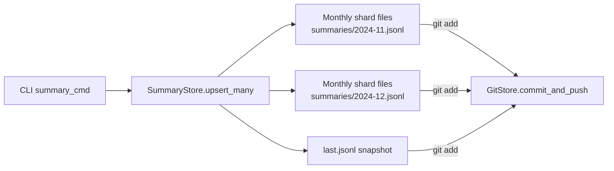

# Design Document

## Overview

摘要 JSONL 仓库需要两项结构性改造：

1. **写入分片从出版年份切换到“摘要发生月份 (UTC)”**，`summary_date` 为必填字段，缺失直接视为输入错误并阻断流程；最终落到 `summaries/<YYYY-MM>.jsonl`。
2. **为每次批处理生成 `last.jsonl` 快照**，内容仅包含本批次的记录且顺序与输入一致，方便推荐/审计脚本直接消费“最新一次摘要”。
3. **CLI 新增 `--input` 与 `--dry-run` 选项**：`--input` 统一作为推荐产物入口（自动根据后缀解析，向后兼容旧 `--parquet`），`--dry-run` 可跳过写仓库/提交，仅把结果输出到 `--output` 指定文件，便于调试。

改造将集中在 `papersys/storage/summary_store.py` 及 `papersys/cli/summary_cmd.py`，保持 CLI→GitStore→文件仓库的链路不变，同时补充日志指引 touched 分片及快照路径。

## Steering Document Alignment

### Technical Standards (tech.md)
- 虽无自定义 steering 文档，本方案沿用现有 `SummaryStore` / `GitStore` 模块化边界，继续使用 `Path`、`loguru`、`typer` 等既定依赖。
- 通过新增纯函数式 partition 解析与 snapshot writer，确保逻辑可单测、符合 KISS/SOLID。

### Project Structure (structure.md)
- 仍在 `papersys/storage` 下封装持久化细节，CLI 只调 `summary_store` 公共接口；日志/CLI 输出规范保持 `loguru` + `typer.echo` 风格。
- JSONL 文件命名维持 `summaries/` 子目录，避免破坏 Git 仓库期望的目录结构与 CI 同步脚本。

## Code Reuse Analysis

### Existing Components to Leverage
- **`SummaryStore` (`papersys/storage/summary_store.py`)**：保留 `upsert_many` 入口与 `iter_records`/`existing_ids` 能力，在内部重写分片与写盘策略，但遵循“只 append、不覆盖、不去重”，仅在发现同一 `id` 重复时报 warning。
- **`GitStore` (`papersys/storage/git_store.py`)**：继续提供 `summary_store` 实例以及 `commit_and_push` 用于数据仓库同步。
- **`summary` CLI (`papersys/cli/summary_cmd.py`)**：沿用现有 records 构建流程，只在 upsert 结果后输出新增日志、透传 `records` 给 `last.jsonl` 写入，并新增 `--input/--dry-run` 处理。

### Integration Points
- **CLI → Storage**：`summary_cmd` 仍调用 `git_store.summary_store.upsert_many(records)`，该方法返回 `SummaryWriteReport`，CLI 用于日志展示 touched months 及 `last.jsonl`。
- **Storage → Git Repo**：`summary_store.root` 下新增月度分片与 `last.jsonl`，`git_store.commit_and_push([...])` 自动纳入版本控制。

## Architecture

### 模块化方案
1. **PartitionResolver**（私有 helper）
   - 输入记录字典，输出 `PartitionKey`（`slug: str`, `source_field: str`）。
   - 仅接受 `SUMMARY_DATE`，缺失或解析失败立即抛 `ValueError`；Slug 形如 `2024-11`。

2. **MonthlyShardWriter**（`SummaryStore` 内部）
   - 负责聚合 `records` 到 `Path('summaries/<slug>.jsonl')`。
   - 先调用 `_validate_existing_file(path)` 确认历史 JSON 行可解析，否则立刻报错阻断；验证通过后直接 **append** 新行，不改动历史顺序。

3. **LastSnapshotWriter**
   - 始终写入 `summaries/last.jsonl`，内容为“当前批次 record list”，无历史合并，保证坏文件可被全量覆盖。

4. **Batch Reporting**
   - `SummaryStore.upsert_many` 返回 `SummaryWriteReport`（touched_months, batch_size, snapshot_path, duplicate_ids）。
   - CLI 利用该报告输出 `logger.info("本次更新月度分片: ...")` 以及重复 ID warning，满足可观测性需求。



### Modular Design Principles
- **Single File Responsibility**：`summary_store.py` 继续只负责 JSONL 底层 I/O，CLI 只 orchestrate pipeline。
- **Component Isolation**：partition/snapshot helper 均为独立函数，便于针对性测试与复用。
- **Service Layer Separation**：Git 操作仍留在 `GitStore`，不会因数据格式变更而耦合。
- **Utility Modularity**：日期解析、JSON dump、写盘逻辑拆分为私有方法，避免跨函数共享可变状态。

## Components and Interfaces

### Component 1 — `SummaryStore`
- **Purpose:** 接收批量记录，按月份写入 JSONL（append-only），并生成 `last.jsonl`。
- **Interfaces:**
  - `upsert_many(records: Iterable[Mapping[str, Any]]) -> SummaryWriteReport`
  - `iter_records() -> Iterator[dict[str, Any]]`（兼容多版本记录）
  - `existing_ids() -> set[str]`
- **Dependencies:** `pathlib.Path`, `json`, `loguru`, `papersys.fields`。
- **Reuses:** 继续在 `GitStore.summary_store` 内实例化，供 CLI/推荐命令使用。

**Key internal changes:**
1. `_target_file` 改为 `_partition_path(record) -> Path`，返回 `summaries/<YYYY-MM>.jsonl`。
2. 新增 `_extract_month_slug(value: Any) -> str`，仅从 `SUMMARY_DATE` 解析 `YYYY-MM`，失败抛错。
3. `_validate_existing_file(path)` 在 append 前逐行 `json.loads`，一旦失败抛 `ValueError` 并终止命令，提醒人工修复。
4. `_append_records(path, records)` 直接以文本 append，保持“旧文件顺序 + 新批次顺序”。
5. `_write_last_snapshot(records: Iterable[Mapping[str, Any]])`：直接按输入顺序写 JSONL。
6. `SummaryWriteReport = dataclass`，字段：`batch_size: int`, `partition_paths: list[Path]`, `partition_slugs: list[str]`, `duplicate_ids: list[str]`, `snapshot_path: Path`。

### Component 2 — `summary` CLI 调整
- **Purpose:** 执行 OCR→LLM→存储流水线，并在保存阶段展示月度/快照路径，同时新增输入/调试选项。
- **Interfaces:** 仍由 `typer` 注册 `papersys summary`。
- **Dependencies:** `SummaryStore`, `GitStore`, `loguru`, `typer`。
- **Reuses:** 复用 `summary_store.upsert_many`，新增日志片段：
  ```python
  report = summary_store.upsert_many(records)
  logger.info("触达月度分片: {}", ", ".join(sorted(report.partition_slugs)))
  logger.info("最新快照: {} ({} 条)", report.snapshot_path, report.batch_size)
  if report.duplicate_ids:
      logger.warning("重复摘要 ID: {}", ", ".join(report.duplicate_ids))
  ```
- **New flags:**
  - `--input PATH`（必填）：根据扩展名选择 parquet/csv/jsonl loader；仍保留 `--parquet` 作为隐藏兼容 alias。
  - `--dry-run/--no-dry-run`：dry-run 时跳过 `GitStore.commit_and_push` 与 `summary_store` 持久化，只在内存里生成 summaries，并把结果写入 `--output` 指定文件，供快速审阅。
  - `--output PATH`：与 `last.jsonl` 内容一致的导出副本；dry-run 下这是唯一产物，非 dry-run 也可用于额外备份。

## Data Models

### Summary Record（输入 JSONL 行）
```
{
  "id": str,
  "title": str | None,
  "publish_date": str | date | None,
  "update_date": str | date | None,
  "summary_date": str | date,   # 必填，缺失视为错误
  "summary_model": str,
  ...  # 其他文本/数组字段
}
```

### SummaryWriteReport
```
@dataclass
class SummaryWriteReport:
    batch_size: int
    partition_paths: list[Path]  # e.g. [root / "2024-11.jsonl"]
    partition_slugs: list[str]   # ["2024-11"]
    duplicate_ids: list[str]
    snapshot_path: Path          # root / "last.jsonl"
```

## Error Handling

1. **日期字段缺失/格式错误**
   - **Handling:** `_extract_month_slug` 捕捉 `ValueError` 直接抛出，CLI 输出明确错误并退出，要求补齐 `summary_date`。
   - **User Impact:** 请求方需修复输入数据后重试，杜绝生成未命名分片。

2. **历史 JSONL 行损坏**
   - **Handling:** `_validate_existing_file` 在 append 前遍历文件，一旦解析失败立即抛错并阻止写入。
   - **User Impact:** 操作员收到报错后可手工修复坏文件或删除再重跑，避免悄悄吞损坏行。

3. **写盘/权限失败**
   - **Handling:** 捕捉 `OSError` 并抛回 CLI；命令行输出 `logger.error`，阻止 Git 提交。
   - **User Impact:** 用户需要修复权限或磁盘问题后重试。

4. **Dry-run 模式**
   - **Handling:** `--dry-run` 自动跳过 Git 提交/JSONL append，只生成 `last.jsonl` 内容并写 `--output`，CLI 日志会强调“未写入仓库”。
   - **User Impact:** 可以在不污染仓库的情况下审阅结果。

## Testing Strategy

### Unit Testing
- 覆盖 `_extract_month_slug` 的多种输入（`date`, ISO 字符串），确保缺失/非法值会抛错。
- 针对 `upsert_many` 使用临时目录断言：
- 正确生成 `summaries/<yyyy-mm>.jsonl`。
  - 同一记录多次写入不会去重，但 `SummaryWriteReport.duplicate_ids` 会记录警告。
  - `last.jsonl` 仅包含本批次记录且顺序与输入一致。
  - `_validate_existing_file` 在遇到坏行时抛错。

### Integration Testing
- 用 `tmp_path` 模拟 GitStore summary 根目录，调用 CLI 保存逻辑（mock summarize 阶段）并校验 append 行为/日志输出。
- Dry-run 流程：确保不会触达仓库路径，只写 `--output`。
- 确认 `SummaryStore.existing_ids()` 仍能正确解出 ID 集合。

### End-to-End Testing
- 执行 `papersys summary --input ... --dry-run --output tmp.jsonl` 的模拟，确保 CLI 日志包含“dry-run”提示，产物只落到 output。
- 结合 `git_store.commit_and_push`，验证新增 `last.jsonl` 与月度分片 append 后的 git diff 符合预期。
