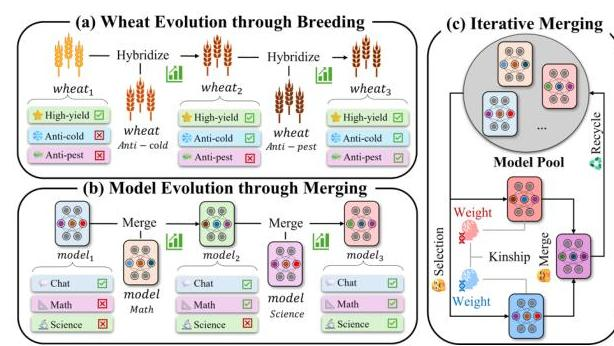
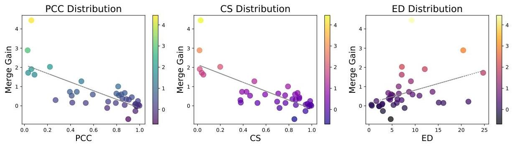
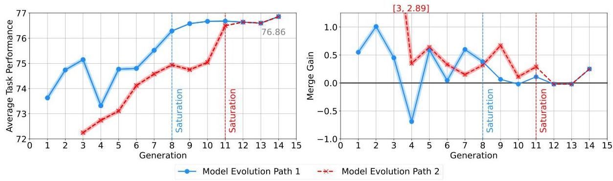
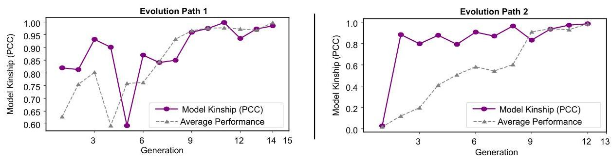
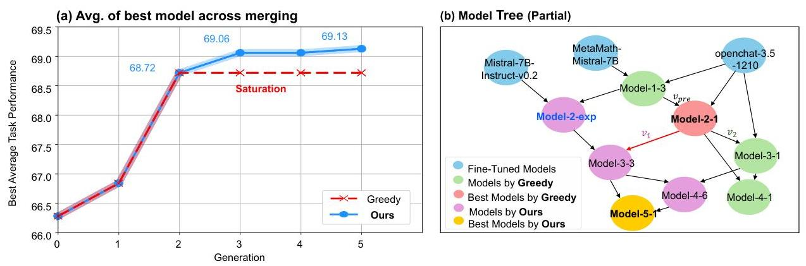
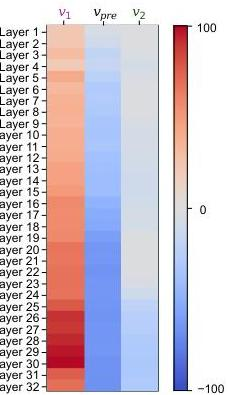
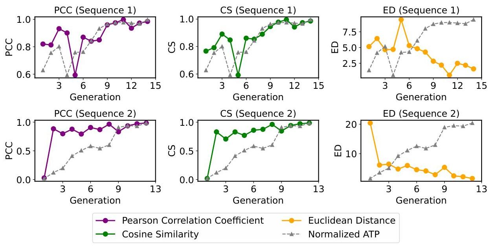
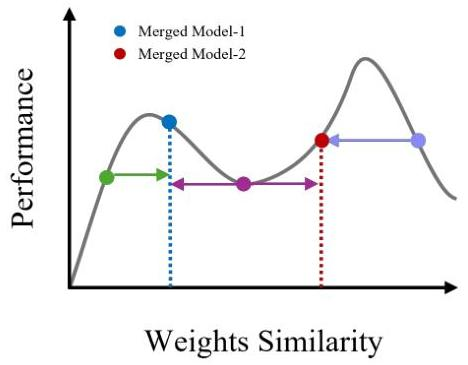
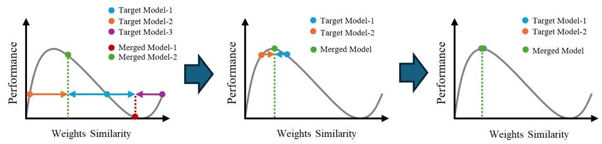
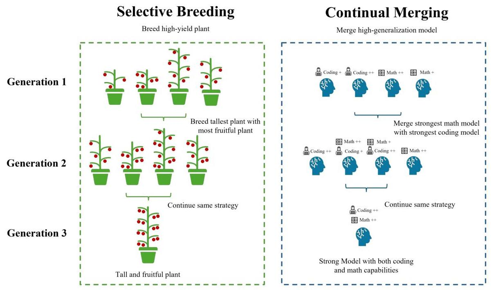

# Exploring Model Kinship for Merging Large Language Models 

Yedi Hu ${ }^{\text {A }}$, Yunzhi Yao ${ }^{\text {A }}$, Ningyu Zhang ${ }^{\text {A }}$, Huajun Chen ${ }^{\text {A }}$, Shumin Deng ${ }^{\text {® }}$<br>${ }^{\text {A }}$ Zhejiang University ${ }^{\diamond}$ National University of Singapore, NUS-NCS Joint Lab<br>\{231sm,zhangningyu\}@zju.edu.cn shumin@nus.edu.sg


#### Abstract

Model merging has emerged as a key technique for enhancing the capabilities and efficiency of Large Language Models (LLMs). The opensource community has driven model evolution by iteratively merging existing models, yet a principled understanding of the gains and underlying factors in model merging remains limited. In this work, we study model evolution through iterative merging, drawing an analogy to biological evolution, and introduce the concept of model kinship, the degree of similarity or relatedness between LLMs. Through comprehensive empirical analysis, we show that model kinship is closely linked to the performance improvements achieved by merging, providing a useful criterion for selecting candidate models. Building on this insight, we propose a new model merging strategy: Top- $k$ Greedy Merging with Model Kinship, which can improve benchmark performance. Specifically, we discover that incorporating model kinship as a guiding criterion enables continuous merging while mitigating performance degradation caused by local optima, thereby facilitating more effective model evolution ${ }^{1}$.


## 1 Introduction

Fine-tuning pre-trained models (PTMs) for downstream tasks has become a popular practice, and has proven particularly effective for Large Language Models (LLMs) (Kolesnikov et al., 2020; Qiu et al., 2020; Askell et al., 2021; Ouyang et al., 2022; Zhao et al., 2023). However, deploying separate fine-tuned models for each task can be resource-intensive (Fifty et al., 2021), which drives increasing demands for multi-task learning solutions (Zhang and Yang, 2022; Yu et al., 2024a; Lu et al., 2024; Liu et al., 2024).

[^0]

Figure 1: An intuitive comparison between wheat evolution and model evolution. A parallel can be drawn between biological reproduction (Part a) and the process of model evolution (Part b). In biological systems, offspring inherit genetic material from both parents, forming a new genotype through the combination of parental traits. Similarly, in model merging, the merged model inherits parameters or weights from the contributing models. Part c demonstrates the iterative execution of model evolution. Starting with a group of LLMs, the repository evolves through a Selection-Merge-Recycle iteration. Notably, model kinship can serve as an effective tool to guide this iterative model merging process (e.g., infer whether there may be gains after model merging.).

Recent studies suggest that model merging (Singh and Jaggi, 2020; Sung et al., 2023; Goddard et al., 2024; Matena and Raffel, 2022; Yang et al., 2024a; Jang et al., 2024) offers a viable approach for achieving multi-task objectives by integrating multiple expert models. Furthermore, advances in model merging toolkits (Goddard et al., 2024; Tang et al., 2024) have lowered the technical barrier, allowing users with limited expertise to easily conduct merging experiments, thus leading to an evolution of LLMs for the community.

At present, researchers have developed various powerful LLMs using model merging techniques (Beeching et al., 2023). Many of these models are created through a biologically inspired evolutionary process involving iterative merging, an approach that we refer to as model evolution (Figure 1(a,b)).


[^0]:    ${ }^{1}$ Corresponding Author.
    ${ }^{1}$ Code is available at https://github.com/zjunlp/ ModelKinship.

Despite these successes, current merging practice faces critical limitations. Progress often relies on continuous trial and extensive human expertise, with little formal guidance or standardized procedure. To address this problem, we propose an iterative model merging framework (Figure 1(c)), leveraging explicit strategies to guide the direction of model evolution toward improved performance. We show that even a simple greedy strategy can outperform baseline merging approaches.

However, in the later stages of both communitydriven model merging experiments and greedy evolution strategies, achieving additional gains in multi-task capability becomes increasingly challenging. To explore possible solutions, we introduce 'model kinship', a metric inspired by the concept of kinship in evolutionary biology (Sahlins, 2013), to inform and enhance the merging process. Model kinship is designed to quantify the degree of similarity or relationship between models throughout the iterative merging process. By offering a principled framework for measuring these relationships, model kinship provides valuable insights that can refine merging strategies for model evolution.

We conduct a comprehensive analysis of model merging experiments based on model kinship. We observe that the model merging process consists of two distinct stages: (1) an improving stage, where models exhibit significant performance gains, and (2) a saturation stage, where improvements diminish and eventually plateau. Empirically, we find a strong correlation between model kinship and variations in average task performance, suggesting that model kinship is indicative of potential effectiveness for model merging. These findings inspire two main insights: (1) high-kinship merges can lead to performance stagnation, akin to inbreeding; (2) low-kinship merges carry greater risk but may yield larger gains and facilitate escape from local optima.

Inspired by this, we propose a novel continual model merging strategy: Top-k Greedy Merging with Model Kinship. Specifically, we find that leveraging model kinship as a criterion enables more effective model merging, helping mitigate degradation and avoid local optima during model evolution. Furthermore, model kinship also proves useful as an early stopping criterion, improving efficiency of the merging process.

In general, this paper mainly contains four key contributions:

1. Iterative Model Merging as a Framework for Model Evolution: We propose continual model merging as a viable framework for evolving LLMs. Through strategically guided merging across iterations, this approach yields consistent improvements in generalization and task performance.
2. Introducing Model Kinship: We introduce model kinship, designed to assess the degree of similarity or relationship between LLMs during the merging process, which can guide model merging strategies and holds promise for advancing auto merging research.
3. Empirical Analysis of Model Evolution: We present a comprehensive empirical analysis of model evolution through iterative merging. Our findings highlight the dynamics of multitask performance improvement and stagnation during evolution. In addition, we propose a preliminary explanation of the underlying mechanisms using model kinship.
4. Practical Model Merging Strategies with Model Kinship: We demonstrate how model kinship guides the model merging process to tackle optimization challenges, and provide practical strategies: Top-k Greedy Merging with Model Kinship, to enhance efficiency and effectiveness of model evolution.

## 2 Background

### 2.1 Model Merging: Fundamentals

Model merging aims to integrate two or more domain-specific models into a unified framework, thereby harnessing their composite capabilities across multiple tasks (Sung et al., 2023). While this approach shares conceptual similarities with ensemble methods (Dietterich et al., 2002; Dong et al., 2020; Jiang et al., 2023b), model merging generates a single, generalized model, avoiding the increased inference time associated with ensembles. Let $f_{i}$ represent the $i$-th model for merging, each with its unique parameters $\theta_{i}$. If the merging process follows method $\mathcal{F}$, the prediction $\hat{y}$ of the merged model $f_{\text {merge }}$ for input $x$ is:

$$
\hat{y}=f_{\text {merge }}(x)=\mathcal{F}\left(f_{1}\left(x ; \theta_{1}\right), f_{2}\left(x ; \theta_{2}\right), \ldots, f_{n}\left(x ; \theta_{n}\right)\right)
$$

### 2.2 Model Evolution: Benefits and Challenges

Parameter averaging methods allow merged models to retain the same architecture and parameter size

as their original components, enabling reuse in subsequent merging steps. Leveraging this property, the open-source community has progressively enhanced model performance through repeated merging, leading to a "Model Evolution". Empirical evidence from the Open LLM Leaderboard *Beeching et al. (2023)* shows that this iterative model merging process can produce highly generalized models, often outperforming those produced through a single merging step *Maxime Labonne (2024)*.

Despite these advances, current community practices largely rely on random merging by multiple contributors, which results in high computational costs and unstable behavior, limiting their practicality for industrial applications.

## 3 Iterative Model Merging and Strategy Boost

In this section, we present controlled experiments to demonstrate that iterative model merging, the process of repeatedly combining models, can help stabilize improvements in multi-task capability. Moreover, we demonstrate that incorporating a selection strategy, such as Top-$k$ Greedy, yields more substantial performance improvements.

### 3.1 Iterative Model Merging Framework

We formally define iterative model merging as a modular framework that evolves a population of models through repeated merging. It is governed by three components: a selection strategy $\mathcal{S}$, which selects candidate models from the pool $\mathcal{P}_{t}$; a merging operator $\mathcal{M}$, such as SLERP or weighted averaging, to combine the selected models; and an stopping criterion $\mathcal{E}$, which determines when to stop the process.

At each generation $t$, a subset $\mathcal{S}_{t} \subseteq \mathcal{P}_{t}$ is selected using $\mathcal{S}$, merged via $\mathcal{M}$, and the resulting model $M_{t+1}$ is added back to the pool. The process continues until the stopping criterion $\mathcal{E}$ is met:

$$
M_{t+1}=\mathcal{M}\left(\mathcal{S}\left(\mathcal{P}_{t}\right)\right) \quad \text { until } \quad \mathcal{E}\left(M_{t+1}\right)
$$

### 3.2 Setup

Baseline Methods. We consider two types of baselines: (1) Multi-model merging methods that support merging all models at once, such as TIES *Yadav et al. (2023)*, Dare-TIES *Yu et al. (2024b)*, and Linear; and (2) Sequential merging, where models are merged pairwise using SLERP *Shoemake (1985)*.

Top- $k$ Greedy Merging. Our approach applies iterative model merging using a Top- $k$ greedy selection strategy on $n$ LLMs (see Algorithm 1). Each merge step uses SLERP. We also include a random merge baseline (Appendix C.2).

Models and Datasets. We use three HuggingFace LLMs based on Mistral-7B: mistral-7b-instruct-v0.2, metamath-mistral-7b, and open-chat-3.5-1210.

Evaluation. Models are evaluated on Winogrande, GSM8k, and TruthfulQA, which highlight their task-specific strengths. Dataset details are in Appendix A.3.

### 3.3 Results

As shown in Table 1, iterative model merging can yield better generalization when combining multiple tasks. In particular, both random and Top- $k$ greedy iterative merging outperform onestep baselines, demonstrating the effectiveness of continual merging. While single-step merging methods can sometimes achieve strong results (e.g., Linear or Dare Ties), their performance is often unstable and sensitive to hyperparameter. Ties, for instance, fails drastically on GSM8k. Sequential SLERP merging shows similar limitations, as its performance varies significantly depending on the merge order. In contrast, iterative merging strategies are more stable, consistently yielding robust performance across tasks.

However, these methods offer only marginal improvements. This raises a key question: How can we further enhance performance beyond the current limits of naive or greedy strategies?

## 4 Preliminary Analysis of Model Kinship

To address this limitation, we investigate whether structural signals beyond raw performance can guide model selection. We introduce model kinship, a metric capturing parameter-space similarity, and conduct a preliminary analysis to examine its correlation with merge gains in community-merged LLMs. This helps assess the potential of kinshipaware strategies in guiding continual merging and avoiding local optima.

### 4.1 Model Kinship

Drawing inspiration from the parallel between artificial selection and model evolution (as detailed in Appendix G), we hypothesize that a concept

| Method | TruthfulQA | Winogrande | GSM8k | Avg. |
| --- | --- | --- | --- | --- |
| Ties (Density=0.5, Weight=0.3) | 62.76 | 79.56 | 8.79 | 50.37 |
| Dare Ties (Density=0.5, Weight=0.3) | 59.36 | 79.08 | 65.73 | 68.05 |
| Linear (Weight=0.3) | 56.37 | 78.08 | 68.54 | 67.66 |
| Sequential SLERP Merge (ord1) | 47.15 | 76.24 | 53.15 | 58.84 |
| Sequential SLERP Merge (ord2) | 61.01 | 79.56 | 63.76 | 68.11 |
| Sequential SLERP Merge (ord3) | 49.80 | 78.53 | 55.72 | 61.35 |
| Random Merging (k=3) | 54.32 | 78.53 | 72.81 | 68.55 |
| Top k Greedy Merging (k=3) | 50.94 | 80.11 | 75.13 | 68.72 |

Table 1: Performance Comparison across multi-model merging, sequential model merging with different SLERP orders, and iterative model merging with strategy.
analogous to kinship, the genetic relatedness studied in evolutionary biology (Thompson, 1985), can also apply to model merging. Specifically, we introduce the notion of model kinship, a metric designed to capture and quantify the evolutionary relationships between the merge candidates. This analogy suggests that, as genetic kinship affects breeding outcomes, model kinship similarly influences the effectiveness of merging strategies in enhancing multi-task performance.

We adopt the most intuitive representation, inspired by the cosine similarity analysis introduced in the Task Arithmetic paper (Ilharco et al., 2023). This metric is designed to evaluate the degree of similarity or relatedness between the task capabilities of large language models (LLMs) based solely on their "genetic" information, meaning the changes in their weights, during model evolution. Considering two models $m_{i}, m_{j}$ involved in a model evolution originated from the pre-trained model $m_{\text {base }}$, the weights of $m_{i}, m_{j}$ are denoted as $\theta_{\mathrm{i}}, \theta_{\mathrm{j}} \in \mathbb{R}^{d}$. Similarly, $\theta_{\text {base }} \in \mathbb{R}^{d}$ represents the weights of the pre-trained model. Since the differences between models emerge after fine-tuning and merging, the variation of weights during model evolution is crucial. It is calculated as:

$$
\delta_{\mathrm{i}}=\theta_{\mathrm{i}}-\theta_{\text {base }}, \delta_{\mathrm{j}}=\theta_{\mathrm{j}}-\theta_{\text {base }}
$$

Model kinship $r$ is designed to capture the similarity of task capabilities between models. In this paper, we explore multiple potential metrics for evaluating similarity. For the calculation, $\operatorname{sim}(\cdot, \cdot)$ denotes the similarity metric function used. Considering two cases merging of 2 models and merging of $n$ models, we define model kinship $r$ as:

$$
r=\left\{\begin{array}{l}
\operatorname{sim}\left(\delta_{1}, \delta_{2}\right), \\
\frac{2}{n(n-1)} \sum_{1 \leq i<j \leq n} \operatorname{sim}\left(\delta_{\mathrm{i}}, \delta_{\mathrm{j}}\right),
\end{array} \quad\right. \text { (Merge N) }
$$

We investigate the relationship between task performance and model kinship (see Appendix E for
the full analysis). The results reveal strong correlations, reinforcing the view that model kinship reflects task-related differences between models.

### 4.2 Evaluation Metrics

Let $T$ be the set of tasks in the task group, where $T=\left\{T_{1}, T_{2}, \ldots, T_{n}\right\}$. Each task $T_{i}$ in the set $T$ is associated with a performance measure $P_{i}$ for the LLM. For a multi-task objective, the Average Task Performance (Avg.) $\bar{P}$ is calculated by:

$$
\bar{P}=\frac{1}{n} \sum_{i=1}^{n} P_{\mathrm{i}}
$$

To evaluate the effectiveness of a single merge, we propose the merge gain metric. Assume we have two models $m_{p r e-1}$ and $m_{p r e-2}$ and their average task performance are $\bar{P}_{p r e-1}$ and $\bar{P}_{p r e-2}$, intuitively, we believe the $\bar{P}_{\text {merged }}$ lie around the mean of $\bar{P}_{p r e-1}$ and $\bar{P}_{p r e-2}$. The merge gain is calculated as the difference of $\bar{P}_{\text {merged }}$ from the mean value of $\bar{P}_{p r e-1}$ and $\bar{P}_{p r e-2}$. For a merging recipe with $k$ models, the merge gain is:

$$
\text { Gain }=\bar{P}_{\text {merged }}-\frac{1}{k} \sum_{i=1}^{k} \bar{P}_{\text {pre-i }}
$$

In the following analysis, we use the task group T = $\{$ ARC, HellaSwag, MMLU, TruthfulQA, Winogrande, GSM8K\}. All models are either fine-tuned or merged from the Mistral-7B architecture.

### 4.3 Analysis of Model Kinship: Correlation and Evolution Dynamics

In this section, we analyze model kinship from two perspectives: (1) its correlation with performance gain across a broad range of open-sourced LLM merges, and (2) its dynamic along specific model evolution paths. These analyses aim to clarify the relationship between model kinship and multi-task capability improvements, as well as to identify phases of merge effectiveness.



Figure 2: Distribution of Sample Experiments: Relationship Between Model Kinship (X-axis) and Merge Gain (Y-axis). Model kinships are calculated using PCC, CS, and ED.



Figure 3: Change in Average Task Performance and Merge Gain across the Model Evolution Process: Paths originate from two different base models. The vertical line marks the transition to the saturation stage. Path 2 is temporally aligned with Path 1 for clarity.

### 4.3.1 Correlation Between Model Kinship and Performance Gain

We begin by exploring the potential relationship between merge gain and model kinship using three similarity metrics: *Pearson Correlation Coefficient (PCC)*, *Cosine Similarity (CS)*, and *Euclidean Distance (ED)*. The models used are based on the *Mistral-7B* architecture (Jiang et al., 2023a) and collected from HuggingFace, with reference to the Open LLM Leaderboard (see Appendix A).

As illustrated in Figure 2, the scatter plots derived from all three metrics suggest a moderate correlation between model kinship and merge gain. Table 2 reports Pearson correlation values for both signed and absolute merge gains. While the correlations for signed gains appear relatively weak (with p-values between 0.05 and 0.1), those for absolute merge gains are comparatively stronger and show greater statistical significance. These observations imply that **model kinship may offer some indication of the potential magnitude of merge gains, though it appears less effective at predicting the direction of change**. While we cannot assert a causal relationship, the association provides useful insight into how kinship might relate to merge outcomes. In light of the comparable performance across the three metrics, we use PCC-based kinship in the remainder of our analysis for consistency.

### 4.3.2 Model Kinship in Evolution Paths

As a further exploration, we examine model kinship across independent model evolution paths to investigate potential phase patterns in the merging process. This analysis centers on the *yamshadow experiment 28-7B* (Labonne, 2024), a Mistral-7B-based model that ranks among the top-performing merged models on the Open LLM Leaderboard. From its model family tree, we extract two main merging trajectories, referred to as **Path 1** and **Path 2**, for comparison.

Figure 3 displays the average task performance and the merge gains along the two evolution paths. The merging process exhibits two distinct phases:

- **Improving Stage.** Rapid performance gains and significant merge improvements, driven by active multi-task balance.
- **Saturation Stage.** Performance stabilizes, and additional merges result in minimal or no measurable improvement.



Figure 4: Comparison between Model Kinship (PCC) and Average Task Performance (normalized to the same scale).



Figure 5: Left (a): The comparison of task performance improvement across merging generations. The red curve (greedy strategy) saturates by generation 2, while the blue curve (modified strategy) escapes the local optima at generation 2 and continues improving multi-task capabilities. Right (b): The partial model family tree from controlled experiments. The red arrow shows critical changes between experiment 1 and 2 in the evolution path.

|  Metric | Correlation
(Normal Value) | Correlation
(Absolute Value)  |
| --- | --- | --- |
|  PCC | -0.50 | -0.59  |
|  P-value | 0.063 | 0.023  |
|  CS | -0.45 | -0.66  |
|  P-value | 0.098 | 0.008  |
|  ED | 0.46 | 0.67  |
|  P-value | 0.091 | 0.007  |

Table 2: Correlation of Model Kinship based on different correlation function *s**i**m*(·, ·) with Merge Gain, along with their corresponding p-values.

Figure 4 shows how the model kinship and normalized average performance change over the course of the merging process. Both metrics exhibit a consistent two-phase trend: an *Improving Stage*, characterized by steady increases, followed by a *Saturation Stage*, where growth plateaus. This parallel progression highlights a potential correlation between model kinship and performance gains, indicating that enhancements in generalization are not only concurrent with but may also be facilitated by increases in model kinship.

To move beyond individual Evolution Paths, we further investigate how model kinship develops across different stages of the merging process, thereby extending our analysis to the broader evolutionary landscape (refer to Appendix D.1). Our findings reveal that the highest-performing models maintain strong mutual kinship. However, this close relatedness can also induce a stagnation phase, where the lack of diversity limits further performance improvements.

### 4.4 Discussion

Considering all results that we observed, this analysis provides two main insights for the application of model kinship:

- High kinship merges may lead to performance stagnation, similar to biological inbreeding, where excessive similarity limits the ability to adjust.
- Low kinship merges involve risk, but can result in greater gains, potentially enabling escape from local optima caused by the greedy strategy.

| Greedy Strategy | | | | | + Model Kinship | | | | | |
| --- | --- | --- | --- | --- | --- | --- | --- | --- | --- | --- |
| Model | Avg. | Gain | $\Delta$ Avg. to Top | Kinship | Model | Avg. | Gain | $\Delta$ Avg. to Top | Kinship |
| MetaMath | 63.72 | / | / | / | MetaMath | 63.72 | / | / | / |
| Instruct | 61.82 | / | / | / | Instruct | 61.82 | / | / | / |
| Open-chat | 66.28 | / | / | / | Open-chat | 66.28 | / | / | / |
| model-1-1 | 62.17 | $-0.6$ | $-4.11$ | 0.01 | model-1-1 | 62.17 | $-0.6$ | $-4.11$ | 0.01 |
| model-1-2 | 64.02 | $-0.03$ | $-2.26$ | $-0.02$ | model-1-2 | 64.02 | $-0.03$ | $-2.26$ | $-0.02$ |
| model-1-3 | 66.84 | $+1.84$ | $+0.56$ | 0.05 | model-1-3 | 66.84 | $+1.84$ | $+0.56$ | 0.05 |
| model-2-1 | 68.72 | $+2.16$ | $+1.88$ | 0.93 | model-2-1 | 68.72 | $+2.16$ | $+1.88$ | 0.93 |
| model-2-2 | 61.47 | $-3.96$ | $-7.25$ | 0.57 | model-2-2 | 61.47 | $-3.96$ | $-7.25$ | 0.57 |
| model-2-3 | 61.32 | $-3.83$ | $-7.40$ | 0.58 | model-2-3 | 61.32 | $-3.83$ | $-7.40$ | 0.58 |
| model-3-1 | 68.59 | $+1.09$ | $-0.13$ | 0.95 | model-3-2 | 67.74 | $+1.09$ | $-0.98$ | 0.93 |
| model-3-2 | 67.74 | $-0.04$ | $-0.98$ | 0.93 | model-3-3 | 69.06 | $+0.74$ | $+0.34$ | 0.24 |
|  | - | - | - | - | model-3-4 | 68.61 | $+1.13$ | $-0.11$ | 0.32 |
| model-4-1 | 68.51 | $-0.14$ | $-0.08$ | 0.98 | model-4-4 | 68.75 | $-0.14$ | $-0.31$ | 0.54 |
| model-4-2 | 68.04 | $-0.19$ | $-0.67$ | 0.98 | model-4-5 | 68.39 | $-0.27$ | $-0.36$ | 0.66 |
| model-4-3 | 68.53 | $+0.37$ | $-0.06$ | 0.94 | model-4-6 | 69.03 | $+0.15$ | $+0.42$ | 0.52 |
|  | - | - | - | - | model-5-1 | 69.13 | $+0.04$ | $+0.10$ | 0.65 |
|  | - | - | - | - | model-5-2 | 68.98 | $+0.07$ | $-0.15$ | 0.65 |
|  | - | - | - | - | model-5-3 | 68.63 | $-0.37$ | $-0.50$ | 0.98 |

Table 3: Results of merging experiments comparing the vanilla greedy strategy and our proposed approach. The first three models serve as the foundation models in both experiments. Note: The model kinship experiment was terminated at generation 5, as it has already outperformed the greedy strategy by that point.

## 5 Using Model Kinship to Improve Model Merging

Building on the insights from section 4, we explore how model kinship can be leveraged to improve the model merging process. Our main experiment centers on the Mistral-7B model, with detailed results presented in the main text. To further evaluate the generalization of our approach, we also conduct two supplementary experiments: one based on Llama-2 (see Appendix B) and another on a distinct task set to test robustness across different evaluation settings. Our results indicate that while greedy strategy focuses on short-term gains, it can lead to suboptimal outcomes. By integrating model kinship, we can help the strategy avoid local optima and gain further improvements.

### 5.1 Main Experiment Setup

For the main experiments, we follow the same settings as described in section 3, including the use of the three fine-tuned Mistral-7B variants and the evaluation on Winogrande, GSM8k, and TruthfulQA. We adopt the Top- $k$ Greedy Merging strategy as the baseline iterative merging strategy ${ }^{2}$.

## Top $k$ Greedy Merging with Model Kinship.

We propose an enhanced merging strategy that augments the original greedy approach with an additional exploration step guided by model kinship

[^0](highlighted in blue in Algorithm 1). This approach aims to merge the best-performing model with the model that has the most distinct kinship, in order to discover potentially better solutions. In Figure 5 (b), models generated by our strategy are marked in purple, while the best-performing models are marked in yellow.

### 5.2 Results and Discussion

Figure 5 (a) illustrates the improvements in top average task performance across merging generations. Table 3 provides model average task performance, merge gain, and model kinship for each generation, comparing the original greedy merging strategy with our kinship-based method. While both strategies achieve the multi-task objective,


Figure 6: Weight Change between two Evolution Paths.
the vanilla greedy strategy ceases to improve after Generation 2, plateauing at an average task performance of $\mathbf{6 8 . 7 2}$. In contrast, strategy utilizing model kinship escapes the local optima (Model-2-1) and continues to improve, reaching 69.13 by Generation 5.


[^0]:    ${ }^{2}$ We provide a Google Colab Notebook.

Merging Models with Low Kinship can Boost Exploration. Figure 5 (b) shows the main branch of the model family tree. To explore how lowkinship merges help escape local optima during saturation, we analyze weight changes: $v_{1}$ (from Model-2-1 to Model-3-1) and $v_{2}$ (from Model-2-1 to Model-3-3), with $v_{\text {pre }}$ (from Model-1-3 to Model-2-1) as baseline. Figure 6 shows that merging with the exploration model $\left(v_{2}\right)$ produces significant, novel weight changes, while $v_{1}$ shows minimal change due to the high similarity between openchat3.5 and Model-2-1.

Early Stopping at High Kinship can Improve Efficiency. Iterative model merging can be resource intensive. In our main experiments, a greedy strategy saturated after 2/4 merges with no further gains. Looking back at community experiments, 5/14 merges in path 1 averaged only 0.57 improvement, and 3/12 merges in path 2 averaged 0.36. A high kinship score (PCC $>0.9$ ) among top models may indicate convergence. Stopping merges early at high kinship generation saves $\mathbf{3 0 \%}$ time with negligible performance loss.

## 6 Related work

Weight averaging, a widely used technique in model merging, traces its origins to Utans (1996). Since the 2010s, weight averaging has been widely applied in deep neural networks, notably for combining checkpoints to improve training stability and performance. (Nagarajan and Kolter, 2019; Tarvainen and Valpola, 2017; Izmailov et al., 2018; Li et al., 2023a; Stoica et al., 2023; Padmanabhan et al., 2023; Jang et al., 2023), leveraging task-specific information (Li et al., 2023b; Ilharco et al., 2022; Izmailov et al., 2018; Smith and Gashler, 2017), and parallel training of large language models (LLMs) (Li et al., 2022). Discovery of Linear Mode Connectivity (LMC) (Garipov et al., 2018; Frankle et al., 2020; Entezari et al., 2022) further expands the use of weight averaging in fusing fine-tuned models through averaging methods (Neyshabur et al., 2020; Wortsman et al., 2022). Further studies have explored optimizable weights for merging, such as Fisher-Merging (Matena and Raffel, 2022), RegMean (Jin et al., 2023), AdaMerging (Yang et al., 2024b), MaTS (Tam et al., 2024). Ilharco et al. (2023) introduce task vectors, representing the weight difference between a fine-tuned model and its base. Further research on parameter interference led to TIES
(Yadav et al., 2023), which preserves important weights and reduces sign conflicts, and DARE (Yu et al., 2024b), which prevents interference by randomly dropping weights. The Model Breadcrumbs (Davari and Belilovsky, 2023) show that the removal of outliers in parameters can reduce noise in model merging. Merging models with different initializations requires additional considerations. Common methods exploit the permutation symmetry of neural networks (Ainsworth et al., 2022; Tatro et al., 2020; Singh and Jaggi, 2020; GuerreroPeña et al., 2023), using alignment techniques to mitigate the interpolation barrier (Xu et al., 2024; Navon et al., 2024). While weight averaging cannot be applied to models with different architectures, it can still be used to enhance feasible fusion methods. Recent work like FuseChat (Wan et al., 2024b) integrates it with Knowledge Fusion (Wan et al., 2024a) to enable novel fusion approaches. Li et al. (2025) further demonstrate that model merging can stabilize training and serve as a low-cost simulator for annealed performance during pretraining, enabling checkpoint reuse and faster validation.

Recently, there have been some works exploring "model evolution". Tellamekala et al. (2024) propose the CoLD Fusion method, showing that iterative fusion can create effective multi-task models. Labonne (2024) develop a tool to automatically merge models on HuggingFace. Akiba et al. (2024) introduce Evolutionary Model Merge, employing evolutionary techniques to optimize model combinations. Tang et al. (2025) present a continual model merging method that enables training-free projection-based merging of models as they arrive sequentially, improving efficiency and task retention without retraining.

## 7 Conclusion

We propose iterative model merging as a framework for evolving large language models through strategic, iterative merges that yield consistent gains in generalization and task performance. To support this framework, we introduce model kinship, a metric that guides merge candidate selection and explains both performance gains and stagnation during merging. Building on this, we propose Top- $k$ Greedy Merging with Model Kinship, a strategy that uses kinship to escape local optima and achieve further improvements. Kinship also serves as an early stopping signal by detecting convergence and reducing redundant computation.

In a broad sense, our work explores how models can achieve autonomous evolution through model merging. Model merging can, to some extent, be likened to biological hybridization. Biological organisms have undergone billions of years of evolution to reach their current state. However, how silicon-based intelligence, represented by LLMs, evolves remains an unresolved mystery. We aspire that this work offer guidance and insights for the future merging and evolution of LLMs.

## Limitations

This study has several limitations: a) Our experiments are limited to two model architectures. It remains unclear whether our metric and method generalize to other architectures, such as Mamba (Gu and Dao, 2023). In addition, the scalability of tasks and candidate models requires further evaluation to assess computational costs in diverse settings. b) The analysis relies on open-source data from the Open Leaderboard. As this dataset is community-generated, it may be affected by noise or user bias. c) We have not fully explored alternative correlation metrics for measuring model kinship. Other metrics may yield stronger or more consistent performance. d) Our demonstration of model kinship is empirical. A more rigorous theoretical framework, such as the assumptions outlined in Appendix E.1, is needed to explain model evolution and kinship in greater depth. e) While model kinship currently guides merging and improves performance, it does not support sustained evolution. Future progress may require incorporating environmental feedback, reward models (Silver et al., 2021), and novel architectures.

## Acknowledgments

This work was supported by the National Natural Science Foundation of China (No. 62576307), Ningbo Natural Science Foundation (2024J020), the Ministry of Education, Singapore, under the Academic Research Fund Tier 1 (FY2023) (Grant A-8001996-00-00), the Academic Research Fund Tier 1 (FY2025) (Grant T1 251RES2507), Tencent AI Lab Rhino-Bird Focused Research Program (RBFR2024003), and Information Technology Center and State Key Lab of CAD\&CG, Zhejiang University.

## References

Samuel K. Ainsworth, Jonathan Hayase, and Siddhartha S. Srinivasa. 2022. Git re-basin: Merging models modulo permutation symmetries. CoRR, abs/2209.04836.

Takuya Akiba, Makoto Shing, Yujin Tang, Qi Sun, and David Ha. 2024. Evolutionary optimization of model merging recipes. CoRR, abs/2403.13187.

Amanda Askell, Yuntao Bai, Anna Chen, Dawn Drain, Deep Ganguli, Tom Henighan, Andy Jones, Nicholas Joseph, Benjamin Mann, Nova DasSarma, Nelson Elhage, Zac Hatfield-Dodds, Danny Hernandez, Jackson Kernion, Kamal Ndousse, Catherine Olsson, Dario Amodei, Tom B. Brown, Jack Clark, and 3 others. 2021. A general language assistant as a laboratory for alignment. CoRR, abs/2112.00861.

Edward Beeching, Clémentine Fourrier, Nathan Habib, Sheon Han, Nathan Lambert, Nazneen Rajani, Omar Sanseviero, Lewis Tunstall, and Thomas Wolf. 2023. Open llm leaderboard. https://huggingface.co/ spaces/open-llm-leaderboard-old/open_llm_ leaderboard.

MohammadReza Davari and Eugene Belilovsky. 2023. Model breadcrumbs: Scaling multi-task model merging with sparse masks. CoRR, abs/2312.06795.

Thomas G Dietterich and 1 others. 2002. Ensemble learning. The handbook of brain theory and neural networks, 2(1):110-125.

Xibin Dong, Zhiwen Yu, Wenming Cao, Yifan Shi, and Qianli Ma. 2020. A survey on ensemble learning. Frontiers Comput. Sci., 14(2):241-258.

Rahim Entezari, Hanie Sedghi, Olga Saukh, and Behnam Neyshabur. 2022. The role of permutation invariance in linear mode connectivity of neural networks. In The Tenth International Conference on Learning Representations, ICLR 2022, Virtual Event, April 25-29, 2022. OpenReview.net.

Chris Fifty, Ehsan Amid, Zhe Zhao, Tianhe Yu, Rohan Anil, and Chelsea Finn. 2021. Efficiently identifying task groupings for multi-task learning. In Advances in Neural Information Processing Systems 34: Annual Conference on Neural Information Processing Systems 2021, NeurIPS 2021, December 6-14, 2021, virtual, pages 27503-27516.

Jonathan Frankle, Gintare Karolina Dziugaite, Daniel M. Roy, and Michael Carbin. 2020. Linear mode connectivity and the lottery ticket hypothesis. In Proceedings of the 37th International Conference on Machine Learning, ICML 2020, 13-18 July 2020, Virtual Event, volume 119 of Proceedings of Machine Learning Research, pages 3259-3269. PMLR.

Timur Garipov, Pavel Izmailov, Dmitrii Podoprikhin, Dmitry P. Vetrov, and Andrew Gordon Wilson. 2018. Loss surfaces, mode connectivity, and fast ensembling of dnns. In Advances in Neural Information

Processing Systems 31: Annual Conference on Neural Information Processing Systems 2018, NeurIPS 2018, December 3-8, 2018, Montréal, Canada, pages 8803-8812.

Charles Goddard, Shamane Siriwardhana, Malikeh Ehghaghi, Luke Meyers, Vlad Karpukhin, Brian Benedict, Mark McQuade, and Jacob Solawetz. 2024. Arcee's mergekit: A toolkit for merging large language models. CoRR, abs/2403.13257.

Albert Gu and Tri Dao. 2023. Mamba: Linear-time sequence modeling with selective state spaces. CoRR, abs/2312.00752.

Fidel A. Guerrero-Peña, Heitor Rapela Medeiros, Thomas Dubail, Masih Aminbeidokhti, Eric Granger, and Marco Pedersoli. 2023. Re-basin via implicit sinkhorn differentiation. In IEEE/CVF Conference on Computer Vision and Pattern Recognition, CVPR 2023, Vancouver, BC, Canada, June 17-24, 2023, pages 20237-20246. IEEE.

Gabriel Ilharco, Marco Túlio Ribeiro, Mitchell Wortsman, Ludwig Schmidt, Hannaneh Hajishirzi, and Ali Farhadi. 2023. Editing models with task arithmetic. In The Eleventh International Conference on Learning Representations, ICLR 2023, Kigali, Rwanda, May 1-5, 2023. OpenReview.net.

Gabriel Ilharco, Mitchell Wortsman, Samir Yitzhak Gadre, Shuran Song, Hannaneh Hajishirzi, Simon Kornblith, Ali Farhadi, and Ludwig Schmidt. 2022. Patching open-vocabulary models by interpolating weights. In Advances in Neural Information Processing Systems 35: Annual Conference on Neural Information Processing Systems 2022, NeurIPS 2022, New Orleans, LA, USA, November 28 - December 9, 2022.

Pavel Izmailov, Dmitrii Podoprikhin, Timur Garipov, Dmitry P. Vetrov, and Andrew Gordon Wilson. 2018. Averaging weights leads to wider optima and better generalization. In Proceedings of the Thirty-Fourth Conference on Uncertainty in Artificial Intelligence, UAI 2018, Monterey, California, USA, August 6-10, 2018, pages 876-885. AUAI Press.

Dong-Hwan Jang, Sangdoo Yun, and Dongyoon Han. 2024. Model stock: All we need is just a few finetuned models. In Computer Vision - ECCV 2024 18th European Conference, Milan, Italy, September 29-October 4, 2024, Proceedings, Part XLIV, volume 15102 of Lecture Notes in Computer Science, pages 207-223. Springer.

Joel Jang, Seungone Kim, Bill Yuchen Lin, Yizhong Wang, Jack Hessel, Luke Zettlemoyer, Hannaneh Hajishirzi, Yejin Choi, and Prithviraj Ammanabrolu. 2023. Personalized soups: Personalized large language model alignment via post-hoc parameter merging. arXiv preprint arXiv:2310.11564.

Albert Q. Jiang, Alexandre Sablayrolles, Arthur Mensch, Chris Bamford, Devendra Singh Chaplot, Diego de Las Casas, Florian Bressand, Gianna Lengyel,

Guillaume Lample, Lucile Saulnier, Lélio Renard Lavaud, Marie-Anne Lachaux, Pierre Stock, Teven Le Scao, Thibaut Lavril, Thomas Wang, Timothée Lacroix, and William El Sayed. 2023a. Mistral 7b. CoRR, abs/2310.06825.

Dongfu Jiang, Xiang Ren, and Bill Yuchen Lin. 2023b. Llm-blender: Ensembling large language models with pairwise ranking and generative fusion. In Proceedings of the 61st Annual Meeting of the Association for Computational Linguistics (Volume 1: Long Papers), ACL 2023, Toronto, Canada, July 9-14, 2023, pages 14165-14178. Association for Computational Linguistics.

Xisen Jin, Xiang Ren, Daniel Preotiuc-Pietro, and Pengxiang Cheng. 2023. Dataless knowledge fusion by merging weights of language models. In The Eleventh International Conference on Learning Representations, ICLR 2023, Kigali, Rwanda, May 1-5, 2023. OpenReview.net.

Alexander Kolesnikov, Lucas Beyer, Xiaohua Zhai, Joan Puigcerver, Jessica Yung, Sylvain Gelly, and Neil Houlsby. 2020. Big transfer (bit): General visual representation learning. In Computer Vision ECCV 2020 - 16th European Conference, Glasgow, UK, August 23-28, 2020, Proceedings, Part V, volume 12350 of Lecture Notes in Computer Science, pages 491-507. Springer.

Maxime Labonne. 2024. Automerger experiments.
Margaret Li, Suchin Gururangan, Tim Dettmers, Mike Lewis, Tim Althoff, Noah A. Smith, and Luke Zettlemoyer. 2022. Branch-train-merge: Embarrassingly parallel training of expert language models. CoRR, abs/2208.03306.

Weishi Li, Yong Peng, Miao Zhang, Liang Ding, Han Hu , and Li Shen. 2023a. Deep model fusion: A survey. arXiv preprint arXiv:2309.15698.

Weishi Li, Yong Peng, Miao Zhang, Liang Ding, Han Hu , and Li Shen. 2023b. Deep model fusion: A survey. CoRR, abs/2309.15698.

Yunshui Li, Yiyuan Ma, Shen Yan, Chaoyi Zhang, Jing Liu, Jianqiao Lu, Ziwen Xu, Mengzhao Chen, Minrui Wang, Shiyi Zhan, Jin Ma, Xunhao Lai, Deyi Liu, Yao Luo, Xingyan Bin, Hongbin Ren, Mingji Han, Wenhao Hao, Bairen Yi, and 7 others. 2025. Model merging in pre-training of large language models. CoRR, abs/2505.12082.

Cong Liu, Xiaojun Quan, Yan Pan, Liang Li, Weigang Wu, and Xu Chen. 2024. Cool-fusion: Fuse large language models without training. CoRR, abs/2407.19807.

Jinliang Lu, Ziliang Pang, Min Xiao, Yaochen Zhu, Rui Xia, and Jiajun Zhang. 2024. Merge, ensemble, and cooperate! A survey on collaborative strategies in the era of large language models. CoRR, abs/2407.06089.

Michael Matena and Colin Raffel. 2022. Merging models with fisher-weighted averaging. In Advances in Neural Information Processing Systems 35: Annual Conference on Neural Information Processing Systems 2022, NeurIPS 2022, New Orleans, LA, USA, November 28 - December 9, 2022.

Maxime Labonne . 2024. Yamshadowexperiment28-7b.
Vaishnavh Nagarajan and J. Zico Kolter. 2019. Uniform convergence may be unable to explain generalization in deep learning. In Advances in Neural Information Processing Systems 32: Annual Conference on Neural Information Processing Systems 2019, NeurIPS 2019, December 8-14, 2019, Vancouver, BC, Canada, pages 11611-11622.

Aviv Navon, Aviv Shamsian, Ethan Fetaya, Gal Chechik, Nadav Dym, and Haggai Maron. 2024. Equivariant deep weight space alignment. In Fortyfirst International Conference on Machine Learning, ICML 2024, Vienna, Austria, July 21-27, 2024. OpenReview.net.

Behnam Neyshabur, Hanie Sedghi, and Chiyuan Zhang. 2020. What is being transferred in transfer learning? In Advances in Neural Information Processing Systems 33: Annual Conference on Neural Information Processing Systems 2020, NeurIPS 2020, December 6-12, 2020, virtual.

Long Ouyang, Jeffrey Wu, Xu Jiang, Diogo Almeida, Carroll L. Wainwright, Pamela Mishkin, Chong Zhang, Sandhini Agarwal, Katarina Slama, Alex Ray, John Schulman, Jacob Hilton, Fraser Kelton, Luke Miller, Maddie Simens, Amanda Askell, Peter Welinder, Paul F. Christiano, Jan Leike, and Ryan Lowe. 2022. Training language models to follow instructions with human feedback. In Advances in Neural Information Processing Systems 35: Annual Conference on Neural Information Processing Systems 2022, NeurIPS 2022, New Orleans, LA, USA, November 28 - December 9, 2022.

Arthi Padmanabhan, Neil Agarwal, Anand Iyer, Ganesh Ananthanarayanan, Yuanchao Shu, Nikolaos Karianakis, Guoqing Harry Xu, and Ravi Netravali. 2023. Gemel: Model merging for [MemoryEfficient], {Real-Time} video analytics at the edge. In 20th USENIX Symposium on Networked Systems Design and Implementation (NSDI 23), pages 973994.

Xipeng Qiu, Tianxiang Sun, Yige Xu, Yunfan Shao, Ning Dai, and Xuanjing Huang. 2020. Pre-trained models for natural language processing: A survey. CoRR, abs/2003.08271.

Marshall Sahlins. 2013. What kinship is-and is not. University of Chicago Press.

Ken Shoemake. 1985. Animating rotation with quaternion curves. In Proceedings of the 12th Annual Conference on Computer Graphics and Interactive Techniques, SIGGRAPH 1985, San Francisco, California, USA, July 22-26, 1985, pages 245-254. ACM.

David Silver, Satinder Singh, Doina Precup, and Richard S Sutton. 2021. Reward is enough. Artificial Intelligence, 299:103535.

Sidak Pal Singh and Martin Jaggi. 2020. Model fusion via optimal transport. In Advances in Neural Information Processing Systems 33: Annual Conference on Neural Information Processing Systems 2020, NeurIPS 2020, December 6-12, 2020, virtual.

Joshua Smith and Michael Gashler. 2017. An investigation of how neural networks learn from the experiences of peers through periodic weight averaging. In 16th IEEE International Conference on Machine Learning and Applications, ICMLA 2017, Cancun, Mexico, December 18-21, 2017, pages 731-736. IEEE.

George Stoica, Daniel Bolya, Jakob Bjorner, Pratik Ramesh, Taylor Hearn, and Judy Hoffman. 2023. Zipit! merging models from different tasks without training. arXiv preprint arXiv:2305.03053.

Yi-Lin Sung, Linjie Li, Kevin Lin, Zhe Gan, Mohit Bansal, and Lijuan Wang. 2023. An empirical study of multimodal model merging. In Findings of the Association for Computational Linguistics: EMNLP 2023, Singapore, December 6-10, 2023, pages 15631575. Association for Computational Linguistics.

Derek Tam, Mohit Bansal, and Colin Raffel. 2024. Merging by matching models in task parameter subspaces. Trans. Mach. Learn. Res., 2024.

Anke Tang, Li Shen, Yong Luo, Han Hu, Bo Du, and Dacheng Tao. 2024. Fusionbench: A comprehensive benchmark of deep model fusion. CoRR, abs/2406.03280.

Anke Tang, Enneng Yang, Li Shen, Yong Luo, Han Hu, Bo Du, and Dacheng Tao. 2025. Merging models on the fly without retraining: A sequential approach to scalable continual model merging. CoRR, abs/2501.09522.

Antti Tarvainen and Harri Valpola. 2017. Mean teachers are better role models: Weight-averaged consistency targets improve semi-supervised deep learning results. In 5th International Conference on Learning Representations, ICLR 2017, Toulon, France, April 24-26, 2017, Workshop Track Proceedings. OpenReview.net.

N. Joseph Tatro, Pin-Yu Chen, Payel Das, Igor Melnyk, Prasanna Sattigeri, and Rongjie Lai. 2020. Optimizing mode connectivity via neuron alignment. In Advances in Neural Information Processing Systems 33: Annual Conference on Neural Information Processing Systems 2020, NeurIPS 2020, December 6-12, 2020, virtual.

Mani Kumar Tellamekala, Shahin Amiriparian, Björn W. Schuller, Elisabeth André, Timo Giesbrecht, and Michel F. Valstar. 2024. COLD fusion: Calibrated and ordinal latent distribution fusion for uncertaintyaware multimodal emotion recognition. IEEE Trans. Pattern Anal. Mach. Intell., 46(2):805-822.

Professor Elizabeth A. Thompson. 1985. Pedigree Analysis in Human Genetics. Johns Hopkins University Press, Baltimore.

Joachim Utans. 1996. Weight averaging for neural networks and local resampling schemes. In Proc. AAAI-96 Workshop on Integrating Multiple Learned Models, page AAAI Press. Citeseer.

Fanqi Wan, Xinting Huang, Deng Cai, Xiaojun Quan, Wei Bi, and Shuming Shi. 2024a. Knowledge fusion of large language models. In The Twelfth International Conference on Learning Representations, ICLR 2024, Vienna, Austria, May 7-11, 2024. OpenReview.net.

Fanqi Wan, Ziyi Yang, Longguang Zhong, Xiaojun Quan, Xinting Huang, and Wei Bi. 2024b. Fusechat: Knowledge fusion of chat models. CoRR, abs/2402.16107.

Mitchell Wortsman, Gabriel Ilharco, Samir Yitzhak Gadre, Rebecca Roelofs, Raphael Gontijo Lopes, Ari S. Morcos, Hongseok Namkoong, Ali Farhadi, Yair Carmon, Simon Kornblith, and Ludwig Schmidt. 2022. Model soups: averaging weights of multiple fine-tuned models improves accuracy without increasing inference time. In International Conference on Machine Learning, ICML 2022, 17-23 July 2022, Baltimore, Maryland, USA, volume 162 of Proceedings of Machine Learning Research, pages 23965-23998. PMLR.

Zhengqi Xu, Ke Yuan, Huiqiong Wang, Yong Wang, Mingli Song, and Jie Song. 2024. Training-free pretrained model merging. CoRR, abs/2403.01753.

Prateek Yadav, Derek Tam, Leshem Choshen, Colin A. Raffel, and Mohit Bansal. 2023. Ties-merging: Resolving interference when merging models. In Advances in Neural Information Processing Systems 36: Annual Conference on Neural Information Processing Systems 2023, NeurIPS 2023, New Orleans, LA, USA, December 10 - 16, 2023.

Enneng Yang, Li Shen, Guibing Guo, Xingwei Wang, Xiaochun Cao, Jie Zhang, and Dacheng Tao. 2024a. Model merging in llms, mllms, and beyond: Methods, theories, applications and opportunities. CoRR, abs/2408.07666.

Enneng Yang, Zhenyi Wang, Li Shen, Shiwei Liu, Guibing Guo, Xingwei Wang, and Dacheng Tao. 2024b. Adamerging: Adaptive model merging for multi-task learning. In The Twelfth International Conference on Learning Representations, ICLR 2024, Vienna, Austria, May 7-11, 2024. OpenReview.net.

Jun Yu, Yutong Dai, Xiaokang Liu, Jin Huang, Yishan Shen, Ke Zhang, Rong Zhou, Eashan Adhikarla, Wenxuan Ye, Yixin Liu, Zhaoming Kong, Kai Zhang, Yilong Yin, Vinod Namboodiri, Brian D. Davison, Jason H. Moore, and Yong Chen. 2024a. Unleashing the power of multi-task learning: A comprehensive survey spanning traditional, deep, and pretrained foundation model eras. CoRR, abs/2404.18961.

Le Yu, Bowen Yu, Haiyang Yu, Fei Huang, and Yongbin Li. 2024b. Language models are super mario: Absorbing abilities from homologous models as a free lunch. In Forty-first International Conference on Machine Learning, ICML 2024, Vienna, Austria, July 21-27, 2024. OpenReview.net.

Yu Zhang and Qiang Yang. 2022. A survey on multitask learning. IEEE Trans. Knowl. Data Eng., 34(12):5586-5609.

Wayne Xin Zhao, Kun Zhou, Junyi Li, Tianyi Tang, Xiaolei Wang, Yupeng Hou, Yingqian Min, Beichen Zhang, Junjie Zhang, Zican Dong, Yifan Du, Chen Yang, Yushuo Chen, Chipeng Chen, Jinhao Jiang, Ruiyang Ren, Yifan Li, Xinyu Tang, Zikang Liu, and 3 others. 2023. A survey of large language models. CoRR, abs/2303.18223.

## A Details of Experiments in Main Sections

This section provides comprehensive details on the models used in the analysis of community experiments. The open merged models from these experiments are accessible through the Hugging Face $\mathrm{Hub}^{3}$. The evaluation results can be accessed in the Openleaderboard ${ }^{4}$ The following tables cover two primary aspects:

- (1) Information on the selected model family trees for two distinct evolution paths, along with detailed analysis results for each merge.
- (2) A summary of the merge experiments conducted for distribution analysis.


## A. 1 Selecting the Evolution Path

The evolution paths are selected using a structured process, focusing on identifying key sequences within the model family trees. The steps were as follows:

- Model Family Tree Construction: The complete model family tree is constructed by referencing model card details for each model involved.
- Branch Identification: We identified the two longest branches within each tree, representing significant sequences of model merging.


## - Performance and Kinship Evaluation:

These branches were analyzed for changes in merging performance, particularly focusing on shifts in multi-task capabilities and model kinship metrics.

Table 4 and 5 present detailed information on the sequential merging process. The second and third columns record the foundational models involved in each merge, while the final column lists the resulting merged models.

## A. 2 Additional Results in Analysis

Table 6 and Table 7 present detailed analysis results that are not reported in the main paper. These include Average Task Performance (ATP), merge gains, and model kinship values, which are computed using Pearson Correlation coefficient, Cosine Similarity, and Euclidean Distance for each merge.

[^0]Table 8 presents all merge experiments contributing to the distribution analysis. The selection of sample experiments adheres to two rules: (1) Samples are evenly chosen across average task performance values ranging from 0.7 to 0.7686 (the average task performance of the best 7B merged model) to accurately reflect the full scope of model evolution. (2) The experiments involve merges of two foundation models, as including multiple models introduces excessive noise.

## A. 3 Details of Datasets Selection

In the main experiments, we utilize three task-specific benchmark datasets-Winogrande, GSM8k, and TruthfulQA-to evaluate the distinct strengths of the models. These datasets assess the following capabilities:

- Winogrande: Evaluates the model's commonsense reasoning.
- GSM8k: Measures the model's mathematical reasoning.
- TruthfulQA: Assesses the model's ability to identify and address human falsehoods.


[^0]:    ${ }^{3}$ https://huggingface.co/datasets
    ${ }^{4}$ https://huggingface.co/spaces/
    open-11m-leaderboard-old/open_11m_leaderboards

| Gen | Model-1 | Model-2 | Model-Merged |
| :--: | :-- | :-- | :-- |
| 1 | Marcoroni-7B-v3 | Mistral-7B-Merge-14-v0.1 | distilabeled-Marcoro14-7B-slerp |
| 2 | distilabeled-Marcoro14-7B | UNA-TheBeagle-7b-v1 | Beagle14-7B |
| 3 | NeuralBeagle14-7B | Turdus | TurdusBeagle-7B |
| 4 | TurdusBeagle-7B | FernandoGPT-v1 | StrangeMerges_9-7B-dare_ties |
| 5 | StrangeMerges_9-7B-dare_ties | MBX-7B-v3 | StrangeMerges_10-7B-slerp |
| 6 | StrangeMerges_10-7B-slerp | NeuralBeagle14-7B | StrangeMerges_11-7B-slerp |
| 7 | StrangeMerges_11-7B-slerp | MBX-7B-v3 | StrangeMerges_20-7B-slerp |
| 8 | StrangeMerges_20-7B-slerp | NeuTrixOmniBe-7B-model | StrangeMerges_21-7B-slerp |
| 9 | StrangeMerges_21-7B-slerp | Experiment26 | StrangeMerges_30-7B-slerp |
| 10 | StrangeMerges_30-7B-slerp | Experiment24 | StrangeMerges_31-7B-slerp |
| 11 | StrangeMerges_31-7B-slerp | Experiment28 | StrangeMerges_32-7B-slerp |
| 12 | StrangeMerges_32-7B-slerp | ... | shadow-clown-7B-slerp |
| 13 | shadow-clown-7B-slerp | yam-jom-7B | YamShadow-7B |
| 14 | YamShadow-7B | Experiment28 | YamshadowExperiment28-7B |

Table 4: Model Family tree of evolution Path 1.

| Gen | Model-1 | Model-2 | Model-Merged |
| :--: | :-- | :-- | :-- |
| 1 | neural-chat-7b-v3-3 | openchat-3.5-1210 | CatPPT-base |
| 2 | Marcoroni-7B-v3 | CatPPT-base | CatMacaroni-Slerp |
| 3 | LeoScorpius-7B | CatMacaroni-Slerp | SamirGPT-v1 |
| 4 | SamirGPT-v1 | ... | Daredevil-7B |
| 5 | NeuralBeagle14-7B | NeuralDaredevil-7B | DareBeagle-7B |
| 6 | Turdus | DareBeagle-7B | TurdusDareBeagle-7B |
| 7 | MarcMistral-7B | TurdusDareBeagle-7B | MarcDareBeagle-7B |
| 8 | MarcBeagle-7B | MarcDareBeagle-7B | MBX-7B |
| 9 | MBX-7B | ... | pastiche-crown-clown-7b-dare |
| 10 | pastiche-crown-clown-7b-dare | ... | shadow-clown-7B-slerp |
| 11 | yam-jom-7B | shadow-clown-7B-slerp | YamShadow-7B |
| 12 | Experiment28-7B | YamShadow-7B | YamshadowExperiment28-7B |

Table 5: Model Family tree of evolution Path 2.

| Gen | Model-Merged | ATP | Gain | PCC | CS | ED |
| :--: | :--: | :--: | :--: | :--: | :--: | :--: |
| 1 | distilabeled-Marcoro14-7B-slerp | 73.63 | 0.55 | 0.82 | 0.76 | 5.15 |
| 2 | Beagle14-7B | 74.74 | 1.01 | 0.81 | 0.79 | 6.43 |
| 3 | StrangeMerges_9-7B-dare_ties | 75.15 | 0.45 | 0.93 | 0.89 | 4.66 |
| 4 | StrangeMerges_9-7B-dare_ties | 73.32 | -0.69 | 0.90 | 0.84 | 4.70 |
| 5 | StrangeMerges_10-7B-slerp | 74.77 | 0.59 | 0.59 | 0.59 | 9.43 |
| 6 | StrangeMerges_11-7B-slerp | 74.8 | 0.045 | 0.87 | 0.86 | 5.31 |
| 7 | StrangeMerges_20-7B-slerp | 75.52 | 0.6 | 0.84 | 0.85 | 4.82 |
| 8 | StrangeMerges_21-7B-slerp | 76.29 | 0.38 | 0.85 | 0.89 | 4.28 |
| 9 | StrangeMerges_30-7B-slerp | 76.58 | 0.065 | 0.96 | 0.94 | 2.83 |
| 10 | StrangeMerges_31-7B-slerp | 76.67 | -0.02 | 0.97 | 0.97 | 2.21 |
| 11 | StrangeMerges_32-7B-slerp | 76.68 | 0.11 | 0.99 | 0.99 | 0.62 |
| 12 | shadow-clown-7B-slerp | 76.64 | -0.02 | 0.93 | 0.94 | 2.49 |
| 13 | YamShadow-7B | 76.6 | -0.02 | 0.97 | 0.97 | 2.19 |
| 14 | YamshadowExperiment28-7B | 76.86 | 0.25 | 0.98 | 0.98 | 1.61 |

Table 6: Summary of Path 1 Results.

| Gen | Model-Merged | ATP | Gain | PCC | CS | ED |
| :--: | :--: | :--: | :--: | :--: | :--: | :--: |
| 1 | CatPPT-base | 72.25 | 2.89 | 0.02 | 0.01 | 20.41 |
| 2 | CatMacaroni-Slerp | 72.74 | 0.35 | 0.88 | 0.83 | 6.16 |
| 3 | SamirGPT-v1 | 73.11 | 0.64 | 0.79 | 0.70 | 6.47 |
| 4 | Daredevil-7B | 74.12 | 0.33 | 0.87 | 0.83 | 4.81 |
| 5 | DareBeagle-7B | 74.58 | 0.15 | 0.79 | 0.77 | 6.01 |
| 6 | TurdusDareBeagle-7B | 74.94 | 0.32 | 0.90 | 0.86 | 4.59 |
| 7 | MarcDareBeagle-7B | 74.75 | 0.67 | 0.87 | 0.87 | 4.17 |
| 8 | MBX-7B | 75.04 | 0.11 | 0.96 | 0.96 | 2.90 |
| 9 | pastiche-crown-clown-7b-dare | 76.50 | 0.29 | 0.83 | 0.84 | 5.38 |
| 10 | shadow-clown-7B-slerp | 76.64 | -0.02 | 0.93 | 0.94 | 2.49 |
| 11 | YamShadow-7B | 76.60 | -0.02 | 0.97 | 0.97 | 2.19 |
| 12 | YamshadowExperiment28-7B | 76.86 | 0.25 | 0.98 | 0.98 | 1.61 |

Table 7: Summary of Path 2 Results.

| Model 1 | Model 2 | Merge Gain |
| :--: | :--: | :--: |
| Multi_verse_model-7B | Experiment26-7B | 0.06 |
| M7-7b | StrangeMerges_32-7B-slerp | $-0.03$ |
| Ognoexperiment27 | Multi_verse_model-7B | 0.03 |
| YamShadow-7B | Experiment28 | 0.25 |
| shadow-clown-7B-slerp | yam-jom-7B | $-0.02$ |
| StrangeMerges_21-7B-slerp | Experiment26 | 0.06 |
| StrangeMerges_31-7B-slerp | Experiment28 | 0.11 |
| NeuralBeagle14-7B | Turdus | 0.45 |
| DareBeagle-7B | Turdus | 0.32 |
| TurdusBeagle-7B | FernandoGPT-v1 | $-0.69$ |
| StrangeMerges_10-7B-slerp | NeuralBeagle14-7B | 0.04 |
| TurdusDareBeagle-7B | MarcMistral-7B | 0.67 |
| StrangeMerges_20-7B-slerp | NeuTrixOmniBe-7B-model-remix | 0.38 |
| StrangeMerges_11-7B-slerp | MBX-7B-v3 | 0.6 |
| Marcoroni-7B-v3 | Mistral-7B-Merge-14-v0.1 | 0.55 |
| distilabeled-Marcoro14-7B-slerp | UNA-TheBeagle-7b-v1 | 1.01 |
| UNA-TheBeagle-7b-v1 | distilabeled-Marcoro14-7B-slerp | 0.89 |
| CatPPT-base | Marcoroni-7B-v3 | 0.35 |
| CatMacaroni-Slerp | LeoScorpius-7B | 0.64 |
| NeuralDaredevil-7B | NeuralBeagle14-7B | 0.15 |
| StrangeMerges_9-7B-dare_ties | MBX-7B-v3 | 0.59 |
| mistral-ft-optimized-1218 | NeuralHerems-Mistral-2.5-7B | $-0.85$ |
| neural-chat-7b-v3-2 | OpenHermes-2.5-Mistral-7B | 1.91 |
| StrangeMerges_30-7B-slerp | Experiment24 | $-0.02$ |
| openchat-3.5-1210 | neural-chat-7b-v3-3 | 2.89 |
| MultiverseEx26-7B-slerp | CalmExperiment-7B-slerp | $-0.09$ |
| CapybaraMarcoroni-7B | DistilHermes-2.5-Mistral-7B | 0.47 |
| Multi_verse_model-7B | Calme-7B-Instruct-v0.9 | 0.04 |
| StrangeMerges_16-7B-slerp | coven_7b_128k_orpo_alpha | $-0.35$ |
| Kunoichi-DPO-v2-7B | AlphaMonarch-7B | $-1.05$ |
| StrangeMerges_15-7B-slerp | Kunoichi-7B | 0.39 |
| Mistral-T5-7B-v1 | Marcoroni-neural-chat-7B-v2 | $-0.18$ |
| Marcoro14-7B-slerp | mistral-ft-optimized-1218 | $-0.61$ |
| mistral-ft-optimized-1218 | NeuralHermes-2.5-Mistral-7B | $-0.85$ |
| MarcDareBeagle-7B | MarcBeagle-7B | $-0.07$ |
| MetaMath-Mistral-7B | Tulpar-7b-v2 | $-0.29$ |
| YugoGPT | AlphaMonarch-7B | $-5.96$ |

Table 8: All Sample Experiments used in distribution analysis.

# B Full Evaluation Results of Main Experiments and Additional Experiments 

## B. 1 Main Mistral-7B Experiments

Table 9 provides a detailed evaluation of the main experiments, including the results for the exploration models and their performance on specific tasks. The model kinship experiment is terminated early at generation 5, as a more promising evolution path is subsequently identified.

## B. 2 Additional Experiments

To assess the generalization of our strategy across different model architectures and task sets, we conduct two additional experiments.

## B.2.1 Mistral-7B Experiments with a Different Task Set

We perform further evaluations using Mistral7B, based on three distinct foundation models: MistralHermes-CodePro-7B-v1, metamath-mistral-7b, and open-chat-3.5-1210. These models are assessed on the HumanEval, GSM8k, and TruthfulQA benchmarks. The model kinship-based merging process is terminated early at generation 3, as a more promising evolution trajectory is identified.

In this task setting, model kinship-guided exploration successfully discovers models (e.g., Child33) that significantly outperform their respective initial baselines.

## B.2.2 LLaMA-2-8B Experiments

We further evaluate our strategy on LLaMA-2-8B using three task-specific fine-tuned models. Table 11 summarizes the results of these additional experiments. The model kinship-based merging process is terminated early at generation 6 upon the discovery of a more favorable evolutionary path.

Consistent with the results from Mistral-7B, model evolution guided by model kinship continues to facilitate performance improvements beyond the capabilities of the original models.

| Model | TruthfulQA | Winogrande | GSM8K | Avg. | Model Kinship |
| :--: | :--: | :--: | :--: | :--: | :--: |
| MetaMath | 44.89 | 75.77 | 70.51 | 63.72 | / |
| Instruct | 68.26 | 77.19 | 40.03 | 61.82 | / |
| Open-chat | 52.15 | 80.74 | 65.96 | 66.28 | / |
| model-1-1-greedy | 52.51 | 76.16 | 57.85 | 62.17 | 0.01 |
| model-1-2-greedy | 58.04 | 76.32 | 57.72 | 64.02 | $-0.02$ |
| model-1-3-greedy | 48.96 | 78.69 | 72.86 | 66.84 | 0.05 |
| model-2-1-greedy | 50.94 | 80.11 | 75.13 | 68.72 | 0.93 |
| model-2-2-greedy | 49.78 | 78.93 | 55.72 | 61.47 | 0.57 |
| model-2-3-greedy | 52.36 | 78.61 | 52.99 | 61.32 | 0.58 |
| model-2-exp | 61.01 | 79.56 | 63.76 | 68.11 | $-0.02$ |
| model-3-1-greedy | 51.95 | 80.51 | 73.31 | 68.59 | 0.95 |
| model-3-2-greedy | 49.96 | 79.72 | 73.54 | 67.74 | 0.93 |
| model-3-3 | 56.95 | 80.25 | 70.00 | 69.06 | 0.24 |
| model-3-4 | 54.38 | 78.45 | 73.01 | 68.61 | 0.32 |
| model-3-exp | 54.13 | 78.69 | 71.65 | 68.15 | 0.03 |
| model-4-1-greedy | 50.82 | 80.11 | 74.60 | 68.51 | 0.98 |
| model-4-2-greedy | 50.36 | 79.47 | 74.31 | 68.04 | 0.98 |
| model-4-3-greedy | 51.04 | 79.72 | 74.83 | 68.53 | 0.94 |
| model-4-4 | 53.31 | 79.40 | 73.54 | 68.75 | 0.54 |
| model-4-5 | 52.48 | 79.01 | 73.68 | 68.39 | 0.66 |
| model-4-6 | 53.69 | 79.72 | 73.69 | 69.03 | 0.52 |
| model-4-exp | 55.16 | 78.53 | 71.80 | 68.49 | 0.48 |
| model-5-1 | 54.85 | 79.37 | 73.31 | 69.13 | 0.65 |
| model-5-2 | 54.78 | 79.40 | 72.86 | 68.98 | 0.65 |
| model-5-3 | 53.49 | 79.24 | 73.16 | 68.63 | 0.98 |
| model-5-exp | 52.98 | 79.32 | 72.78 | 68.36 | 0.59 |

Table 9: Evaluation Results of Main Experiments of Mistral-7B.

| Model | TruthfulQA | GSM8K | HumanEval | Avg. | Model Kinship |
| :--: | :--: | :--: | :--: | :--: | :--: |
| MetaMath | 44.89 | 70.51 | 17.68 | 44.36 | / |
| Openchat-3.5-1210 | 52.15 | 65.96 | 2.44 | 40.18 | / |
| MistralHermes-CodePro-7B-v1 | 49.67 | 60.88 | 22.56 | 44.37 | / |
| child1-1-greedy | 51.87 | 69.60 | 15.80 | 45.76 | 0.19 |
| child1-2-greedy | 48.04 | 72.78 | 9.15 | 43.32 | 0.08 |
| child1-3-greedy | 48.96 | 72.86 | 18.29 | 46.70 | 0.05 |
| child2-1-greedy | 50.24 | 71.72 | 12.20 | 44.72 | 0.15 |
| child2-2-greedy | 50.88 | 73.24 | 7.32 | 43.81 | 0.92 |
| child2-3-greedy | 51.15 | 67.32 | 19.51 | 45.99 | 0.34 |
| child2-4-greedy | 50.05 | 72.33 | 4.88 | 42.42 | 0.21 |
| child2-exp | 50.33 | 71.11 | 18.90 | 46.78 | 0.21 |
| child3-1-greedy | 51.47 | 69.22 | 21.34 | 47.34 | 0.73 |
| child3-2-greedy | 50.71 | 72.40 | 9.15 | 44.09 | 0.82 |
| child3-3 | 49.69 | 74.37 | 21.34 | 48.47 | 0.82 |
| child3-4 | 50.57 | 69.75 | 17.68 | 46.00 | 0.91 |
| child4-1-greedy | 50.56 | 68.46 | 12.20 | 43.74 | 0.79 |
| child4-2-greedy | 51.28 | 68.46 | 19.51 | 46.42 | 0.95 |
| child5-1-greedy | 51.36 | 68.69 | 20.73 | 46.93 | 0.99 |
| child5-2-greedy | 50.49 | 73.24 | 9.76 | 44.50 | 0.78 |
| child6-1-greedy | 50.50 | 73.24 | 9.15 | 44.30 | 0.78 |
| child6-2-greedy | 51.42 | 69.14 | 20.12 | 46.89 | 0.99 |
| child7-1-greedy | 51.36 | 68.82 | 20.34 | 46.84 | 0.99 |
| child7-2-greedy | 51.42 | 68.74 | 20.81 | 46.99 | 0.99 |
| child7-3-greedy | 51.44 | 69.15 | 20.44 | 47.01 | 0.99 |

Table 10: Evaluation Results of Additional Experiments of Mistral-7B.

| Model | TruthfulQA | Winogrande | GSM8K | Avg. | Model Kinship |
| :--: | :--: | :--: | :--: | :--: | :--: |
| winogrande | 42.0 | 77.9 | 6.4 | 42.1 | / |
| GSM8K | 39.0 | 73.4 | 38.0 | 50.1 | / |
| TruthfulQA | 56.7 | 68.9 | 9.5 | 45.0 | / |
| child1-1-greedy | 40.2 | 79.3 | 34.2 | 51.2 | 0.03 |
| child1-2-greedy | 46.7 | 74.4 | 34.2 | 51.7 | 0.01 |
| child1-3-greedy | 46.1 | 77.1 | 1.9 | 41.7 | 0.01 |
| child-2-1-greedy | 44.5 | 78.5 | 36.8 | 53.2 | 0.19 |
| child-2-2-greedy | 43.7 | 74.0 | 40.4 | 52.7 | 0.45 |
| child-2-3-greedy | 38.9 | 77.5 | 37.1 | 51.1 | 0.39 |
| child-2-exp | 43.3 | 81.2 | 28.5 | 51.0 | 0.01 |
| child-3-1-greedy | 44.2 | 77.1 | 37.3 | 52.8 | 0.88 |
| child-3-2-greedy | 45.4 | 77.5 | 34.5 | 52.4 | 0.79 |
| child-3-3-greedy | 45.0 | 73.8 | 36.6 | 51.8 | 0.89 |
| child-3-exp | 45.1 | 78.6 | 30.3 | 51.3 | 0.58 |
| child-4-1-greedy | 44.4 | 78.5 | 36.8 | 53.2 | 0.95 |
| child-4-2-greedy | 44.1 | 75.5 | 40.0 | 53.1 | 0.97 |
| child-4-exp | 43.3 | 80.9 | 32.6 | 52.2 | 0.81 |
| child-5-1-greedy | 44.2 | 77.1 | 37.2 | 52.8 | 0.97 |
| child-5-2-greedy | 44.3 | 77.4 | 36.7 | 52.8 | 0.91 |
| child-5-3-greedy | 44.3 | 78.3 | 36.8 | 53.1 | 0.98 |
| child-5-exp | 44.5 | 78.1 | 32.0 | 51.5 | 0.64 |
| child-6-1-greedy | 44.5 | 78.5 | 36.8 | 53.2 | 0.99 |
| child-6-2-greedy | 44.4 | 78.3 | 36.8 | 53.2 | 0.99 |
| child-6-3-greedy | 44.3 | 78.3 | 36.8 | 53.1 | 0.99 |
| child-6-exp | 44.3 | 80.4 | 35.3 | 53.4 | 0.80 |

Table 11: Evaluation Results of addtional experiments of Llama-2.

## C Algorithm Details for the Main Experiment

In this section, we present the detailed algorithms employed in our main experiment, along with an ablation study to validate our baseline method, Top $k$ Greedy Merging.

### C. 1 Algorithms

The Top- $k$ Greedy Merging algorithm aims to iteratively construct improved models through pairwise merging, guided by performance evaluation and, in the extended version, model kinship. It begins with a set of $n$ foundation models $M=$ $\left\{m_{1}, m_{2}, \ldots, m_{n}\right\}$. In the first step, all possible pairs of models are merged to form the first generation $G_{1}$ of merged models. These new models are added back into the candidate set $M$.

The algorithm then evaluates all models in $M$ using a task-specific evaluation function $f$ and selects the top $k$ performing models to form the working set $S$. It maintains an iterative loop that continues as long as the top- $k$ set $S$ changes between iterations, ensuring exploration continues only while performance improves. Within each iteration, all model pairs from $S$ are merged to produce the next generation of models $G_{i}$. These new models are added into $M$, and their performance is evaluated using $f$ to update $S$.

In the variant with model kinship, additional steps introduce a model exploration mechanism. This kinship-guided exploration step is designed to escape local optima by encouraging diversity in the merging path, potentially leading to models with better generalization or complementary capabilities. The algorithm terminates when the top- $k$ set $S$ stabilizes, indicating no further performance gains are observed. Each model is named according to its generation and creation order to track its origin during analysis.

### C. 2 Ablation Study of Greedy Strategy

The ablation study on the Greedy Strategy is conducted using the Mistral-7B architecture, following the same experimental settings outlined in the main experiments. For comparison, we employ the random-merge strategy, where models in each generation are merged with randomly selected models (excluding themselves) from the repository, as illustrated in Algorithm 2.

The following table presents the evaluation results. Each column represents:

- Model: The name of each model. Note that the first three entries are fine-tuned foundation models used in our experiments.
- TruthfulQA_mc2, Winogrande, GSM8K: The benchmark results for each dataset, indicating the model's task-specific capabilities.
- Average: The average score across all benchmarks, reflecting the model's overall generalization performance.
- Model Kinship: The kinship score (Here, we use cosine similarity to measure model kinship) of the parent models involved in the merge, indicating their relatedness.
- Parent-1 and Parent-2: The names of the parent models used in the merging process.

In the random-merge strategy, the average performance in each generation fluctuates. The highest average performance achieved is 68.55 , slightly lower than the 68.72 observed in the greedy experiment. While the random-merge strategy avoids convergence to local optima, it demonstrates an unstable improvement process, which can lead to unpredictable results.

| Model | TruthfulQA_mc2 | Winogrande | GSM8K | Average | Model Kinship |
| :-- | :--: | :--: | :--: | :--: | :--: |
| MetaMath-mistral-7B | 44.89 | 75.77 | 70.51 | 63.72 | $/$ |
| Mistral-7B-Instruct-v0.2 | 68.26 | 77.19 | 40.03 | 61.82 | $/$ |
| Open-chat-3.5-1210 | 52.15 | 80.74 | 65.96 | 66.28 | $/$ |
| child1-1 | 52.51 | 76.16 | 57.85 | 62.17 | 0.01 |
| child1-2 | 58.04 | 76.32 | 57.72 | 64.02 | 0.01 |
| child1-3 | 48.96 | 78.69 | 72.86 | 66.84 | 0.03 |
| child2-1 | 44.68 | 74.00 | 50.80 | 56.40 | 0.29 |
| child2-2 | 49.78 | 78.93 | 55.72 | 61.47 | 0.41 |
| child2-3 | 61.01 | 79.56 | 63.76 | 68.11 | 0.01 |
| child3-1 | 51.52 | 78.23 | 56.71 | 62.15 | 0.84 |
| child3-2 | 43.52 | 75.22 | 47.43 | 55.39 | 0.59 |
| child3-3 | 54.32 | 78.53 | 72.81 | $\mathbf{6 8 . 5 5}$ | 0.28 |
| child4-1 | 55.32 | 78.41 | 56.23 | 63.32 | 0.54 |
| child4-2 | 50.53 | 78.42 | 57.65 | 62.20 | 0.86 |
| child4-3 | 53.45 | 79.31 | 72.65 | 68.47 | 0.67 |

Table 12: Evaluation results using the random-merge strategy.

```
Algorithm 1 Top \(k\) Greedy Merging with Model Kinship.
Require: A set \(M\) of \(n\) foundation models \(\left\{m_{1}, m_{2}, \ldots, m_{n}\right\}\) Evaluation function \(f\), Similarity metric
function \(\operatorname{sim}(\cdot, \cdot)\) for model kinship.
    Generate the first generation of merged models \(G_{1}\) by merging each pair in set \(M\), and set generation
    \(i=1\).
    Combine the set \(G_{1}\) into set \(M\).
    Evaluate each model \(m\) in set \(M\), and select the top \(k\) models. Denote this set as \(S=\)
    \(\left\{m_{1}, m_{2}, \ldots, m_{k}\right\}\).
    Initialize a variable \(S_{\text {prev }}=\emptyset\) to store the top \(k\) models from the previous iteration.
    while \(S \neq S_{\text {prev }}\) do
        i++
        Set \(S_{\text {prev }}=S\).
        Select each model pair from \(S\). Denote this set as \(P=\left\{p_{1}, p_{2}, \ldots, p_{j}\right\}\).
        Merge every selected pair in set \(P\) as merged model set \(G_{i}=\left\{m_{1}, m_{2}, \ldots, m_{j}\right\}\) for generation \(i\),
        and add each merged model into set \(M\).
        Identify the current best model \(m_{\text {best }} \in S\).
        Identify the model \(m_{f} \in S\) with the lowest model kinship to \(m_{\text {best }}\) from the \(G_{i-1}\) according to the
        similarity metric \(\operatorname{sim}(\cdot, \cdot)\).
        Merge \(m_{f}\) with \(m_{\text {best }}\) to generate a new model \(m_{\text {exp }}\), and add \(m_{\text {exp }}\) into set \(G_{i}\) and set \(M\).
        Evaluate each new model \(m \in G_{i}\) using \(f\) and update \(S\).
        Evaluate \(m_{\text {exp }}\) using \(f\) and update \(S\).
    end while
```

Note: The blue-highlighted steps are only executed in modified experiments incorporating model kinship-based exploration. To distinguish between different models in the subsequent experiments, each model generated in a given generation is named as model-generation-id.

# Algorithm 2 Random Merge Algorithm. 

Require: A set $M$ of $n$ foundation models $\left\{m_{1}, m_{2}, \ldots, m_{n}\right\}$, Evaluation function $f$.
1: Generate the first generation of merged models $G_{1}$ by randomly merging pairs in set $M$, and set generation $i=1$.
2: Combine the set $G_{1}$ into set $M$.
3: Evaluate each model $m$ in set $M$.
4: Initialize a variable $S_{\text {prev }}=\emptyset$ to store the top $k$ models from the previous iteration.
5: while $S \neq S_{\text {prev }}$ do
6: i++
7: Set $S_{\text {prev }}=S$.
8: Randomly select pairs of models from $M$. Denote this set as $P=\left\{p_{1}, p_{2}, \ldots, p_{j}\right\}$.
9: Merge each selected pair in set $P$ to form the merged model set $G_{i}=\left\{m_{1}, m_{2}, \ldots, m_{j}\right\}$ for generation $i$, and add each merged model into set $M$.
10: Evaluate each new model $m \in G_{i}$ using $f$ and update $S$.
11: end while

## D Additional Analysis for Community Model Evolution

### D.1 Analysis of Model Kinship Change across Merging Stages

To determine whether the discovery of increasing model kinship in model evolution paths can be generalized to the entire model evolution process, we perform an analysis of the merging stages. Given the community's predominant use of the performance-prior strategy, we calculate model kinship among models with similar performance, simulating the selection of models at each stage. For this analysis, we randomly select 5 models from each merging stage, as delineated by boundaries identified in prior analysis - Saturation Stage ( $\geq 0.75$ ), Improving Stage ( $<0.75$ and $\geq 0.73$ ), and Initial Merges (fine-tuned models) to form three foundation model groups, representing potential merges at different stages of model evolution.

### D.2 Details of Model Group Selection

This section presents the exact models included in each model group, as shown in Table 13. The selection process is conducted across three distinct groups: (1) the top 5 models on the leaderboard, with a performance difference of 0.2 , (2) 5 models with performance scores around 73 and a performance difference of 0.2 , and (3) 5 fine-tuned models. It is important to note that the fine-tuned models are not selected based on performance, and may exhibit significant differences in results.

| Group | Models |
| --- | --- |
| Top Model Group | YamshadowExperiment28-7B |
| | Yamshadow-7B |
| | Experiment25-7B |
| | StrangeMerges_24-7B-slerp |
| | MonaTrix-v6 |
| Mid Stage Model Group | Daredevil-7B |
| | CatMarcoro14-7B |
| | Mayo |
| | Calmesmol-7B-slerp |
| | StrangeMerges_4-7B-slerp |
| Fine-tuned Model Group | Zephyr-beta |
| | MetaMath-Mistral-7B |
| | Mistral-7B-Instruct-v0.2 |
| | openchat-3.5-1210 |
| | WizardLM-2 |

Table 13: Model Group in Kinship Matrix Analysis.

Figure 7 illustrates the model kinship between models within each group. We observe that model kinship increases with the average task perfor-
mance across models that follow different evolution paths. Additionally, during the saturation stage, all potential merges display a strong affinity, with model kinship values nearing 1.


Figure 7: The Model Kinship Matrices for the three model groups. Each element represents the model kinship value between the corresponding models. In Group B and C, the merged models are arranged by average task performance, ordered from high to low (left to right).

## E Analysis between Task Relatedness and Model Kinship

In the formulation of model kinship, we use the placeholder $\sim(\cdot, \cdot)$ as a similarity metric function to explore options that can effectively capture taskrelated differences. One such metric is cosine similarity, derived from the analysis in the task vector, which has been validated as effective for representing differences in single-task models through the cosine similarity of delta parameters (task vectors). In addition to cosine similarity, we also investigate the Pearson correlation coefficient and Euclidean distance.

However, we have not thoroughly evaluated the applicability of these metrics in the context of model evolution, particularly for merged models with multi-task capabilities. To address this, we examine the relationship between the similarity metrics and task information in subsequent sections.

Our analysis focuses on the LLaMA-2 architecture, as we can find the necessary open-source finetuned checkpoints on various datasets. To measure differences between models, we currently use a preliminary evaluation method: the Average Task Performance Difference (ATPD), which aims to represent task capability differences based on evaluation performance.

The Average Task Performance Difference (ATPD) between two models, $M_{1}$ and $M_{2}$, is calculated by averaging the absolute differences in performance across all tasks. Let $T$ denote the set of tasks, and $P_{i}^{(j)}$ represent the performance of model $M_{j}$ on task $i$. Then, the ATPD is defined as:

$$
\operatorname{ATPD}\left(M_{1}, M_{2}\right)=\frac{1}{|T|} \sum_{i \in T}\left|P_{i}^{(1)}-P_{i}^{(2)}\right|
$$

- $|T|$ : the total number of tasks.
- $P_{i}^{(1)}$ and $P_{i}^{(2)}$ : performances of models $M_{1}$ and $M_{2}$ on task $i$.
- $\left|P_{i}^{(1)}-P_{i}^{(2)}\right|$ : absolute difference in performance for task $i$.

| Method | Corr(cs) | Corr(pcc) | Corr(ed) |
| :-- | :--: | :--: | :--: |
| Value | -0.77 | -0.74 | 0.80 |

Table 14: Correlation values between ATPD and model kinship.

For this study, we utilize models from additional LLaMA-2 experiments (Appendix.B). These models are merged from three fine-tuned models, allowing us to control the generated models to focus solely on the corresponding task capabilities. The following table presents the results, with Winogrande, TruthfulQA, and GSM8K representing the performance differences across each task.

The results in Table. 14 demonstrate strong correlations: Cosine Similarity (-0.77) and Pearson Correlation Coefficient (-0.74) exhibit negative correlations, while Euclidean Distance (0.80) shows a positive correlation. This supports that model kinship is related to task differences. As mentioned in the limitations, the current metrics are viable but not optimal. Combining them with task information studies could further enhance the value of our work.

## E. 1 Additional Results: Analysis of Model Kinship and Average Task Performance

This section provides supplementary analysis on the relationship between model kinship and average task performance. Figure 8 illustrates a comparison between average task performance and model kinship using two additional metrics not included in the main paper. From an intuitive observation, model kinship based on the three metrics exhibits a similar correlation with average task performance.

| Model 1 | Model 2 | Winogrande | TruthfulQA | GSM8K | ATPD | Kinship(es) | Kinship(pez) | Kinship(od) |
| :--: | :--: | :--: | :--: | :--: | :--: | :--: | :--: | :--: |
| child-4-1-greedy | child-5-3-greedy | 0.10 | 0.00 | 0.20 | 0.10 | 0.99 | 0.99 | 2.17 |
| child-2-1-greedy | child-4-1-greedy | 0.20 | 0.10 | 0.00 | 0.10 | 0.98 | 0.99 | 4.22 |
| child-2-1-greedy | child-5-3-greedy | 0.10 | 0.10 | 0.20 | 0.13 | 0.99 | 0.99 | 2.19 |
| child-4-exp | child-2-1-greedy | 1.10 | 0.90 | 0.10 | 0.70 | 0.80 | 0.75 | 25.53 |
| child-2-1-greedy | child-3-1-greedy | 0.20 | 1.30 | 0.70 | 0.73 | 0.95 | 0.98 | 6.74 |
| child-4-1-greedy | child-6-exp | 0.10 | 1.90 | 1.40 | 1.13 | 0.74 | 0.71 | 25.54 |
| child-4-1-greedy | child-4-2-greedy | 0.30 | 3.00 | 3.20 | 2.17 | 0.97 | 0.98 | 6.57 |
| child-2-2-greedy | child-3-1-greedy | 0.50 | 3.10 | 3.10 | 2.23 | 0.97 | 0.98 | 6.57 |
| child-2-1-greedy | child-4-2-greedy | 0.50 | 3.10 | 3.20 | 2.27 | 0.91 | 0.96 | 9.29 |
| child-3-exp | child-2-1-greedy | 0.70 | 0.20 | 6.30 | 2.40 | 0.64 | 0.52 | 35.52 |
| child-4-exp | child-2-1-greedy | 1.10 | 2.50 | 4.00 | 2.53 | 0.78 | 0.75 | 25.53 |
| child-2-1-greedy | child1-2-greedy | 2.30 | 4.00 | 2.40 | 2.90 | 0.79 | 0.89 | 15.75 |
| child-2-1-greedy | child-2-2-greedy | 0.70 | 4.40 | 3.80 | 2.97 | 0.88 | 0.95 | 12.43 |
| child-2-2-greedy | child1-2-greedy | 3.00 | 0.40 | 6.20 | 3.20 | 0.89 | 0.92 | 11.68 |
| child1-1-greedy | GSM8K | 1.20 | 5.90 | 3.80 | 3.63 | 0.39 | 0.46 | 36.39 |
| child1-1-greedy | child1-2-greedy | 6.50 | 4.90 | 0.00 | 3.80 | 0.19 | 0.16 | 38.07 |
| child-2-exp | child-2-1-greedy | 1.10 | 2.80 | 8.10 | 4.00 | 0.58 | 0.77 | 28.33 |
| child1-2-greedy | GSM8K | 7.70 | 1.00 | 3.80 | 4.17 | 0.45 | 0.38 | 26.32 |
| child-2-1-greedy | child1-3-greedy | 7.80 | 3.10 | 2.90 | 4.60 | 0.58 | 0.51 | 45.24 |
| child-3-1-greedy | child-2-exp | 0.90 | 4.10 | 8.80 | 4.60 | 0.58 | 0.63 | 32.45 |
| winogrande | TruthfulQA | 14.70 | 9.00 | 3.10 | 8.93 | 0.01 | 0.01 | 74.49 |
| child1-2-greedy | child1-3-greedy | 0.60 | 2.70 | 32.30 | 11.87 | 0.64 | 0.52 | 46.06 |
| child1-2-greedy | winogrande | 4.70 | 3.50 | 27.80 | 12.00 | 0.01 | 0.02 | 55.89 |
| winogrande | GSM8K | 3.00 | 4.50 | 31.60 | 13.03 | 0.03 | 0.11 | 54.01 |
| child1-1-greedy | child1-3-greedy | 5.90 | 2.20 | 32.30 | 13.47 | 0.52 | 0.64 | 44.16 |
| GSM8K | TruthfulQA | 17.70 | 4.50 | 28.50 | 16.90 | 0.01 | 0.01 | 61.56 |

Table 15: Summary of Model Merging Results.


Figure 8: Illustration of comparison between the correlation of Pearson Correlation Coefficient (PCC), Cosine Similarity (CS), and Euclidean Distance (ED) with average task performance (Normalized to the same value scale).

F Optimization Assumption of Model Evolution



Figure 9: An intuitive illustration of how model evolution can fall into local optima due to a performanceprior strategy. It shows that Merged Model 2 may be overlooked, despite its potential for better multi-task performance.

Our findings using new strategy offer a new perspective on model evolution through multiple merging. If the merging process can be improved using a common optimization strategy, it raises the question of whether the underlying mechanism mirrors this optimization problem. Thus, we hypothesize the following:

Hypothesis: The evolution process may be simplified to a binary search process for most weight-averaging-based model merging methods.

Figure 10 illustrates the ideal scenario in our assumption where multiple merges produce a highly generalized model. For the generalization task $t$, the y-axis represents the model performance for task $t$ and the x-axis represents the model's weight space. In early merging stages, models fine-tuned with different tasks exhibit significant weight space dissimilarity. The merging process averages these weight spaces, and the experiment conductor selects the better-merged models while discarding the inferior ones. In stage 2, the search area narrows and the improvements become stable, eventually leading to an optimized state in stage 3 when "saturation stage" occurs.

In this context, Model Kinship serves as a metric to quantify the weight space distance between two models, with a higher model kinship indicating a lower weight space distance. Following this assumption, our findings of the optimization problem in model evolution can be elucidated in Figure 9.

However, we currently lack sufficient evidence to validate this hypothesis. Future work is needed to explore this further.



Figure 10: An intuitive illustration of the optimization process assumption in model evolution, where models progressively converge towards the optimal model.


Figure 11: An intuitive comparison between selective breeding and iterative model merging. The left process demonstrates breeding a tall and frutful plant by selecting parents with the desired traits in an biological scenario. The right process shows developing a model with capabilities of coding and math through model evolution.

# G Referenced Concepts in Evolutionary biology 

In this section, we detail the conceptual parallels between biological processes and model merging, highlighting our motivation for employing model kinship.

## G. 1 Iterative Merging vs. Artificial Selection

We draw inspiration for model evolution from biological evolution, specifically focusing on the correlation between biological evolution through artificial selection and model evolution via model merging. Artificial selection involves retaining desirable traits by manually selecting breeding pairs in each generation, typically those exhibiting the most significant features. Similarly, model evolution, as explored in this paper through Iterative Model Merging, adopts a comparable approach: users preserve desired task capabilities by strategically selecting merging pairs. Through iterative merging, they can develop a model that is proficient in all tasks in a given task set. To illustrate this comparison more effectively, Figure 11 shows an example of combining two features/task capabilities in evolution.

## G. 2 Inbreeding Depression vs. Saturation Stage

As highlighted in the main paper, one of our key findings is that the late stage of model evolution often enters a saturation stage, during which models exhibit minimal differences from one another. This phenomenon parallels "inbreeding depression" in artificial selection, where breeding closely related individuals reduces genetic diversity and fitness. Although genetic inheritance and model weights operate differently, merging closely related models leads to new models with minimal variation, thereby reducing the effectiveness of merging, particularly in weight averaging. To address this issue, we propose quantifying the differences between models, a concept we term model kinship, to guide the merging process and mitigate the challenges associated with the saturation stage in model evolution.

## H References to Open Models

See Table 16.

| Model Name | HuggingFace Reference |
| :--: | :--: |
| Multi_verse_model-7B | https://huggingface.co/MTSAIR/multi_verse_model |
| Experiment26-7B | https://huggingface.co/yam-peleg/Experiment26-7B |
| M7-7b | https://huggingface.co/liminerity/M7-7b |
| StrangeMerges_32-7B-slerp | https://huggingface.co/Gille/StrangeMerges_32-7B-slerp |
| Ognocxperiment27 | https://huggingface.co/automerger/Ognocxperiment27-7B |
| YamShadow-7B | https://huggingface.co/automerger/YamShadow-7B |
| Experiment28 | https://huggingface.co/yam-peleg/Experiment28-7B |
| shadow-clown-7B-slerp | https://huggingface.co/CorticalStack/shadow-clown-7B-slerp |
| yam-jom-7B | https://huggingface.co/mayacinka/yam-jom-7B |
| StrangeMerges_21-7B-slerp | https://huggingface.co/Gille/StrangeMerges_21-7B-slerp |
| StrangeMerges_31-7B-slerp | https://huggingface.co/Gille/StrangeMerges_31-7B-slerp |
| NeuralBeagle14-7B | https://huggingface.co/mlabonne/NeuralBeagle14-7B |
| Turdus | https://huggingface.co/udkai/Turdus |
| DareBeagle-7B | https://huggingface.co/shadowml/DareBeagle-7B |
| TurdusBeagle-7B | https://huggingface.co/leveldevai/TurdusBeagle-7B |
| FernandoGPT-v1 | https://huggingface.co/samir-fama/FernandoGPT-v1 |
| StrangeMerges_10-7B-slerp | https://huggingface.co/Gille/StrangeMerges_10-7B-slerp |
| TurdusDareBeagle-7B | https://huggingface.co/leveldevai/TurdusDareBeagle-7B |
| MarcMistral-7B | https://huggingface.co/flenmingmiguel/MarcMistral-7B |
| StrangeMerges_20-7B-slerp | https://huggingface.co/Gille/StrangeMerges_20-7B-slerp |
| NeuTrixOmniBe-7B-model-remix | https://huggingface.co/Kukedlc/NeuTrixOmniBe-7B-model-remix |
| StrangeMerges_11-7B-slerp | https://huggingface.co/Gille/StrangeMerges_11-7B-slerp |
| MBX-7B-v3 | https://huggingface.co/flenmingmiguel/MBX-7B-v3 |
| Marcoroni-7B-v3 | https://huggingface.co/AIDS-ai-business/Marcoroni-7B-v3 |
| Mistral-7B-Merge-14-v0.1 | https://huggingface.co/EmbeddedLLM/Mistral-7B-Merge-14-v0.1 |
| distilabeled-Marcoro14-7B-slerp | https://huggingface.co/Argilla/distilabeled-Marcoro14-7B-slerp |
| UNA-TheBeagle-7b-v1 | https://huggingface.co/fblgit/UNA-TheBeagle-7b-v1 |
| CatPPT-base | https://huggingface.co/rishiraj/CatPPT-base |
| CatMacaroni-Slerp | https://huggingface.co/cookinai/CatMacaroni-Slerp |
| LeoScorpius-7B | https://huggingface.co/viethq188/LeoScorpius-7B |
| NeuralDaredevil-7B | https://huggingface.co/mlabonne/NeuralDaredevil-7B |
| StrangeMerges_9-7B-dare_ties | https://huggingface.co/Gille/StrangeMerges_9-7B-dare_ties |
| mistral-ft-optimized-1218 | https://huggingface.co/OpenPipe/mistral-ft-optimized-1218 |
| NeuralHermes-Mistral-2.5-7B | https://huggingface.co/mlabonne/NeuralHermes-2.5-Mistral-7B |
| neural-chat-7b-v3-2 | https://huggingface.co/Intel/neural-chat-7b-v3-2 |
| OpenHermes-2.5-Mistral-7B | https://huggingface.co/teknium/OpenHermes-2.5-Mistral-7B |
| StrangeMerges_30-7B-slerp | https://huggingface.co/Gille/StrangeMerges_30-7B-slerp |
| Experiment24 | https://huggingface.co/yam-peleg/Experiment24-7B |
| neural-chat-7b-v3-3 | https://huggingface.co/Intel/neural-chat-7b-v3-3 |
| MultiverseEx26-7B-slerp | https://huggingface.co/allknowingroger/MultiverseEx26-7B-slerp |
| CalmExperiment-7B-slerp | https://huggingface.co/allknowingroger/CalmExperiment-7B-slerp |
| CapybaraMarcoroni-7B | https://huggingface.co/AtAndDev/CapybaraMarcoroni-7B |
| DistilHermes-2.5-Mistral-7B | https://huggingface.co/eren23/DistilHermes-2.5-Mistral-7B |
| Calme-7B-Instruct-v0.9 | https://huggingface.co/MaziyarPanahi/Calme-7B-Instruct-v0.9 |
| StrangeMerges_16-7B-slerp | https://huggingface.co/Gille/StrangeMerges_16-7B-slerp |
| coven_7b_128k_orpo_alpha | https://huggingface.co/raidhon/coven_7b_128k_orpo_alpha |
| Kunoichi-DPO-v2-7B | https://huggingface.co/SanjiWatsuki/Kunoichi-DPO-v2-7B |
| AlphaMonarch-7B | https://huggingface.co/mlabonne/AlphaMonarch-7B |
| StrangeMerges_15-7B-slerp | https://huggingface.co/Gille/StrangeMerges_15-7B-slerp |
| Kunoichi-7B | https://huggingface.co/SanjiWatsuki/Kunoichi-7B |
| Mistral-T5-7B-v1 | https://huggingface.co/ignos/Mistral-T5-7B-v1 |
| Marcoroni-neural-chat-7B-v2 | https://huggingface.co/ Toten5/Marcoroni-neural-chat-7B-v2 |
| Marcoro14-7B-slerp | https://huggingface.co/Rupesh2/Marcoro14-7B-slerp |
| MarcDareBeagle-7B | https://huggingface.co/leveldevai/MarcDareBeagle-7B |
| MarcBeagle-7B | https://huggingface.co/leveldevai/MarcBeagle-7B |
| MetaMath-Mistral-7B | https://huggingface.co/meta-math/MetaMath-Mistral-7B |
| openchat-3.5-1210 | https://huggingface.co/openchat/openchat-3.5-1210 |
| Tulpar-7b-v2 | https://huggingface.co/HyperbeeAI/Tulpar-7b-v2 |
| YugoGPT | https://huggingface.co/gordicaleksa/YugoGPT |

Table 16: Model and Hugging Face Reference Links