# Model Merging Scaling Laws in Large Language Models 

Yuanyi Wang ${ }^{1}$; Yanggan Gu ${ }^{1}$; Yiming Zhang ${ }^{1}$; Qi Zhou ${ }^{1}$, Zhaoyi Yan ${ }^{2}$, Congkai Xie ${ }^{2}$, Xinyao Wang ${ }^{3}$; Jianbo Yuan ${ }^{3}$; Hongxia Yang ${ }^{1,2 \dagger}$<br>${ }^{1}$ The Hong Kong Polytechnic University, ${ }^{2}$ InfiX.ai, ${ }^{3}$ Amazon<br>hongxia.yang@polyu.edu.hk


#### Abstract

We study empirical scaling laws for language model merging measured by crossentropy. Despite its wide practical use, merging lacks a quantitative rule that predicts returns as we add experts or scale the model size. We identify a compact power law that links model size and expert number: the size-dependent floor decreases with model capacity, while the merging tail exhibits clear diminishing returns in the number of experts. The law holds in-domain and cross-domain, tightly fits measured curves across diverse architectures and methods (Average, TA, TIES, DARE), and explains two robust regularities: most gains arrive early, and variability shrinks as more experts are included. Building on this, we present a simple theory that explains why gains fall roughly as $1 / k$ and links the floor and tail to properties of the base model and the diversity across domains. This law enables predictive planning: estimate how many experts are needed to reach a target loss, decide when to stop adding experts, and trade off scaling the base model versus adding experts under a fixed budget-turning merging from heuristic practice into a computationally efficient, planable alternative to multitask training. This suggests a scaling principle for distributed generative AI: predictable gains can be achieved by composing specialists, offering a complementary path toward AGI-level systems.


## 1 INTRODUCTION

Large language models (LLMs) are often specialized by fine-tuning on different domains, producing multiple domain experts. Model merging combines these experts in weight space to synthesize a single model without retraining. This idea underlies a range of methods: linear rules such as weight averaging (Izmailov et al., 2018; Wortsman et al., 2022), task arithmetic (Ilharco et al.), selective or nonlinear schemes like TIES (Yadav et al., 2023), and DARE (Yu et al., 2024). Merging has proven attractive in practice-it can approximate joint training at a fraction of the cost, supports modular pipelines with adapters, e.g., LoRA (Hu et al.; Mao et al., 2025), and enables composition under privacy or compute constraints.

Despite this promise, merging remains largely empirical. Practitioners experiment with subsets, orders, and normalization rules, often at substantial computational expense. Unlike pretraining, where well-established scaling laws guide how loss decreases with model size, data, or compute (Kaplan et al., 2020; Hoffmann et al., 2022), merging lacks an analogous quantitative account. This gap makes it difficult to anticipate convergence as more experts are added, to compare rules across base sizes, or to make budget-aware design choices.

[^0]
[^0]:    ${ }^{*}$ Equal contribution.
    ${ }^{\dagger}$ Work done outside of Amazon.
    ${ }^{\ddagger}$ Corresponding Author.

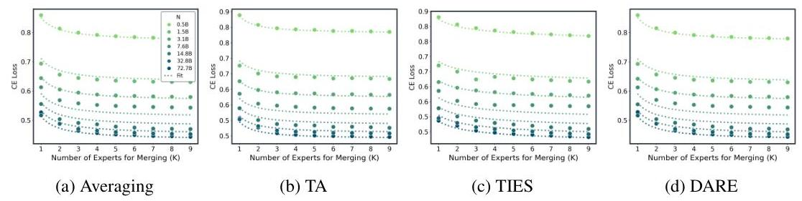

Figure 1: Model Merging Scaling Law. CE vs. number of merged experts $(k)$ at multiple model sizes $(N)$ for four merging methods. Dots are real measurements; dotted lines are fits to the unified law $L_{\infty}(N)+A(N) /(k+b)$. Across methods we see the same pattern: steep early gains that flatten into a $1 /(k+b)$ tail, and a uniform downward shift with larger $N$ (both the floor and the tail shrink). Method differences get smaller and smaller as scaling up. $R^{2}>0.98$ over all fitted points

In this paper, we first introduce a compact, predictive merging scaling law that couples model size $N$ with the number of merged experts $k$ :

$$
\mathbb{E}[L \mid N, k]=\underbrace{L_{*}+B N^{-\beta}}_{\text {floor } L_{\infty}(N)}+\underbrace{\frac{A_{0} N^{-\gamma}}{k+b}}_{\text {merging tail }}, \quad \beta, \gamma>0, b \geq 0
$$

Intuitively, larger base models depress the size-dependent floor $L_{\infty}(N)$ and shrink the tail amplitude $A_{0} N^{-\gamma}$; adding experts yields steep early improvements that taper as $1 /(k+b)$. The term $L_{*}$ denotes the irreducible floor that remains even for very large $N$.

As shown in Fig. 1 and Fig. 2, our experiments on $\mathbf{1 0 , 5 0 6}$ merged models, base sizes from 0.5 to 72B, nine domains, four methods: Average/Task Arithmetic (TA)/TIES/DARE, validate this power law and directly compare merging with multitask SFT under normalized loss and GPU-hours. Empirically, merging approaches multitask SFT performance while using negligible GPU-hours, and method gaps compress as $k$ and $N$ grow. These findings position merging as a practical, budget-friendly alternative to comprehensive multitask training and highlight the significance of the proposed merging scaling law for forecasting returns and planning budgets.

This study reveals a consistent power law for LLM merging that aligns with the later sections: (i) larger models are easier to merge, floors decrease with $N$ and tails shrink (Fig. 4); (ii) most gains arrive early, with a clear elbow at small $k$ (Sec. 3.3.3); (iii) mixing domains helps pooled generalization under the same floor+tail scaling (Sec. 3.3.2); (iv) method differences are small at scale, with both means and variability converging (Sec. 3.3.4); (v) order sensitivity fades quickly as $k$ grows (Sec. 4.3); and (vi) the law transfers across backbones with the same diminishingreturns shape (Sec. 4.4).
In summary, this work provides:
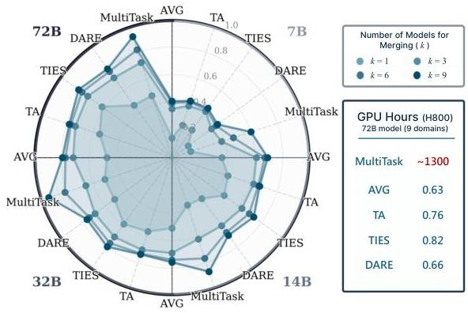

Figure 2: Overview of Merging vs MultiTask. The the polar axis represents the normalized negative loss.
(1) Unified scaling law: We introduce a compact floor+tail law that links base size and expert count, and show it applies consistently in both in-domain and cross-domain settings.
(2) Large-scale validation: Across extensive experiments covering diverse domains, model sizes, 105,06 models, and merging methods, the law tightly fits measured curves, variance contracts with more experts, and method gaps compress as scale increases.
(3) Theory: We derive a universal inverse- $k$ tail and variance under equal-normalized composition, and connect the floor and tail terms to base curvature and cross-domain dispersion.

(4) Operational recipe: A lightweight three-point fit predicts the full curve and recommends an efficient expert count, converting trial-and-error into budgetable planning; results are robust to candidate-pool size and transfer across architectures.

# 2 BACKGROUND, Related Work, and Setup 

Notation. Let $N$ denote the size of the base model, $\mathcal{M}$ denotes a set of expert models, and let $k$ be the number of expert models to be merged. We denote the base model by $\theta_{0}$. A task vector $v$ is defined as the parameter difference between the base model and a domain-adapted model, which may be either the full parameter difference or a low-rank adaptation such as an adapter/LoRA module (Hu et al., 2022) restricted to its subspace. Unless otherwise stated, we employ equal-weight merging, where all task vectors are assigned the same importance. For fixed $N$ and $k$, the expected loss refers to the average performance over all possible $k$-element subsets of experts drawn from $\mathcal{M}$, while variance measures the variability of the loss.

### 2.1 BACKGROUND

Model Merging Model merging is the integration of multiple independently trained models into a single cohesive model by aggregating their parameters (Matena \& Raffel, 2022; Jin et al., 2022; Wang et al., 2025a). Existing work performs merging either (i) on the full parameter space, e.g., model soups and Fisher/weight-space averaging (Izmailov et al., 2018; Wortsman

Table 1: Unified view of model merging recipes

| Method | $\Psi(v)$ | $c$ | $\alpha$ | Add. Params |
| :-- | :--: | :--: | :--: | :--: |
| Average | $v$ | 1 | $\alpha=1 / k$ | - |
| TA | $v$ | 0.8 | $\alpha=1 / k$ | - |
| TIES | Trim, Elect, Disjoint | 1 | $\alpha=1 / k$ | $d=1.0$ |
| DARE | $m \odot v /(1-p)$ | 1 | $\alpha=1 / k$ | $p=0.2$ |

et al., 2022; Davari \& Belilovsky, 2024), or (ii) within modular subspaces, most commonly adapters/LoRA (Hu et al., 2022), enabling plug-and-play composition across domains with minimal interference (Hu et al.; Mao et al., 2025). Merging methods are refined with advanced techniques (Jhunjhunwala et al., 2024; Yan et al., 2025; Akiba et al., 2025), including dynamic parameter selection (Yang et al., 2023). Despite these advances, the core idea remains manipulating task vectors-changes relative to the base pre-trained model (Rinaldi et al., 2025; Zhang et al., 2024; Bowen et al., 2024). Further gains come from processing task vectors before aggregation, for instance using element-wise masks or gates (e.g., TIES/DARE) to reduce conflicts between experts (Yadav et al., 2023; Yu et al., 2024; Lu et al., 2024). These methods cover the majority of practical pipelines and constitute the settings evaluated in this paper. However, most of aforementioned studies consider limited expert models to merge, and the relation between the number of experts and the effectiveness is underexplored. Wang et al. (2025c); Yadav et al. (2024) examined this relationship from theoretical and empirical perspectives, respectively, identifying factors that influence merging performance, but did not provide a systematic scaling law to guide merging across different domains and model sizes.

Scaling Law Classical scaling laws quantify how loss scales with model size, data, and compute: parameter/data power laws and compute-optimal trade-offs (Kaplan et al., 2020; Hoffmann et al., 2022; Hestness et al., 2017). Extensions study transfer and evaluation efficiency, as well as precision/quantization scaling that augments the usual size-data laws with a precision term (Kumar et al.). Scaling laws provide a predictable, quantitative framework that helps researchers make more informed decisions and prevent the blind allocation of vast resources (Ardalani et al., 2022; Klug \& Heckel, 2022; Neumann \& Gros, 2022; Geiping et al., 2022). Specifically, scaling laws have been leveraged by Filipovich et al. (2022) to empirically demonstrate that Direct Feedback Alignment (DFA) is not a more compute-efficient training method than backpropagation. Hilton et al. (2023) extend these laws by incorporating sparsity, finding a compute-optimal sparse-dense trade-off that challenges the conventional belief that dense models are always superior for large-scale training. Fernandes et al. (2023) research on scaling laws to multilingual neural machine translation models, revealing that data mixture weights affect the multiplicative factor of the scaling law but not the scaling exponent. These laws guide pretraining, but they do not address composition in weight space.

### 2.2 SETUP

Expert Models We use a dual-track design to balance control and realism (details in App. C). (i) Controlled experts: Starting from the same base, we train nine domain experts with identical

hyperparameters. All base models are from the Qwen2.5 series (0.5B-72B) (Qwen et al., 2025). (ii) Open-source experts: We additionally treat diverse HuggingFace checkpoints as experts to test robustness under heterogeneous, partly opaque post-training.

Data We construct our own expert set $\mathcal{M}$ using data from Mixture-of-Thoughts (Face, 2025) and OpenScience ${ }^{1}$, where all solutions are generated by DeepSeek-R1 (DeepSeek-AI et al., 2025) to ensure consistent quality. For mathematics, we sample 93,700 instances and categorize them into five subfields (Algebra, Analysis, Discrete Mathematics and Combinatorics, Geometry and Topology, Number Theory), with 200 medium-difficulty problems per subfield reserved for validation. For science, we combine both datasets, selecting 20,000 training and 200 validation samples from each of Biology, Physics, and Chemistry. For code, we use 82,000 training and 10,000 validation samples from Mixture-of-Thoughts. This construction provides broad domain coverage, balanced validation sets, and consistent standards across all expert models.

Merging $k$ Experts In this paper, we are engaged in four merging methods, which are Average merge, TA, TIES and DARE. We use a unified form to represent all of these merging recipes in Table 1. For a given number of experts $k$, we denote by $\mathcal{K}=\{K \subseteq \mathcal{M}:|K|=k\}$ the collection of all $k$-expert subsets of $\mathcal{M}$. Merging all experts in the $K$ can be written as:

$$
\theta=\theta_{0}+\sum_{i \in K} \alpha_{i, k} \Psi\left(v_{i}\right), \quad \sum_{i \in K} \alpha_{i, k}=c
$$

with a fixed scale $c>0$ (often $c=1$ ).
Evaluation. We report token-level cross-entropy: per domain, we score 30M held-out tokens and average the loss. For each $k$, we aggregate by averaging CE over all $\binom{|\mathcal{M}|}{k}$ expert subsets (or a uniform random subset when $N>8 \mathrm{~B}$ to control cost, and sampling procedure is provided in Appendix.D). Our project, including data and code, is provided in https://github.com/ InfiXAI/Merging-Scaling-Law.

# 3 Scaling Laws with Merging Experts and Model Size 

In this section, we ask a simple question: As we merge more experts ( $k$ ) and use larger models ( $N$ ), how does the cross-entropy (CE) loss change? We study this in two standard setups: in-domain (evaluation on the single domain) and cross-domain (experts drawn from nine heterogeneous domains and evaluated by macro-averaging over all nine). We use four widely adopted merge rules that scale from small to large models: Average (Wortsman et al., 2022), TA (Ilharco et al.), TIES (Yadav et al., 2023), and DARE (Yu et al., 2024). Our grids cover $N \in\{0.5,1.5,3,7,14,32,72\} \mathrm{B}$ (with 10,506 models in total) and $k \in\{1, \ldots, 9\}$; domains are algebra, analysis, geometry, discrete, number_theory, code, chemistry, physics, biology.

### 3.1 A Unified Empirical Scaling Law

Given a model of size $N$ and a set $K \in \mathcal{K}$ with $k$ experts, let $L$ denote the cross-entropy loss of the merged model. Since for a fixed $k$ there are $\binom{|\mathcal{M}|}{k}$ possible choices of $K$, we use the average loss as a metric to evaluate the merging recipe. We find that the expected merge loss is a function of $(N, k)$.

Empirically, we fit the curves and the mean loss follows a floor + tail form with a small finite- $k$ offset:

$$
\mathbb{E}[L \mid N, k]=L_{\infty}(N)+\frac{A(N)}{k+b}, \quad b \geq 0 \text { (small). }
$$

Here $L_{\infty}(N)$ is the limiting "best models can do" as $k \rightarrow \infty$, and $A(N) /(k+b)$ is a diminishingreturns term that explains why most gains arrive by small $k$. Both size dependencies are well captured by simple power laws:

$$
L_{\infty}(N)=L_{*}+B N^{-\beta}, \quad A(N)=A_{0} N^{-\gamma}, \quad \beta, \gamma \geq 0
$$

[^0]
[^0]:    ${ }^{1}$ https://huggingface.co/datasets/nvidia/OpenScience

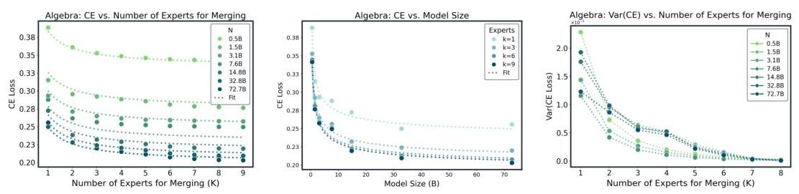

Figure 3: Merging Scaling Law in a single algebra domain. (left) CE vs. number of merged experts $(k)$ (middle) C vs. multiple model sizes $(N)$. Dots are real measurements; lines are fits to the unified law $L_{\infty}(N)+A(N) /(k+b)$ on the single domain. (right) Variance of CE decreases as CE.

Interpretation. Bigger models help twice: they lower the floor $L_{\infty}(N)$ and shrink the tail amplitude $A(N)$, so (i) CE is lower for any fixed $k$, and (ii) fewer experts are needed to get close to the floor.
To fit this power law, we estimate $\left(L_{*}, B, \beta, A_{0}, \gamma, b\right)$ with weighted nonlinear least squares. Because the empirical variability across runs contracts roughly like $1 / k$, we use weights proportional to $k$ when fitting curves in $k$ (this stabilizes early- $k$ noise without over-fitting the tail). All methods and both setups yield near-unity $R^{2}$ with small, structureless residuals; a tiny $b$ absorbs occasional early- $k$ curvature. Figure 1 plots CE vs. the number of merged experts $k$ at multiple model sizes $N$ for each method; dots are measurements and dotted lines are the fitted $L_{\infty}(N)+A(N) /(k+b)$ curves. The same visual pattern holds across methods: steep early gains that flatten into a $1 /(k+b)$ tail, and a uniform downward shift as $N$ increases.

# 3.1.1 In-DOMAIN (SINGLE-DOMAIN) 

The Figure. 3 shows the Average merging performance in the single algebra domain, and all domains are provided in the Appendix.F.0.1. We can observe that: (1) Diminishing returns in $k$. Within each domain, CE decreases monotonically (or near-monotonically) as we merge more experts and follows the $1 /(k+b)$ tail predicted by equation 3 . Most of the achievable improvement arrives early: there is a clear elbow by $k \approx 5 \sim 6$, after which additional experts yield progressively smaller gains. (2) Scaling with $N$. Bigger models help in two orthogonal ways consistent with equation 4: the floor $L_{\infty}(N)$ drops with $N$ and the tail amplitude $A(N)$ is flat-to-decreasing, so (i) CE is lower at any fixed $k$, and (ii) fewer experts are needed to approach the floor. Math-like domains exhibit shorter tails (earlier saturation), whereas science-like domains benefit more from increasing $k$ before saturating.

### 3.1.2 Cross-dOMAIN

The Figure. 1 shows the power laws across nine domains with expert numbers, and Figure. 3 (middle) shows the model size fittings. It is noted that (1) Same law, pooled over domains. When merging experts drawn across heterogeneous domains and evaluating by macro-averaged CE, the same floor+tail law equation 3 holds: gains are monotone with $k$, steep early, and flatten into a $1 /(k+b)$ tail. The elbow again occurs around $k \approx 5$. (2) Scaling with $N$. Increasing model size uniformly shifts curves downward (lower floor) and weakly contracts tails (smaller $A(N)$ ), mirroring the in-domain behavior: larger models are both better at any fixed $k$ and require fewer experts to approach the pooled floor.
Summary: Across both in-domain and cross-domain settings, the expected merge loss fits the same power law (equation.3). Bigger $N$ lowers the floor and shortens the tail, explaining the monotone gains and early saturation in $k$.

### 3.2 THEORY FOR THE MERGING ScALING LaW

Assumptions. Fix a model size $N$. Let $L(\cdot ; N)$ be twice continuously differentiable near the base $\theta_{0}(N)$ with $M(N)$-Lipschitz Hessian $H(N)$ and gradient $g(N)$. Expert/task update vectors $v(N)$ lie in the merged subspace with mean $\mu(N)$, covariance $\Sigma(N)$, and finite sixth moment. We use equalnormalization $\alpha_{i, k}=c / k$ (covering uniform averaging, normalized sums, and adapter ensembling); specialized non-uniform weightings can change the tail rate and are outside our scope.

Theorem 1 (Average-case joint merging law). Under the assumptions above (equal weights), for each fixed $N$ the population-averaged loss over $k$ merged experts satisfies the second-order law

$$
\mathbb{E}[L \mid N, k]=\underbrace{L\left(\theta_{0} ; N\right)+c g^{\top} \mu+\frac{1}{2} c^{2} \mu^{\top} H \mu}_{L_{\infty}(N)}+\underbrace{\frac{1}{2} c^{2} \operatorname{Tr}(H \Sigma)}_{A(N)} \cdot \frac{1}{k}+\mathcal{O}_{N}\left(k^{-3 / 2}\right)
$$

where $H$ denotes an approximation to the Hessian matrix, and $\mu, \Sigma$ represent respectively the mean and covariance of task vectors in the merged subspace. In particular, the empirical family equation 3 appears with $b(N)=0$ at leading order; finite- $k$ effects manifest as a small positive offset in practice. Parameterizing $L_{\infty}(N), A(N)$ by equation 4 yields the practical joint model $\mathbb{E}[L \mid N, k]=L_{*}+B N^{-\beta}+A_{0} N^{-\gamma} /\left(k+b_{0}\right)$.
Corollary 1 (Variance shrinkage). Let $a_{N} \triangleq g(N)+H(N) c \mu(N)$. Under the same assumptions and $a_{N}^{\top} \Sigma(N) a_{N}>0$,

$$
\operatorname{Var}\left(L\left(\theta_{0}+\Delta \theta_{k} ; N\right)\right)=\Theta\left(\frac{1}{k}\right), \quad \operatorname{sd}=\mathcal{O}\left(\frac{1}{\sqrt{k}}\right)
$$

If $a_{N}^{\top} \Sigma(N) a_{N}=0$, the variance contracts faster, at $\Theta\left(1 / k^{2}\right)$.
Proof: The detailed proof is provided in Appendix A and B.

# 3.3 Core Findings for Merging 

### 3.3.1 LARGER MODELS MAKE MERGING EASIER

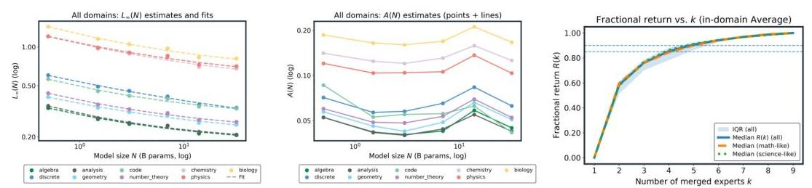

Figure 4: Larger models are easier to merge. (Left) Per-domain floors $L_{\infty}(N)$ fall monotonically with model size $N$. (Middle) Tail amplitude $A(N)$ is small and overall flat-to-decreasing with $N$. Most of the gain comes from the first few experts. (Right) Median fractional return $R(k)$ with IQR band; $k=5$ and $k=6$ cross the $85 \% / 90 \%$ thresholds, respectively. This means only $60 \%$ of experts in the expert pool can get over $90 \%$ performance.

Setup: We study the in-domain case across nine domains and define "easier to merge" as: at a fixed number of experts $k$, (i) CE is lower, and (ii) the number of experts needed to get $\varepsilon$-close to the domain floor is smaller. Following the unified law in $\S 3.1$, we estimate the floor $L_{\infty}(N)$ and the tail amplitude $A(N)$ from joint $(N, k)$ fits and summarize them in Fig. 4.

Findings. Figure 4 (left) shows that floors decay cleanly with model size $N$ across all domains (power-law trend), while Fig. 4 (middle) shows tails are small and overall decreasing with oscillation in terms of $N$. Together these two effects explain why larger models are easier to merge: at any fixed $k$ the CE is lower and fewer experts are required to approach the floor. As a headline number, at $k=9$ the domain-averaged CE drops from 0.739 (@0.5B) to 0.430 (@32B), a $\mathbf{4 1 . 9 \%}$ reduction. Domains with shorter tails (math-like) saturate earlier; science-like domains benefit more from increasing $k$ but still follow the same floor+tail pattern. Per-domain parameters and worked examples for the experts-to-floor budget are provided in App. H.1.

### 3.3.2 Mixing DOMAINS HELPS GENERALIZATION

Findings \& why. As seen in Fig. 1 and 4 (left), cross-domain merging follows the same law as in-domain: gains are monotone in $k$, steep early, and flatten into a $1 /(k+b)$ tail, with an elbow around $k \approx 5$. Larger $N$ uniformly shifts the pooled curves downward, mirroring the lower floor and smaller

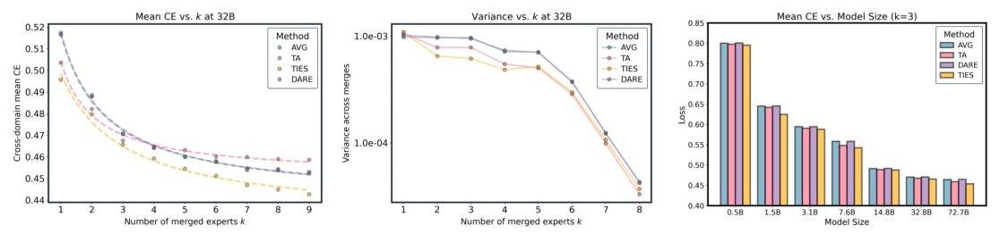

Figure 5: Method sensitivity is little at scale. Left: Mean CE vs. $k$ at $N=32 \mathrm{~B}$-all methods follow the power law; the early- $k$ lead of TA/TIES $(0.5)$ is small $(\sim 1-2 \%)$ and narrows by $k \gtrsim 8$. Right: Variance vs. $k$ at $N=32 \mathrm{~B}$, near- $1 / k$ contraction; TIES/TA $<$ Average at small $k$, and all methods meet near the variance floor by $k \approx 8$. Curves show measurements (markers) and floor+tail fits (lines) with a shared small $b$ per method.
tail amplitude from Sec. 3.3.1. The diversity of donors reduces domain-specific bias (lower $L_{\infty}$ ) while averaging attenuates variance and leaves a short tail governed by $A(N) /(k+b)$. The rare late- $k$ uptick in Fig. 4(middle) is a smaller nonlinearity, and the effect disappears in overall loss, confirming that cross-domain generalization inherits the same scaling with diminishing-returns tail.

# 3.3.3 MOST OF THE GAIN COMES FROM THE FIRST FEW EXPERTS 

Setup. We quantify the "return" from merging $k$ experts at a fixed $(N, d)$ by the fraction of realized improvement $R(N, d, k)$ computed from the monotone envelope of the measured CE curve (see App. H.2). We summarize two views in Fig. 4: (left) the median $R(k)$ over all $(N, d)$ with an IQR band; (right) a heatmap of the smallest $k$ that reaches a target return (here $90 \%$ ).
Findings \& why. As shown in Fig. 4, most of the improvement arrives early: the median curve crosses $85 \%$ by $k=5$ and $90 \%$ by $k=6$, and the $k_{90}$ heatmap concentrates in $\{5,6\}$ across domains and model sizes. Math-like domains tend to saturate slightly earlier, while science-like domains keep a longer-but still flattening-tail. This "early elbow" follows directly from the unified law $L(N, k)=L_{\infty}(N)+A(N) /(k+b)$ : the marginal gain $\Delta_{k} \approx A(N) /[(k+b)(k+1+b)]$ decays roughly as $k^{-2}$, so returns diminish sharply beyond the first few experts.

### 3.3.4 MERGE METHODS DIFFER LITTLE AT LARGE SCALE

Setup. We compare four merge methods, Average, TA $(\lambda=0.8)$, TIES $(\lambda \in\{0.5,1\})$, and DARE (density 0.2 ), under the same protocol as before, reporting macro-averaged CE across nine domains and fitting each curve with the unified law. Figure 5a shows mean CE vs. $k$ at $N=32 \mathrm{~B}$; Fig. 5b shows the corresponding merge-to-merge variance.
Findings \& why. As $k$ grows (and especially at larger $N$ ), method gaps in mean CE compress quickly: in Fig. 5a, small early advantages (TA/TIES at $k \leq 3$ ) shrink to a tight band by $k \approx 8$ (differences $\lesssim 2 \%$ ). Variance exhibits the same convergence (Fig. 5b), contracting near $\sim 1 / k$ and approaching a small floor where all methods meet. This behavior follows directly from the shared scaling form: the diminishing-returns tail $A(N) /(k+b)$ makes early steps method-sensitive, while the common floor $L_{\infty}(N)$ dominates at larger $k$ and $N$, leaving only second-order differences.

## 4 FURTHER ANALYSIS AND CHECKS

Beyond establishing the unified law in $\S 3.1$, we stress-test it along practical axes that affect day-to-day merging: how large the candidate pool is, whether mixing domains helps, how sensitive results are to order/selection, and whether findings transfer across backbones. Throughout, we keep the evaluation protocol fixed and re-estimate the same $L_{\infty}(N)+A(N) /(k+b)$ family. The main text reports trends and takeaways; per-domain numbers and fit diagnostics are in the Appendix.

### 4.1 DOES A BIGGER CANDIDATE POOL HELP?

Setup. We repeat the cross-domain analysis while restricting the pool of available donor domains to $M \in\{8,7\}$ (DARE; identical $(N, k)$ grids), then refit the unified law. Figure 6 contrasts the fitted floor $L_{\infty}(N)$ and tail $A(N)$ for $M=8$ vs. $M=7$.


Figure 6: Effect of candidate-pool size. Two restricted-pool fits of the unified law (decreasing the number of candidates from $\mathrm{M}=9$ to 8 and 7). Left ( $M=8$ ), Right ( $M=7$ ): floors $L_{\infty}(N)$ are tight across domains; tails $A(N)$ show weak or no shrinkage with $N$.
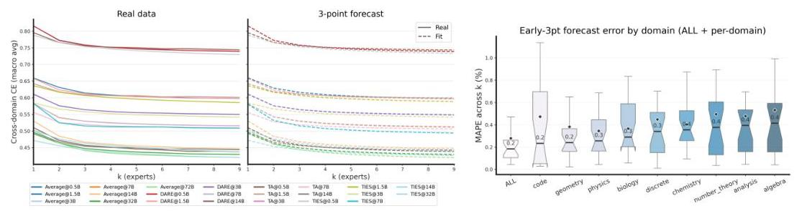

Figure 7: Predicting the $k$-curve from three points. Left: ground truth (markers) versus a floor+tail fit using only $k=\{1,2,4\}$ (lines) across representative domains/methods. Right: forecast error as MAPE across $k$ (lower is better) and the distribution of recommended $k^{\star}$ under $\Delta=1 \%$, concentrated at $5-6$. Together these show that three points suffice to recover the full curve and yield a practical early-stop $k^{\star}$.

Findings \& why. The law itself is stable to pool size: floors remain tight power laws in $N$ with negligible change across $M$ (Fig. 6, both panels). The effect of a larger pool shows up almost entirely in the tail: moving from $M=8$ to $M=7$ makes $A(N)$ flat-to-decreasing with $N$ on sciencelike domains (chemistry/physics) while leaving math-like domains nearly unchanged. Intuitively, a slightly more diverse pool supplies complementary donors and reduces residual cross-domain mismatch, shrinking the $A(N) /(k+b)$ term; this yields the clearest gains at moderate-to-large $k$ and larger $N$. In short, a bigger pool chiefly helps by tightening the tail rather than shifting the floor.

# 4.2 CAN THREE POINTS PREDICT THE WHOLE $k$-CURVE? (YES) 

Setup. For each series, either a single (domain, $N$ ) in-domain curve or a (method, $N$ ) cross-domain curve, we fit the unified law $L(k)=L_{\infty}(N)+\frac{A(N)}{k+b}$ using only the first three points $k \in\{1,2,4\}$, then forecast the full $k \in\{1, \ldots, 9\}$ trajectory and the value at a target $k$.

Findings \& why. Three points suffice. Across domains and methods, the early- $k$ slope plus the long-tail shape are captured well by $L_{\infty}+A /(k+b)$, so fitting on $\{1,2,4\}$ closely tracks the full curve in Fig. 7(left). The implied $k^{\star}$ concentrates around $5 \sim 6$ in Fig. 7(right), aligning with the elbow found in $\S 3.3 .3$. Intuitively, the model's floor $L_{\infty}$ anchors the late regime while $A$ controls the early drop; those two degrees of freedom are identifiable from three well-spaced points, yielding stable forecasts without overfitting. This can guide us to make decisions for the merging in practice.

### 4.3 DOES MERGE ORDER MATTER?

Setup. We permute donor orders under DARE, and at each $(N, k)$ summarize the across-order dispersion of the macro-averaged CE by standard deviation, range, and coefficient of variation; we also fit a parsimonious tail $\operatorname{Std}_{\text {order }}(N, k) \approx c_{0}(N)+c_{1}(N) /(k+b)$.
Findings. Order effects fade fast. Fig. 8 (left) shows that, at 32B, both the interquartile mass and the whiskers collapse as $k$ grows (about $83 \%$ shrinkage in whisker length by $k=8$ ). Fig. 8 (middle) confirms that this contraction holds for all base sizes and follows the same $1 /(k+b)$ pattern that governs the mean, with larger $N$ being slightly more stable. Fig. 8 (right) quantifies worst-best

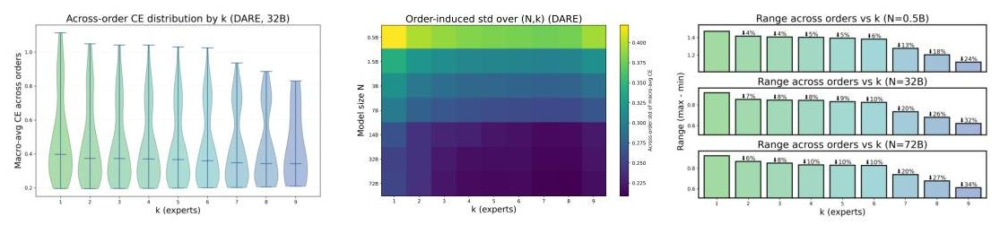

Figure 8: Order sensitivity contracts with $k$ (DARE). Left: At $N=32 \mathrm{~B}$, the distribution of macro CE across merge orders (violins) tightens quickly as $k$ increases; the whisker length shrinks by $\sim 83 \%$ from $k=1$ to $k=8$, while the median curve is monotone in $k$. Middle: Heatmap of across-order std over $(N, k)$ shows a robust left-to-right decay at all scales, consistent with a near- $1 /(k+b)$ tail (larger $N$ is also slightly darker, i.e., more stable). Right: Worst-best spread (range) decreases steadily with $k$; the annotated relative reductions vs. $k=1$ are about $\{24 \%, 32 \%, 34 \%\}$ at $k=9$ for $N \in\{0.5,32,72\} \mathrm{B}$, respectively. In absolute CE terms (32B), the range drops from $\approx 0.086$ at $k=1$ to $\approx 0.015$ at $k=8$ (Appx.).
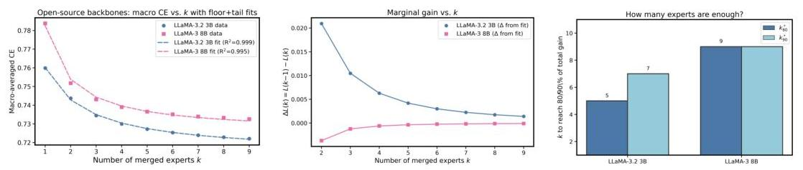

Figure 9: Cross-backbone validation on LLaMA. Left: Macro CE vs. $k$ on LLaMA-3.2 3B and LLaMA-3 8B, with floor+tail fits $L_{\infty}+\frac{A}{k+b}$ showing the same inverse tail. Middle: Marginal gain $\Delta L(k)$ decays smoothly with $k$, consistent with the $1 /(k+b)$ form. Right: Experts-to-target $k_{80 / 90}^{*}$ concentrates at small $k$, echoing that most gains come early.
differences: the relative range reduction at $k=9$ is $\approx 24 \%(0.5 \mathrm{~B}), 32 \%(32 \mathrm{~B})$, and $34 \%(72 \mathrm{~B})$, and in absolute CE the 32B spread falls from $\sim 0.086$ (@ $k=1$ ) to $\sim 0.015$ (@ $k=8$ ). Practically, once $k \geq 6$ the across-order spread is small compared to early- $k$ method gaps and to the floor itself, so curating a specific merge order yields little benefit.

# 4.4 DOES THE SAME LAW HOLD ON OTHER BACKBONES? (YES, LLAMA TOO) 

Setup. We replicate the cross-domain protocol from $\S 3.1$ on two open-source backbones, LLaMA-3.2 3B and LLaMA-3 8B. For each backbone, we merge experts sampled across nine domains, report the macro-averaged CE for $k \in\{1, \ldots, 9\}$, and fit the same floor+tail form $L(k)=L_{\infty}+\frac{A}{k+b}$ with a small $b$. To complement the main curve fit, we also visualize the marginal gain $\Delta L(k)=L(k-1)-L(k)$ and the experts-to-target bars $k_{80 / 90}^{*}$ (the smallest $k$ that reaches $80 / 90 \%$ of the total $k=1 \rightarrow 9$ improvement).

Findings. Both backbones follow the same law with a clear $1 /(k+b)$ tail: CE decreases monotonically in $k$, gains are steep at small $k$ and flatten thereafter (Fig. 9a). The marginal gain curves (Fig. 9b) decay smoothly with $k$, illustrating diminishing returns consistent with the inverse tail; experts-to-target bars (Fig. 9c) show that both backbones need only a small number of experts to secure most of the improvement ( $80 / 90 \%$ reached at modest $k$ ), in line with our main-scale observations. Absolute CE levels differ slightly-LLaMA-3.2 3B sits lower and shows a marginally steeper early slope-reflecting backbone capability (series 3.2 vs. 3.0), not a change of law. In short, the merging scaling law transfers across architectures: same functional form, same diminishing-returns shape, and similar fitted parameter ranges.

# 5 CONCLUSION 

This paper presented a simple, predictive merging scaling law that links model size and the number of merged experts via a floor+tail power law. This law unifies a broad set of empirical regularities: larger bases lower the size-dependent floor, most improvement arrives at small $k$, variance contracts with additional experts, method gaps compress at scale, and merge order quickly becomes inconsequential. The same power law form holds in-domain and cross-domain, and transfers across architectures and representative merging methods. Beyond description, the law is prescriptive. A lightweight fit from a few early points forecasts the full loss-vs. $-k$ curve and recommends an efficient expert count, enabling budget-aware decisions about when to stop adding experts and how to trade off scaling the base model versus increasing $k$. Together, these results elevate merging from heuristic practice to a computationally efficient, planable alternative to multitask fine-tuning.

# REFERENCES 

aaditya. aaditya/openbiollm-llama3-8b. https://huggingface.co/aaditya/ OpenBioLLM-Llama3-8B, 2025.

Takuya Akiba, Makoto Shing, Yujin Tang, Qi Sun, and David Ha. Evolutionary optimization of model merging recipes. Nature Machine Intelligence, 7(2):195-204, 2025.

Newsha Ardalani, Carole-Jean Wu, Zeliang Chen, Bhargav Bhushanam, and Adnan Aziz. Understanding scaling laws for recommendation models. arXiv preprint arXiv:2208.08489, 2022.

Tian Bowen, Lai Songning, Wu Jiemin, Shuai Zhihao, Ge Shiming, and Yue Yutao. Beyond task vectors: Selective task arithmetic based on importance metrics. arXiv preprint arXiv:2411.16139, 2024.

Dampfinchen. Dampfinchen/llama-3-8b-ultra-instruct. https://huggingface.co/ Dampfinchen/Llama-3-8B-Ultra-Instruct, 2025.

MohammadReza Davari and Eugene Belilovsky. Model breadcrumbs: Scaling multi-task model merging with sparse masks. In European Conference on Computer Vision, pp. 270-287. Springer, 2024.

DeepSeek-AI, Daya Guo, Dejian Yang, Haowei Zhang, Junxiao Song, Ruoyu Zhang, Runxin Xu, Qihao Zhu, Shirong Ma, Peiyi Wang, Xiao Bi, Xiaokang Zhang, Xingkai Yu, Yu Wu, Z. F. Wu, Zhibin Gou, Zhihong Shao, Zhuoshu Li, Ziyi Gao, Aixin Liu, Bing Xue, Bingxuan Wang, Bochao Wu, Bei Feng, Chengda Lu, Chenggang Zhao, Chengqi Deng, Chenyu Zhang, Chong Ruan, Damai Dai, Deli Chen, Dongjie Ji, Erhang Li, Fangyun Lin, Fucong Dai, Fuli Luo, Guangbo Hao, Guanting Chen, Guowei Li, H. Zhang, Han Bao, Hanwei Xu, Haocheng Wang, Honghui Ding, Huajian Xin, Huazuo Gao, Hui Qu, Hui Li, Jianzhong Guo, Jiashi Li, Jiawei Wang, Jingchang Chen, Jingyang Yuan, Junjie Qiu, Junlong Li, J. L. Cai, Jiaqi Ni, Jian Liang, Jin Chen, Kai Dong, Kai Hu, Kaige Gao, Kang Guan, Kexin Huang, Kuai Yu, Lean Wang, Lecong Zhang, Liang Zhao, Litong Wang, Liyue Zhang, Lei Xu, Leyi Xia, Mingchuan Zhang, Minghua Zhang, Minghui Tang, Meng Li, Miaojun Wang, Mingming Li, Ning Tian, Panpan Huang, Peng Zhang, Qiancheng Wang, Qinyu Chen, Qiushi Du, Ruiqi Ge, Ruisong Zhang, Ruizhe Pan, Runji Wang, R. J. Chen, R. L. Jin, Ruyi Chen, Shanghao Lu, Shangyan Zhou, Shanhuang Chen, Shengfeng Ye, Shiyu Wang, Shuiping Yu, Shunfeng Zhou, Shuting Pan, S. S. Li, Shuang Zhou, Shaoqing Wu, Shengfeng Ye, Tao Yun, Tian Pei, Tianyu Sun, T. Wang, Wangding Zeng, Wanjia Zhao, Wen Liu, Wenfeng Liang, Wenjun Gao, Wenqin Yu, Wentao Zhang, W. L. Xiao, Wei An, Xiaodong Liu, Xiaohan Wang, Xiaokang Chen, Xiaotao Nie, Xin Cheng, Xin Liu, Xin Xie, Xingchao Liu, Xinyu Yang, Xinyuan Li, Xuecheng Su, Xuheng Lin, X. Q. Li, Xiangyue Jin, Xiaojin Shen, Xiaosha Chen, Xiaowen Sun, Xiaoxiang Wang, Xinnan Song, Xinyi Zhou, Xianzu Wang, Xinxia Shan, Y. K. Li, Y. Q. Wang, Y. X. Wei, Yang Zhang, Yanhong Xu, Yao Li, Yao Zhao, Yaofeng Sun, Yaohui Wang, Yi Yu, Yichao Zhang, Yifan Shi, Yiliang Xiong, Ying He, Yishi Piao, Yisong Wang, Yixuan Tan, Yiyang Ma, Yiyuan Liu, Yongqiang Guo, Yuan Ou, Yuduan Wang, Yue Gong, Yuheng Zou, Yujia He, Yunfan Xiong, Yuxiang Luo, Yuxiang You, Yuxuan Liu, Yuyang Zhou, Y. X. Zhu, Yanhong Xu, Yanping Huang, Yaohui Li, Yi Zheng, Yuchen Zhu, Yunxian Ma, Ying Tang, Yukun Zha, Yuting Yan, Z. Z. Ren, Zehui Ren, Zhangli Sha, Zhe Fu, Zhean Xu, Zhenda Xie, Zhengyan Zhang, Zhewen Hao, Zhicheng Ma, Zhigang Yan, Zhiyu Wu, Zihui Gu, Zijia Zhu, Zijun Liu, Zilin Li, Ziwei Xie, Ziyang Song, Zizheng Pan, Zhen Huang, Zhipeng Xu, Zhongyu Zhang, and Zhen Zhang. Deepseek-r1: Incentivizing reasoning capability in llms via reinforcement learning, 2025. URL https://arxiv.org/abs/2501.12948.

Hugging Face. Open r1: A fully open reproduction of deepseek-r1, January 2025. URL https: //github.com/huggingface/open-r1.

Patrick Fernandes, Behrooz Ghorbani, Xavier Garcia, Markus Freitag, and Orhan Firat. Scaling laws for multilingual neural machine translation. In International Conference on Machine Learning, pp. 10053-10071. PMLR, 2023.

Matthew J Filipovich, Alessandro Cappelli, Daniel Hesslow, and Julien Launay. Scaling laws beyond backpropagation. arXiv preprint arXiv:2210.14593, 2022.

Jonas Geiping, Micah Goldblum, Gowthami Somepalli, Ravid Shwartz-Ziv, Tom Goldstein, and Andrew Gordon Wilson. How much data are augmentations worth? an investigation into scaling laws, invariance, and implicit regularization. arXiv preprint arXiv:2210.06441, 2022.

Yanggan Gu, Zhaoyi Yan, Yuanyi Wang, Yiming Zhang, Qi Zhou, Fei Wu, and Hongxia Yang. Infifpo: Implicit model fusion via preference optimization in large language models. arXiv preprint arXiv:2505.13878, 2025.

Joel Hestness, Sharan Narang, Newsha Ardalani, Gregory Diamos, Heewoo Jun, Hassan Kianinejad, Md Mostofa Ali Patwary, Yang Yang, and Yanqi Zhou. Deep learning scaling is predictable, empirically. arXiv preprint arXiv:1712.00409, 2017.

Jacob Hilton, Jie Tang, and John Schulman. Scaling laws for single-agent reinforcement learning. arXiv preprint arXiv:2301.13442, 2023.

Jordan Hoffmann, Sebastian Borgeaud, Arthur Mensch, Elena Buchatskaya, Trevor Cai, Eliza Rutherford, Diego de Las Casas, Lisa Anne Hendricks, Johannes Welbl, Aidan Clark, et al. Training compute-optimal large language models. In Proceedings of the 36th International Conference on Neural Information Processing Systems, pp. 30016-30030, 2022.

Edward J Hu, Phillip Wallis, Zeyuan Allen-Zhu, Yuanzhi Li, Shean Wang, Lu Wang, Weizhu Chen, et al. Lora: Low-rank adaptation of large language models. In International Conference on Learning Representations.

Edward J Hu, Yelong Shen, Phillip Wallis, Zeyuan Allen-Zhu, Yuanzhi Li, Shean Wang, Lu Wang, Weizhu Chen, et al. Lora: Low-rank adaptation of large language models. ICLR, 1(2):3, 2022.

Rustam Ibragimov and Sh Sharakhmetov. Analogues of khintchine, marcinkiewicz-zygmund and rosenthal inequalities for symmetric statistics. Scandinavian journal of statistics, pp. 621-633, 1999 .

Gabriel Ilharco, Marco Tulio Ribeiro, Mitchell Wortsman, Ludwig Schmidt, Hannaneh Hajishirzi, and Ali Farhadi. Editing models with task arithmetic. In The Eleventh International Conference on Learning Representations.

P Izmailov, AG Wilson, D Podoprikhin, D Vetrov, and T Garipov. Averaging weights leads to wider optima and better generalization. In 34th Conference on Uncertainty in Artificial Intelligence 2018, UAI 2018, pp. 876-885, 2018.

Divyansh Jhunjhunwala, Neharika Jali, Gauri Joshi, and Shiqiang Wang. Erasure coded neural network inference via fisher averaging. In 2024 IEEE International Symposium on Information Theory (ISIT), pp. 13-18. IEEE, 2024.

Xisen Jin, Xiang Ren, Daniel Preotiuc-Pietro, and Pengxiang Cheng. Dataless knowledge fusion by merging weights of language models. arXiv preprint arXiv:2212.09849, 2022.
jondurbin. jondurbin/bagel-8b-v1.0. https://huggingface.co/jondurbin/ bagel-8b-v1.0, 2025.

Jared Kaplan, Sam McCandlish, Tom Henighan, Tom B Brown, Benjamin Chess, Rewon Child, Scott Gray, Alec Radford, Jeffrey Wu, and Dario Amodei. Scaling laws for neural language models. arXiv preprint arXiv:2001.08361, 2020.

Tobit Klug and Reinhard Heckel. Scaling laws for deep learning based image reconstruction. arXiv preprint arXiv:2209.13435, 2022.

Tanishq Kumar, Zachary Ankner, Benjamin Frederick Spector, Blake Bordelon, Niklas Muennighoff, Mansheej Paul, Cengiz Pehlevan, Christopher Re, and Aditi Raghunathan. Scaling laws for precision. In The Thirteenth International Conference on Learning Representations.

Zhenyi Lu, Chenghao Fan, Wei Wei, Xiaoye Qu, Dangyang Chen, and Yu Cheng. Twin-merging: Dynamic integration of modular expertise in model merging. Advances in Neural Information Processing Systems, 37:78905-78935, 2024.

Yuren Mao, Yuhang Ge, Yijiang Fan, Wenyi Xu, Yu Mi, Zhonghao Hu, and Yunjun Gao. A survey on lora of large language models. Frontiers of Computer Science, 19(7):197605, 2025.

Michael S Matena and Colin A Raffel. Merging models with fisher-weighted averaging. Advances in Neural Information Processing Systems, 35:17703-17716, 2022.

MergeBench. Mergebench/llama-3.2-3b-instruct_coding. https://huggingface.co/ MergeBench/Llama-3.2-3B-Instruct_coding, 2025a.

MergeBench. Mergebench/llama-3.2-3b-instruct_instruction. https://huggingface.co/ MergeBench/Llama-3.2-3B-Instruct_instruction, 2025b.

MergeBench. Mergebench/llama-3.2-3b-instruct_math. https://huggingface.co/ MergeBench/Llama-3.2-3B-Instruct_math, 2025c.

MergeBench. Mergebench/llama-3.2-3b-instruct_multilingual. https://huggingface.co/ MergeBench/Llama-3.2-3B-Instruct_multilingual, 2025d.

MergeBench. Mergebench/llama-3.2-3b-instruct_safety. https://huggingface.co/ MergeBench/Llama-3.2-3B-Instruct_safety, 2025e.
meta llama. meta-llama/llama-3.1-8b-instruct. https://huggingface.co/meta-llama/ Llama-3.1-8B-Instruct, 2025a.
meta llama. meta-llama/llama-3.2-3b-instruct. https://huggingface.co/meta-llama/ Llama-3.2-3B-Instruct, 2025b.

Oren Neumann and Claudius Gros. Scaling laws for a multi-agent reinforcement learning model. arXiv preprint arXiv:2210.00849, 2022.

NousResearch. Nousresearch/hermes-3-llama-3.1-8b. https://huggingface.co/ NousResearch/Hermes-3-Llama-3.1-8B, 2025a.

NousResearch. Nousresearch/hermes-3-llama-3.2-3b. https://huggingface.co/ NousResearch/Hermes-3-Llama-3.2-3B, 2025b.

Joaquim Ortega-Cerdà and Jordi Saludes. Marcinkiewicz-zygmund inequalities. Journal of approximation theory, 145(2):237-252, 2007.

Qwen, :, An Yang, Baosong Yang, Beichen Zhang, Binyuan Hui, Bo Zheng, Bowen Yu, Chengyuan Li, Dayiheng Liu, Fei Huang, Haoran Wei, Huan Lin, Jian Yang, Jianhong Tu, Jianwei Zhang, Jianxin Yang, Jiaxi Yang, Jingren Zhou, Junyang Lin, Kai Dang, Keming Lu, Keqin Bao, Kexin Yang, Le Yu, Mei Li, Mingfeng Xue, Pei Zhang, Qin Zhu, Rui Men, Runji Lin, Tianhao Li, Tianyi Tang, Tingyu Xia, Xingzhang Ren, Xuancheng Ren, Yang Fan, Yang Su, Yichang Zhang, Yu Wan, Yuqiong Liu, Zeyu Cui, Zhenru Zhang, and Zihan Qiu. Qwen2.5 technical report, 2025. URL https://arxiv.org/abs/2412.15115.

Filippo Rinaldi, Giacomo Capitani, Lorenzo Bonicelli, Donato Crisostomi, Federico Bolelli, Elisa Ficarra, Emanuele Rodola, Simone Calderara, and Angelo Porrello. Update your transformer to the latest release: Re-basin of task vectors. arXiv preprint arXiv:2505.22697, 2025.
theprint. theprint/rewiz-llama-3.2-3b. https://huggingface.co/theprint/ ReWiz-Llama-3.2-3B, 2025.

Undi95. Undi95/llama-3-lewdplay-8b-evo. https://huggingface.co/Undi95/ Llama-3-LewdPlay-8B-evo, 2025a.

Undi95. Undi95/meta-llama-3-8b-instruct-hf. https://huggingface.co/Undi95/ Meta-Llama-3-8B-Instruct-hf, 2025b.

VAGOsolutions. Vagosolutions/llama-3-sauerkrautlm-8b-instruct. https://huggingface.co/ VAGOsolutions/Llama-3-SauerkrautLM-8b-Instruct, 2025.

ValiantLabs. Valiantlabs/llama3.2-3b-shiningvaliant2. https://huggingface.co/ ValiantLabs/Llama3.2-3B-ShiningValiant2, 2025.

Peng Wang, Shengchao Hu, Zerui Tao, Guoxia Wang, Dianhai Yu, Li Shen, Quan Zheng, and Dacheng Tao. Sewa: Selective weight average via probabilistic masking. arXiv preprint arXiv:2502.10119, 2025a.

Yuanyi Wang, Zhaoyi Yan, Yiming Zhang, Qi Zhou, Yanggan Gu, Fei Wu, and Hongxia Yang. Infigfusion: Graph-on-logits distillation via efficient gromov-wasserstein for model fusion. arXiv preprint arXiv:2505.13893, 2025b.

Zijing Wang, Xingle Xu, Yongkang Liu, Yiqun Zhang, Peiqin Lin, Shi Feng, Xiaocui Yang, Daling Wang, and Hinrich Schütze. Why do more experts fail? a theoretical analysis of model merging, 2025c. URL https://arxiv.org/abs/2505.21226.

Weyaxi. Weyaxi/einstein-v6.1-llama3-8b. https://huggingface.co/Weyaxi/ Einstein-v6.1-Llama3-8B, 2025.

Mitchell Wortsman, Gabriel Ilharco, Samir Ya Gadre, Rebecca Roelofs, Raphael Gontijo-Lopes, Ari S Morcos, Hongseok Namkoong, Ali Farhadi, Yair Carmon, Simon Kornblith, et al. Model soups: averaging weights of multiple fine-tuned models improves accuracy without increasing inference time. In International conference on machine learning, pp. 23965-23998. PMLR, 2022.

Prateek Yadav, Derek Tam, Leshem Choshen, Colin A Raffel, and Mohit Bansal. Ties-merging: Resolving interference when merging models. Advances in Neural Information Processing Systems, 36:7093-7115, 2023.

Prateek Yadav, Tu Vu, Jonathan Lai, Alexandra Chronopoulou, Manaal Faruqui, Mohit Bansal, and Tsendsuren Munkhdalai. What matters for model merging at scale? arXiv preprint arXiv:2410.03617, 2024.

Kunda Yan, Min Zhang, Sen Cui, Zikun Qu, Bo Jiang, Feng Liu, and Changshui Zhang. Calm: Consensus-aware localized merging for multi-task learning. arXiv preprint arXiv:2506.13406, 2025.

Enneng Yang, Zhenyi Wang, Li Shen, Shiwei Liu, Guibing Guo, Xingwei Wang, and Dacheng Tao. Adamerging: Adaptive model merging for multi-task learning. arXiv preprint arXiv:2310.02575, 2023.

Le Yu, Bowen Yu, Haiyang Yu, Fei Huang, and Yongbin Li. Language models are super mario: Absorbing abilities from homologous models as a free lunch. In Forty-first International Conference on Machine Learning, 2024.

Frederic Z Zhang, Paul Albert, Cristian Rodriguez-Opazo, Anton van den Hengel, and Ehsan Abbasnejad. Knowledge composition using task vectors with learned anisotropic scaling. Advances in Neural Information Processing Systems, 37:67319-67354, 2024.

# LIMITATIONS. 

Our study centers on cross-entropy and equal-normalized composition; extending to other objectives and adaptive weighting is an important next step. While the law is robust across datasets, methods, and backbones we tested, probing extreme scales, additional modalities, and broader downstream metrics (robustness, safety, calibration) remains future work. On the theoretical side, refining the link between floor/tail parameters, curvature anisotropy, and domain dispersion, and developing selection/ordering policies that exploit these quantities, could further tighten predictions and automate practical merging at scale.

## A Detailed Proof of THEOREM 1

We fix a model size $N$ and omit $(N)$ when clear. Following Assumption 3.2: (i) $L$ is twice continuously differentiable near $\theta_{0}$ with an $M$-Lipschitz Hessian; (ii) task vectors $v_{i}$ are i.i.d. with mean $\mu$ and covariance $\Sigma$, and $\mathbb{E}\left\|v_{i}\right\|^{6}<\infty$; (iii) equal-weight normalisation $\alpha_{i, k}=c / k$.

# Decomposition. Let 

$$
\Delta \theta_{k}(S)=\sum_{i \in S} \frac{c}{k} v_{i}=c \mu+\varepsilon_{k}(S), \quad \varepsilon_{k}(S):=\frac{c}{k} \sum_{i \in S}\left(v_{i}-\mu\right)
$$

Expectation $\mathbb{E}[\cdot]$ is with respect to the uniform random $k$-subset $S$ (the same orders follow for i.i.d. sampling with replacement) and $\varepsilon$ means the sampling error.
Lemma 1 (Moments of the mean-corrected step). $\mathbb{E}\left[\varepsilon_{k}\right]=0$ and $\mathbb{E}\left[\varepsilon_{k} \varepsilon_{k}^{\top}\right]=\frac{c^{2}}{k} \Sigma$. Moreover, $\mathbb{E}\left\|\varepsilon_{k}\right\|^{3}=\mathcal{O}\left(k^{-3 / 2}\right)$ under $\mathbb{E}\left\|v_{i}\right\|^{6}<\infty$.

Proof. Linearity gives $\mathbb{E}\left[\varepsilon_{k}\right]=0$. For the second moment, averaging $k$ i.i.d. centred vectors yields covariance $c^{2} \Sigma / k$. The $p=3$ Marcinkiewicz-Zygmund (Ortega-Cerdà \& Saludes, 2007; Ibragimov \& Sharakhmetov, 1999) inequality gives

$$
\mathbb{E}\left\|\varepsilon_{k}\right\|^{3} \leq \frac{C_{3} c^{3}}{k^{3 / 2}}\left(\mathbb{E}\left\|\xi_{1}\right\|^{2}\right)^{3 / 2}+\frac{C_{3}^{\prime} c^{3}}{k^{2}} \mathbb{E}\left\|\xi_{1}\right\|^{3}=\mathcal{O}\left(\frac{1}{k^{3 / 2}}\right)
$$

for $\xi_{i}:=v_{i}-\mu$, hence the stated rate after multiplying by $c^{3}$.
Step 1: Taylor expand at $\theta_{0}+c \mu$. Define $\phi(\delta):=L\left(\theta_{0}+c \mu+\delta\right)$. Let $a:=\nabla \phi(0)=\nabla L\left(\theta_{0}+c \mu\right)$ and $H_{S}:=\nabla^{2} \phi(0)=\nabla^{2} L\left(\theta_{0}+c \mu\right)$. The Hessian is $M$-Lipschitz, hence the second-order Taylor formula with remainder

$$
\phi(\delta)=\phi(0)+a^{\top} \delta+\frac{1}{2} \delta^{\top} H_{S} \delta+R_{S}(\delta), \quad\left|R_{S}(\delta)\right| \leq \frac{M}{6}\|\delta\|^{3}
$$

Plugging $\delta=\varepsilon_{k}(S)$ and taking expectation, using Lemma 1,

$$
\begin{aligned}
\mathbb{E}\left[L\left(\theta_{k}(S)\right)\right] & =L\left(\theta_{0}+c \mu\right)+a^{\top} \mathbb{E}\left[\varepsilon_{k}\right]+\frac{1}{2} \mathbb{E}\left[\varepsilon_{k}^{\top} H_{S} \varepsilon_{k}\right]+\mathbb{E}\left[R_{S}\left(\varepsilon_{k}\right)\right] \\
& =L\left(\theta_{0}+c \mu\right)+\frac{1}{2} \operatorname{Tr}\left(H_{S} \mathbb{E}\left[\varepsilon_{k} \varepsilon_{k}^{\top}\right]\right)+\mathbb{E}\left[R_{S}\left(\varepsilon_{k}\right)\right] \\
& =L\left(\theta_{0}+c \mu\right)+\frac{1}{2} c^{2} \operatorname{Tr}\left(H_{S} \Sigma\right) \cdot \frac{1}{k}+\mathcal{O}\left(\frac{1}{k^{3 / 2}}\right)
\end{aligned}
$$

Thus, at the asymptote point $\theta_{0}+c \mu$ the averaged curve has a $1 / k$ tail with coefficient $\frac{1}{2} c^{2} \operatorname{Tr}\left(H_{S} \Sigma\right)$, up to $\mathcal{O}\left(k^{-3 / 2}\right)$.

Step 2: relate $(L_{\infty}(N), A(N))$ used in the main text to the above. In the main text we present the $k \rightarrow \infty$ intercept and tail amplitude at the base $\theta_{0}$, using a PSD curvature surrogate $H$ (e.g., GGN/Fisher) evaluated at $\theta_{0}$ :

$$
L_{\infty}(N):=L\left(\theta_{0}\right)+c g^{\top} \mu+\frac{1}{2} c^{2} \mu^{\top} H \mu, \quad A(N):=\frac{1}{2} c^{2} \operatorname{Tr}(H \Sigma)
$$

where $g=\nabla L\left(\theta_{0}\right)$.
To connect these to equation 7 , apply Taylor at $\theta_{0}$ with the same Lipschitz- $M$ control:

$$
L\left(\theta_{0}+c \mu\right)=L\left(\theta_{0}\right)+c g^{\top} \mu+\frac{1}{2} c^{2} \mu^{\top} H \mu+\rho_{0}, \quad\left|\rho_{0}\right| \leq \frac{M}{6} c^{3}\|\mu\|^{3}+\underbrace{\frac{1}{2} c^{2}\left[\mu^{\top}\left(\nabla^{2} L\left(\theta_{0}\right)-H\right) \mu\right]}_{\text {curvature surrogate error }}
$$

Similarly, since $\left\|H_{S}-\nabla^{2} L\left(\theta_{0}\right)\right\|_{\text {op }} \leq M c\|\mu\|$ (Hessian Lipschitz along the segment),
$\operatorname{Tr}\left(H_{S} \Sigma\right)=\operatorname{Tr}(H \Sigma)+\eta_{0}, \quad\left|\eta_{0}\right| \leq\left\|\left(H_{S}-H\right)\right\|_{\text {op }} \operatorname{Tr}(\Sigma) \leq M c\|\mu\| \operatorname{Tr}(\Sigma)+\left|\operatorname{Tr}\left(\left(\nabla^{2} L\left(\theta_{0}\right)-H\right) \Sigma\right)\right|$.
Combining equation 7-equation 9 ,

$$
\mathbb{E}\left[L\left(\theta_{k}(S)\right)\right]=\underbrace{L\left(\theta_{0}\right)+c g^{\top} \mu+\frac{1}{2} c^{2} \mu^{\top} H \mu}_{L_{\infty}(N)}+\underbrace{\frac{1}{2} c^{2} \operatorname{Tr}(H \Sigma)}_{A(N)} \cdot \frac{1}{k}+R_{N, k}
$$

with an explicit error bound

$$
\left|R_{N, k}\right| \leq \underbrace{\left|\rho_{0}\right|}_{\mathcal{O}\left(\|\mu\|^{3}\right)+\text { surrogate }}+\underbrace{\frac{1}{2} c^{2} \frac{\left|\eta_{0}\right|}{k}}_{\mathcal{O}\left(\|\mu\| / k\right)+\text { surrogate }}+\underbrace{\underline{C} k^{-3 / 2}}_{\text {from } \mathbb{E}\left[R_{S}\left(\varepsilon_{k}\right)\right]}
$$

where $C$ depends on $M, c$ and the sixth-moment bound of $v_{i}$. Hence,

$$
\mathbb{E}[L \mid N, k]=L_{\infty}(N)+\frac{A(N)}{k}+\mathcal{O}_{N}\left(\frac{1}{k^{3 / 2}}\right)+\mathcal{O}_{N}\left(\|\mu\|^{3}\right)+\mathcal{O}_{N}\left(\frac{\|\mu\|}{k}\right)+\text { (error) }
$$

Interpretation of the approximation terms. The $\mathcal{O}\left(k^{-3 / 2}\right)$ term is the genuine averaging remainder from Step 1. The $\mathcal{O}\left(\|\mu\|^{3}\right)$ and $\mathcal{O}\left(\|\mu\| / k\right)$ terms arise from using base-point coefficients $(g, H)$ to parameterise the intercept and tail: when $\|\mu\|$ is moderate (typical in practice for adapter/LoRA merging or small $c$ ), these terms are dominated by the leading $1 / k$ tail. Any persistent curvaturesurrogate mismatch at $\theta_{0}$ is absorbed into the (fitted) $L_{\infty}(N)$ and $A(N)$ in the empirical model; it does not change the $1 / k$ rate.

Conclusion (Theorem 1 in " $\approx$ " form). Collecting the above, for each fixed $N$,

$$
\mathbb{E}[L \mid N, k] \approx L_{\infty}(N)+\frac{A(N)}{k}
$$

with a quantitative remainder given by equation 11. Equivalently, at the granularity used in the main text,

$$
\mathbb{E}[L \mid N, k]=L_{\infty}(N)+\frac{A(N)}{k}+\mathcal{O}_{N}\left(\frac{1}{k^{3 / 2}}\right)
$$

where the $N$-dependent constants (including the small base-point/curvature-surrogate discrepancies) are absorbed into $L_{\infty}(N), A(N)$ —exactly the form fitted in our 2D scaling law.

# B DETAILED PROOF OF COROLLARY 1 

We continue with the setting and notation of Appendix A. Fix a model size $N$ and omit $(N)$ when clear. Based on the equation 6 , the second-order expansion at $\theta_{0}+c \mu$ :

$$
L\left(\theta_{0}+c \mu+\delta\right)=L\left(\theta_{0}+c \mu\right)+a^{\top} \delta+\frac{1}{2} \delta^{\top} H_{S} \delta+R_{S}(\delta), \quad\left|R_{S}(\delta)\right| \leq \frac{M}{6}\|\delta\|^{3}
$$

with $a:=\nabla L\left(\theta_{0}+c \mu\right)$ and $H_{S}:=\nabla^{2} L\left(\theta_{0}+c \mu\right)$. Besides Lemma 1 (which gave $\mathbb{E}\left[\varepsilon_{k}\right]=$ $0, \operatorname{Cov}\left(\varepsilon_{k}\right)=\frac{c^{2}}{k} \Sigma$, and $\mathbb{E}\left\|\varepsilon_{k}\right\|^{3}=\mathcal{O}\left(k^{-3 / 2}\right)$ ), we will need $p=4,6$ moment bounds. By Marcinkiewicz-Zygmund / Rosenthal inequalities (Ortega-Cerdà \& Saludes, 2007),

$$
\mathbb{E}\left\|\varepsilon_{k}\right\|^{p}=\mathcal{O}\left(k^{-p / 2}\right), \quad p \in\{2,4,6\}
$$

Then we make a variance decomposition. By equation 12 with $\delta=\varepsilon_{k}(S)$,

$$
L\left(\theta_{k}(S)\right)=C+\underbrace{a^{\top} \varepsilon_{k}}_{L_{1}}+\underbrace{\frac{1}{2} \varepsilon_{k}^{\top} H_{S} \varepsilon_{k}}_{L_{2}}+\underbrace{R_{S}\left(\varepsilon_{k}\right)}_{L_{3}}, \quad C:=L\left(\theta_{0}+c \mu\right)
$$

Hence

$$
\begin{aligned}
\operatorname{Var}\left(L\left(\theta_{k}(S)\right)\right)= & \operatorname{Var}\left(L_{1}\right)+\operatorname{Var}\left(L_{2}\right)+\operatorname{Var}\left(L_{3}\right) \\
& +2 \operatorname{Cov}\left(L_{1}, L_{2}\right)+2 \operatorname{Cov}\left(L_{1}, L_{3}\right)+2 \operatorname{Cov}\left(L_{2}, L_{3}\right)
\end{aligned}
$$

We bound the six pieces one by one.
(i) Linear term: $\operatorname{Var}\left(L_{1}\right)$. Since $\operatorname{Var}\left[\varepsilon_{k}\right]=0$ and $\operatorname{Cov}\left(\varepsilon_{k}\right)=\frac{c^{2}}{k} \Sigma$,

$$
\operatorname{Var}\left(L_{1}\right)=\operatorname{Var}\left(a^{\top} \varepsilon_{k}\right)=a^{\top} \operatorname{Cov}\left(\varepsilon_{k}\right) a=\frac{c^{2}}{k} a^{\top} \Sigma a
$$

(ii) Quadratic term: $\operatorname{Var}\left(L_{2}\right)$. Using $\left(x^{\top} A x\right)^{2} \leq\|A\|_{F}^{2}\|x\|^{4}$,

$$
\mathbb{E}\left[L_{2}^{2}\right]=\frac{1}{4} \mathbb{E}\left[\left(\varepsilon_{k}^{\top} H_{S} \varepsilon_{k}\right)^{2}\right] \leq \frac{1}{4}\left\|H_{S}\right\|_{F}^{2} \mathbb{E}\left\|\varepsilon_{k}\right\|^{4}=\mathcal{O}\left(\frac{1}{k^{2}}\right)
$$

by equation 13 with $p=4$. Moreover $\mathbb{E}\left[L_{2}\right]=\frac{1}{2} \mathbb{E}\left[\varepsilon_{k}^{\top} H_{S} \varepsilon_{k}\right]=\frac{1}{2} \operatorname{Tr}\left(H_{S} \operatorname{Cov}\left(\varepsilon_{k}\right)\right)=$ $\frac{1}{2} \frac{c^{2}}{k} \operatorname{Tr}\left(H_{S} \Sigma\right)$, so $\left|\mathbb{E}\left[L_{2}\right]\right|=\mathcal{O}(1 / k)$, hence $\left|\mathbb{E}\left[L_{2}\right]\right|^{2}=\mathcal{O}\left(1 / k^{2}\right)$. Therefore

$$
\operatorname{Var}\left(L_{2}\right)=\mathbb{E}\left[L_{2}^{2}\right]-\mathbb{E}\left[L_{2}\right]^{2}=\mathcal{O}\left(\frac{1}{k^{2}}\right)
$$

(iii) Remainder: $\operatorname{Var}\left(L_{3}\right)$. By equation 12, $\left|L_{3}\right| \leq \frac{M}{6}\left\|\varepsilon_{k}\right\|^{3}$, so $\mathbb{E}\left[L_{3}^{2}\right] \leq\left(\frac{M}{6}\right)^{2} \mathbb{E}\left\|\varepsilon_{k}\right\|^{6}=$ $\mathcal{O}\left(\frac{1}{k^{3}}\right)$ by equation 13 with $p=6$, hence

$$
\operatorname{Var}\left(L_{3}\right) \leq \mathbb{E}\left[L_{3}^{2}\right]=\mathcal{O}\left(\frac{1}{k^{3}}\right)
$$

(iv) Covariances. By Cauchy-Schwarz and the above variance bounds,

$$
\begin{aligned}
& \left|\operatorname{Cov}\left(L_{1}, L_{2}\right)\right| \leq \sqrt{\operatorname{Var}\left(L_{1}\right) \operatorname{Var}\left(L_{2}\right)}=\mathcal{O}\left(\frac{1}{k^{3 / 2}}\right) \\
& \left|\operatorname{Cov}\left(L_{1}, L_{3}\right)\right| \leq \sqrt{\operatorname{Var}\left(L_{1}\right) \operatorname{Var}\left(L_{3}\right)}=\mathcal{O}\left(\frac{1}{k^{2}}\right) \\
& \left|\operatorname{Cov}\left(L_{2}, L_{3}\right)\right| \leq \sqrt{\operatorname{Var}\left(L_{2}\right) \operatorname{Var}\left(L_{3}\right)}=\mathcal{O}\left(\frac{1}{k^{5 / 2}}\right)
\end{aligned}
$$

Then combining equation 14 -equation 20 ,

$$
\operatorname{Var}\left(L\left(\theta_{k}(S)\right)\right)=\frac{c^{2}}{k} a^{\top} \Sigma a+\mathcal{O}\left(\frac{1}{k^{2}}\right)
$$

Here $\mathcal{O}\left(1 / k^{2}\right)$ is a one-sided upper bound on the remainder. If $\alpha>0$, which is non-degenerate case, there exist constants $C_{1}, C_{2}>0$ and $k_{0}$ such that for all $k \geq k_{0}$,

$$
\frac{C_{1}}{k} \leq \operatorname{Var}\left(L\left(\theta_{k}(S)\right)\right) \leq \frac{C_{2}}{k}
$$

hence

$$
\operatorname{Var}\left(L\left(\theta_{k}(S)\right)\right)=\Theta\left(\frac{1}{k}\right), \quad \operatorname{sd}\left(L\left(\theta_{k}(S)\right)\right)=\mathcal{O}\left(\frac{1}{\sqrt{k}}\right)
$$

For the degenerate linear term, where $a^{\top} \Sigma a=0$, the linear contribution vanishes and equation 16equation 20 give the uniform bound

$$
\operatorname{Var}\left(L\left(\theta_{k}(S)\right)\right)=\mathcal{O}\left(\frac{1}{k^{2}}\right)
$$

Moreover, whenever $H_{S}$ is nonzero on the range of $\Sigma$ and the fourth central moments of $v_{i}$ are not all degenerate along that range (a mild condition satisfied in our experiments), the quadratic fluctuation has nonzero variance constant, so the bound is tight:

$$
\operatorname{Var}\left(L\left(\theta_{k}(S)\right)\right)=\Theta\left(\frac{1}{k^{2}}\right)
$$

# C EXPERT MODEL DETAILS 

Table 2: Training Hyperparameters

| Hyperparameter | Value |
| :-- | :-- |
| Batch Size | 16 |
| Learning Rate | $1 \times 10^{-5}$ |
| Warmup Ratio | 0.05 |
| Number of Epochs | 2 |
| Maximum Sequence Length | 16,384 |
| Optimizer | Adam (with offloading) |
| Precision | bfloat16 |
| Gradient Checkpointing | Enabled |
| Zero Redundancy Optimizer Stage | 3 |

For evaluation, we evaluate model performance using (token-level) cross-entropy loss. For each domain, we randomly sample 30 M tokens from the corresponding validation set. Let $x_{t}$ denote the $t$-th token sequence in the evaluation set and $p_{\theta}\left(x_{t}\right)$ the probability assigned by the model parameterized by $\theta$. The domain-specific loss is defined as the average negative log-likelihood:

$$
\mathcal{L}_{\text {overall }}=-\frac{1}{\sum_{i \in \mathcal{M}} T_{i}} \sum_{i \in \mathcal{M}} \sum_{t=1}^{T_{i}} \log p_{\theta}\left(x_{t} \mid x_{t-1}, . ., x_{1}\right)
$$

where $T_{i}$ is the number of tokens in domain $i$. Even for a given $k$, we have $\binom{|\mathcal{M}|}{k}$ possible selections to merge. Each such choice yields a potentially distinct merged model. This indicates that the loss is not only a function of $k$ but also depends on which specific domains are included. Therefore, for a fixed $k$, we enumerate all $\binom{|\mathcal{M}|}{k}$ possible subsets of domain experts and compute the expected loss over them. ${ }^{2}$

Note: We isolate weight-space merging and its scaling; complementary model fusion baselines (e.g., InfiGFusion, InfiFPO Wang et al. (2025b); Gu et al. (2025)) are different ways as they require data and additional training.

# D SAMPLING ALGORITHM 

```
Algorithm 1 Diverse Permutation Generation
Require: \(k \in \mathbb{N}\), base sequence \(\mathbf{s}=[1,2, \ldots, 9]\)
Ensure: Set of \(k\) diverse permutations \(\mathcal{P}=\left\{\pi_{1}, \ldots, \pi_{k}\right\}\)
    Initialize \(\mathcal{P} \leftarrow\{\mathbf{s}\}\)
    if \(k \geq 2\) then
        \(\mathcal{P} \leftarrow \mathcal{P} \cup\{\operatorname{reverse}(\mathbf{s})\}\)
    end if
    for \(i=3\) to \(k\) do
        Generate candidate set \(\mathcal{C}\) by random shuffling of \(\mathbf{s}(|\mathcal{C}|=1000)\)
        \(\pi^{*} \leftarrow \arg \max _{\pi \in \mathcal{C}} \min _{\pi^{\prime} \in \mathcal{P}} d_{H}\left(\pi, \pi^{\prime}\right)\)
        \(\mathcal{P} \leftarrow \mathcal{P} \cup\left\{\pi^{*}\right\}\)
    end for
    return \(\mathcal{P}\)
```

We employ Algorithm 1 to perform sampling over model merge combinations, where $d_{H}$ denotes the Hamming distance. Figure 10 illustrates a comparison between curves obtained via our sampling strategy (where $k=15$ ) and those obtained from full merging combinations on the 0.5 B model. The results demonstrate that the sampled curves closely align with the full ones, both in terms of overall trend and numerical values.

## E Scaling

## LAWS FOR EXPERT MODEL TRAINING

In addition to investigating the scaling laws of model merging, we further examine the scaling behavior of expert models during the post-training stage. Specifically, we conduct a systematic analysis across different domains to understand how post-training affects expert models. Our study focuses on characterizing the relationship between the magnitude of the loss and three key factors: model size, the number of training

[^0]
[^0]:    ${ }^{2}$ Since the computational overhead of model merging grows with model size, we mitigate the cost by randomly sampling a subset of all possible combinations when the model size exceeds 8 B parameters. The complete sampling procedure is detailed in the next section.

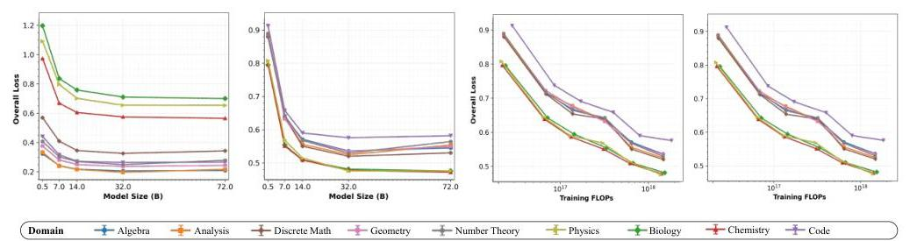

Figure 11: Expert Post-training Scaling Law. Expert models performance improves as we increase the model size, computational budget used for post-training.
tokens, and the overall computational budget. This analysis provides new insights into the scaling laws that govern post-training dynamics and highlights their potential applicability across diverse domains.

Figure 11 illustrates the performance of expert models, measured in terms of loss, as a function of model size and computational budget. Overall, we observe a consistent trend across domains: larger models and greater computation generally yield improved performance. This observation aligns with the well-established language modeling scaling law (Kaplan et al., 2020). Nevertheless, an important distinction arises across domains. For instance, the performance curve in the Biology domain exhibits substantially higher loss values compared to that in Geometry, even under comparable training conditions. This suggests that the model's pre-existing knowledge reserves differ across domains, leading to heterogeneous post-training dynamics despite identical training configurations. Such domain-specific disparities may further induce instability when merging expert models trained on heterogeneous knowledge bases.

# F Appendix: In-Domain Fits 

## F.0.1 In-DOMAIN (SINGLE-DOMAIN EVIDENCE)

Diminishing returns in $k$. CE decreases near-monotonically with $k$ and follows the $1 /(k+b)$ tail. At 0.5 B the macro in-domain CE drops from $\approx 0.816$ at $k=1$ to $\approx 0.739$ at $k=9(-9.5 \%)$; at 32 B it drops from $\approx 0.493$ to $\approx 0.430(-12.8 \%)$. Most gains arrive by $k \approx 5$ (math-like domains saturate sooner; science-like domains carry longer tails).
Scaling with $N$. Both the floor $L_{\infty}(N)$ and the tail amplitude $A(N)$ shrink with $N$; at fixed $k=9$, macro CE moves from $\approx 0.739$ (@0.5B) to $\approx 0.430$ (@32B), about $-42 \%$. Per-domain joint fits (Average) give tight exponents (e.g., $\beta \in[0.33,0.42]$ ) and high $R^{2}$ (Table 3).
Where the details live. Full per-domain parameters for Average/TA/TIES (incl. $b$ ), plus 72B forecasts, are reported in Appx. F. The 72B extrapolation is modest: at $k=9$ the median in-domain CE is forecast to drop another $\sim 6-10 \%$ from 32B to 72B.

## F. 1 MEAN CE: JOINT $(N, k)$ FITS

Table 3 reports the per-domain parameters of the joint law $L_{\infty, d}(N)=L_{*, d}+B_{d} N^{-\beta_{d}}$ and $A_{d}(N)=A_{0, d} N^{-\gamma_{d}}$ with the finite- $k$ offset $b_{0, d}$. All numbers come from weighted nonlinear least squares (weights $\propto k$ ). $R^{2}$ is computed on held-in $k$ grid points.

## F. 2 Variance: Joint $(N, k)$ Fits by Method

We fit $\operatorname{Var}\left[L_{d} \mid N, k\right]=V_{*, d}+B_{d}^{(\text {var })} N^{-\beta_{d}^{(\text {var })}}+\frac{A_{0, d}^{(\text {var })} N^{-\gamma_{d}^{(\text {var })}}}{k+b_{0, d}^{(\text {var })}}$ with $V_{*, d} \approx 0$. Below we list parameters and $N=72 \mathrm{~B}$ predictions for $k \in\{1,3,5,9\}$.

Average. Parameters:

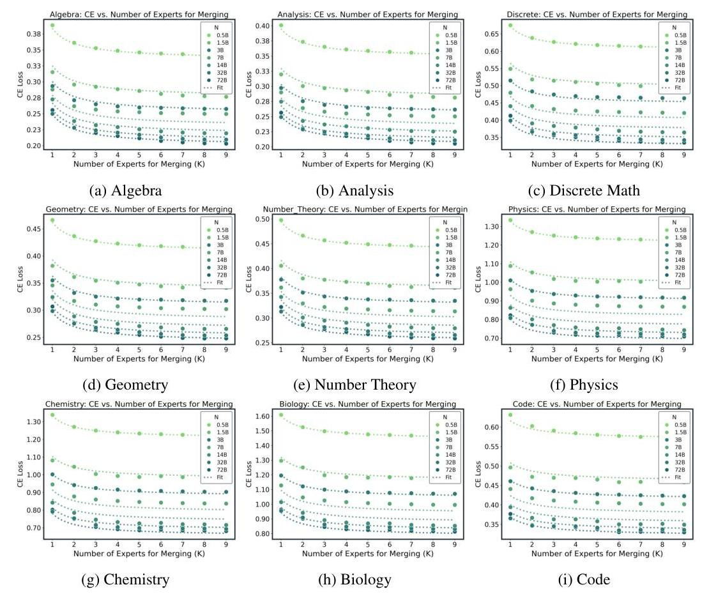

Figure 12: Merging Scaling Law with the Averaging Method

Table 3: Joint $(N, k)$ fit for Average (per-domain parameters).

| domain | Lstar | B | beta | A0 | gamma | b0 | R2 |
| :-- | --: | --: | --: | --: | --: | --: | --: |
| algebra | 0.18092 | 0.11453 | 0.42335 | 0.052334 | 0.0086009 | 0.096378 | 0.984 |
| analysis | 0.18784 | 0.11445 | 0.46899 | 0.054877 | 0.02738 | 0.1375 | 0.988 |
| biology | 0.63884 | 0.6201 | 0.37247 | 0.1588 | $1.4702 \mathrm{e}-11$ | 0.022561 | 0.990 |
| chemistry | 0.50824 | 0.54954 | 0.34262 | 0.12219 | $2.15 \mathrm{e}-08$ | $1.668 \mathrm{e}-14$ | 0.990 |
| code | 0.28292 | 0.20851 | 0.41186 | 0.082102 | 0.13678 | 0.43453 | 0.986 |
| discrete | 0.2052 | 0.3295 | 0.26766 | 0.066181 | $4.7525 \mathrm{e}-12$ | $9.8614 \mathrm{e}-05$ | 0.992 |
| geometry | 0.20278 | 0.16029 | 0.35431 | 0.052369 | $1.3982 \mathrm{e}-12$ | 0.0087202 | 0.987 |
| number_theory | 0.21726 | 0.16818 | 0.38339 | 0.055823 | $6.8172 \mathrm{e}-09$ | 0.0070628 | 0.992 |
| physics | 0.54195 | 0.52847 | 0.33756 | 0.1111 | 0.0038941 | $9.3222 \mathrm{e}-17$ | 0.987 |

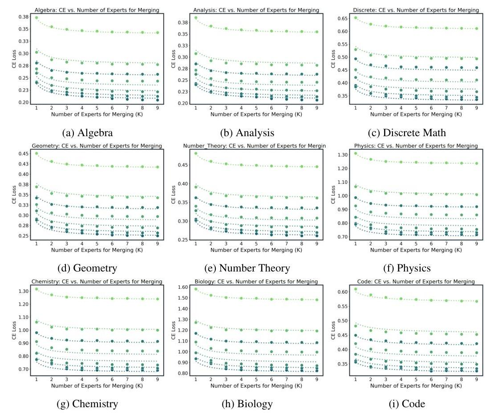

Figure 13: Merging Scaling Law with the TA Method

Table 4: Joint $(N, k)$ fit for TA (per-domain parameters).

| domain | Lstar | B | beta | A0 | gamma | b0 | R2 |
| :-- | --: | --: | --: | --: | --: | --: | --: |
| algebra | 0.1912 | 0.10481 | 0.48613 | 0.031756 | $2.0539 \mathrm{e}-12$ | $3.0949 \mathrm{e}-12$ | 0.993 |
| analysis | 0.19859 | 0.10452 | 0.53812 | 0.032072 | 0.020433 | $8.3408 \mathrm{e}-12$ | 0.994 |
| biology | 0.67453 | 0.6048 | 0.39438 | 0.10437 | $2.0948 \mathrm{e}-10$ | $6.7298 \mathrm{e}-13$ | 0.994 |
| chemistry | 0.5471 | 0.52754 | 0.3698 | 0.079144 | $1.4331 \mathrm{e}-15$ | $5.2296 \mathrm{e}-13$ | 0.994 |
| code | 0.29195 | 0.19378 | 0.4604 | 0.061683 | 0.11845 | 0.41132 | 0.993 |
| discrete | 0.26439 | 0.26479 | 0.36064 | 0.045787 | $5.5863 \mathrm{e}-10$ | $1.153 \mathrm{e}-15$ | 0.997 |
| geometry | 0.21888 | 0.14605 | 0.40757 | 0.034849 | $3.6096 \mathrm{e}-12$ | $6.4127 \mathrm{e}-08$ | 0.995 |
| number_theory | 0.23532 | 0.15 | 0.45207 | 0.037155 | $2.7958 \mathrm{e}-12$ | $4.9617 \mathrm{e}-11$ | 0.997 |
| physics | 0.57646 | 0.50399 | 0.36559 | 0.073691 | $1.0052 \mathrm{e}-07$ | $5.0247 \mathrm{e}-15$ | 0.993 |

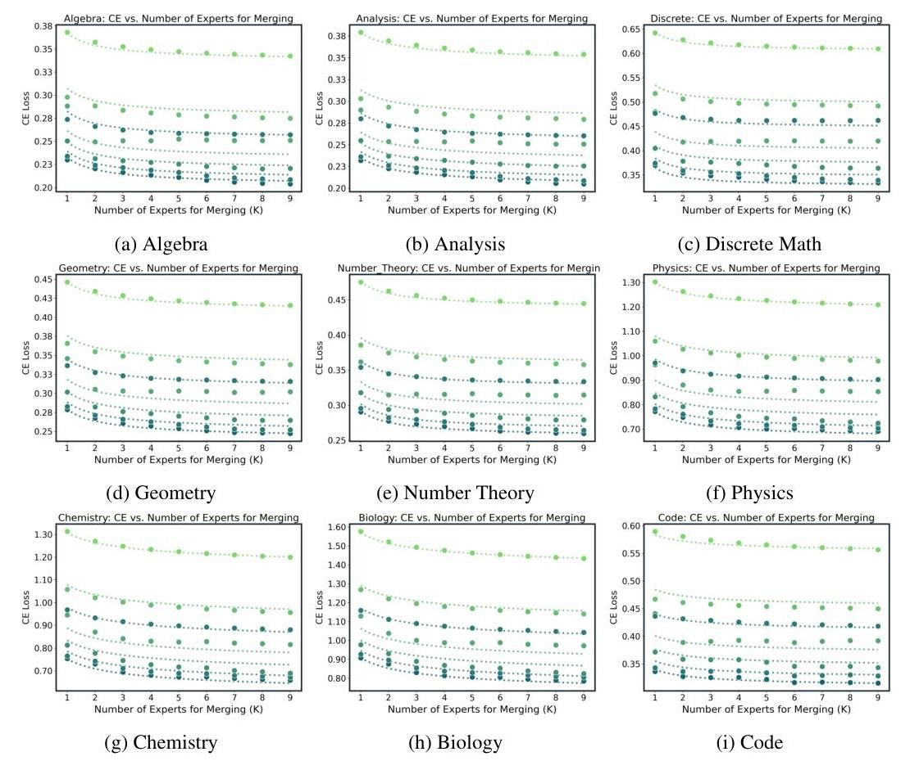

Figure 14: Merging Scaling Law with the TIES Method

Table 5: Joint $(N, k)$ fit for TIES (per-domain parameters).

| domain | Lstar | B | beta | A0 | gamma | b0 | R2 |
| :-- | :--: | :--: | :--: | :--: | --: | --: | --: |
| algebra | 0.18929 | 0.10752 | 0.46554 | 0.035371 | 0.011425 | 0.19757 | 0.975 |
| analysis | 0.19237 | 0.10912 | 0.50434 | 0.050902 | 0.016536 | 0.58856 | 0.980 |
| biology | 0.6077 | 0.60414 | 0.38384 | 0.37301 | 0.0080666 | 1.1634 | 0.990 |
| chemistry | 0.48423 | 0.53452 | 0.35563 | 0.30644 | 0.0069314 | 1.2221 | 0.989 |
| code | 0.26877 | 0.21391 | 0.38297 | 0.079839 | 0.11961 | 1.1999 | 0.986 |
| discrete | 0.22555 | 0.30917 | 0.28993 | 0.037062 | $2.9507 \mathrm{e}-10$ | $1.2161 \mathrm{e}-08$ | 0.988 |
| geometry | 0.21017 | 0.15222 | 0.38672 | 0.051128 | $5.5086 \mathrm{e}-10$ | 0.39637 | 0.983 |
| number_theory | 0.22585 | 0.15954 | 0.41453 | 0.046348 | $1.0173 \mathrm{e}-09$ | 0.27291 | 0.987 |
| physics | 0.53415 | 0.51524 | 0.34897 | 0.15923 | 0.00073252 | 0.50358 | 0.987 |

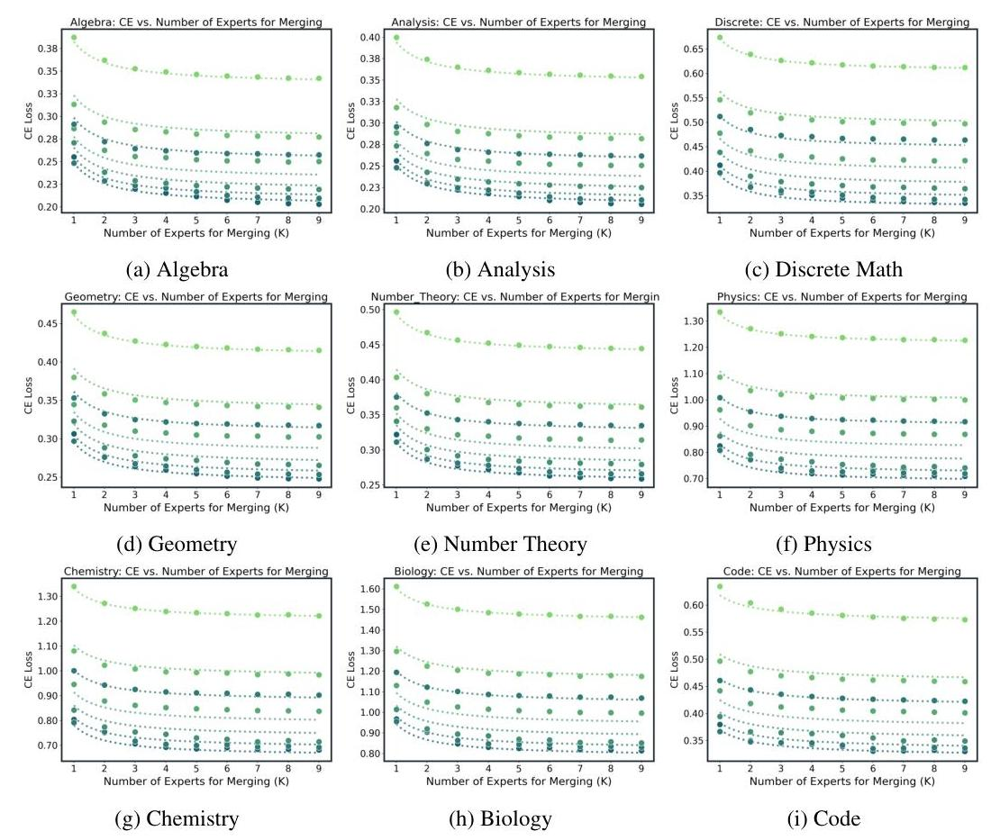

Figure 15: Merging Scaling Law with the DARE Method

Table 6: Variance fit parameters, Average.

| domain | ls | b | beta | a0 | gamma | b0 | r2 |
| :-- | :-- | :-- | :-- | :-- | :-- | :-- | :-- |
| algebra | $1.36 \mathrm{e}-18$ | $5.57 \mathrm{e}-19$ | 3 | 0.00159 | 0.0178 | $1.89 \mathrm{e}-11$ | 0.844 |
| discrete | $5.80 \mathrm{e}-34$ | $1.23 \mathrm{e}-22$ | 1.94 | 0.00254 | 0.00496 | $2.29 \mathrm{e}-19$ | 0.862 |
| analysis | $8.12 \mathrm{e}-29$ | $2.49 \mathrm{e}-20$ | 3 | 0.00146 | 0.0283 | $1.57 \mathrm{e}-12$ | 0.861 |
| geometry | $2.30 \mathrm{e}-27$ | $9.82 \mathrm{e}-22$ | 2.1 | 0.00192 | 0.032 | $1.82 \mathrm{e}-16$ | 0.851 |
| code | $3.25 \mathrm{e}-23$ | $2.74 \mathrm{e}-22$ | 0.067 | 0.0085 | 0.254 | 0.912 | 0.782 |
| number_theory | $2.92 \mathrm{e}-20$ | $1.53 \mathrm{e}-23$ | $2.08 \mathrm{e}-07$ | 0.00248 | 0.0273 | $5.79 \mathrm{e}-13$ | 0.86 |
| chemistry | $7.08 \mathrm{e}-31$ | $9.84 \mathrm{e}-24$ | 1.99 | 0.0393 | 0.127 | 0.205 | 0.891 |
| physics | $5.15 \mathrm{e}-21$ | $1.09 \mathrm{e}-27$ | 1.76 | 0.0229 | 0.119 | 0.125 | 0.903 |
| biology | $1.43 \mathrm{e}-19$ | $1.77 \mathrm{e}-33$ | 1.9 | 0.0556 | 0.151 | 0.272 | 0.879 |

Table 7: Variance at $N=72 \mathrm{~B}$, Average.

| domain | $k=1$ | $k=3$ | $k=5$ | $k=9$ |
| :-- | :-- | :-- | :-- | :-- |
| algebra | 0.00148 | $4.93 \mathrm{e}-04$ | $2.96 \mathrm{e}-04$ | $1.64 \mathrm{e}-04$ |
| analysis | 0.0013 | $4.32 \mathrm{e}-04$ | $2.59 \mathrm{e}-04$ | $1.44 \mathrm{e}-04$ |
| biology | 0.0229 | 0.00889 | 0.00552 | 0.00314 |
| chemistry | 0.0189 | 0.00711 | 0.00438 | 0.00247 |
| code | 0.0015 | $7.34 \mathrm{e}-04$ | $4.86 \mathrm{e}-04$ | $2.90 \mathrm{e}-04$ |
| discrete | 0.00249 | $8.30 \mathrm{e}-04$ | $4.98 \mathrm{e}-04$ | $2.77 \mathrm{e}-04$ |
| geometry | 0.00168 | $5.59 \mathrm{e}-04$ | $3.35 \mathrm{e}-04$ | $1.86 \mathrm{e}-04$ |
| number_theory | 0.0022 | $7.34 \mathrm{e}-04$ | $4.41 \mathrm{e}-04$ | $2.45 \mathrm{e}-04$ |
| physics | 0.0122 | 0.00441 | 0.00269 | 0.00151 |

TA. Parameters:
Table 8: Variance fit parameters, TA.

| domain | ls | b | beta | a0 | gamma | b0 | r2 |
| :-- | :-- | :-- | :-- | :-- | :-- | :-- | :-- |
| algebra | $7.61 \mathrm{e}-31$ | $9.32 \mathrm{e}-22$ | $4.05 \mathrm{e}-08$ | 0.00109 | $1.62 \mathrm{e}-06$ | $3.41 \mathrm{e}-16$ | 0.821 |
| discrete | $5.05 \mathrm{e}-36$ | $9.52 \mathrm{e}-33$ | 0.784 | 0.0017 | $1.14 \mathrm{e}-10$ | $9.33 \mathrm{e}-23$ | 0.819 |
| analysis | $2.63 \mathrm{e}-44$ | $2.67 \mathrm{e}-26$ | 0.585 | $9.98 \mathrm{e}-04$ | $2.01 \mathrm{e}-06$ | $7.55 \mathrm{e}-23$ | 0.84 |
| geometry | $8.01 \mathrm{e}-30$ | $4.73 \mathrm{e}-21$ | $3.03 \mathrm{e}-08$ | 0.00133 | 0.00682 | $5.56 \mathrm{e}-16$ | 0.848 |
| code | $1.78 \mathrm{e}-33$ | $2.30 \mathrm{e}-05$ | 3 | 0.00525 | 0.206 | 0.514 | 0.816 |
| number_theory | $4.23 \mathrm{e}-45$ | $1.72 \mathrm{e}-27$ | 1.62 | 0.00171 | $5.25 \mathrm{e}-07$ | $8.13 \mathrm{e}-21$ | 0.845 |
| chemistry | $1.75 \mathrm{e}-24$ | $3.78 \mathrm{e}-21$ | 2.18 | 0.0266 | 0.112 | $1.88 \mathrm{e}-11$ | 0.93 |
| physics | $6.05 \mathrm{e}-20$ | $2.15 \mathrm{e}-21$ | 0.812 | 0.0169 | 0.0995 | $1.70 \mathrm{e}-28$ | 0.936 |
| biology | $2.27 \mathrm{e}-19$ | $2.19 \mathrm{e}-23$ | 1.91 | 0.0372 | 0.137 | $4.71 \mathrm{e}-12$ | 0.924 |

Table 9: Variance at $N=72 \mathrm{~B}$, TA.

| domain | $k=1$ | $k=3$ | $k=5$ | $k=9$ |
| :-- | :-- | :-- | :-- | :-- |
| algebra | 0.00109 | $3.64 \mathrm{e}-04$ | $2.19 \mathrm{e}-04$ | $1.21 \mathrm{e}-04$ |
| analysis | $9.98 \mathrm{e}-04$ | $3.33 \mathrm{e}-04$ | $2.00 \mathrm{e}-04$ | $1.11 \mathrm{e}-04$ |
| biology | 0.0207 | 0.00691 | 0.00414 | 0.0023 |
| chemistry | 0.0165 | 0.0055 | 0.0033 | 0.00183 |
| code | 0.00144 | $6.18 \mathrm{e}-04$ | $3.94 \mathrm{e}-04$ | $2.28 \mathrm{e}-04$ |
| discrete | 0.0017 | $5.66 \mathrm{e}-04$ | $3.40 \mathrm{e}-04$ | $1.89 \mathrm{e}-04$ |
| geometry | 0.0013 | $4.32 \mathrm{e}-04$ | $2.59 \mathrm{e}-04$ | $1.44 \mathrm{e}-04$ |
| number_theory | 0.00171 | $5.70 \mathrm{e}-04$ | $3.42 \mathrm{e}-04$ | $1.90 \mathrm{e}-04$ |
| physics | 0.011 | 0.00368 | 0.00221 | 0.00123 |

TIES. Parameters:
Variance at $N=72 \mathrm{~B}$ :

Table 10: Variance fit parameters, TIES.

| domain | ls | b | beta | a0 | gamma | b0 | r2 |
| :-- | :-- | :-- | :-- | :-- | :-- | :-- | :-- |
| algebra | $1.35 \mathrm{e}-27$ | $4.08 \mathrm{e}-32$ | 0.863 | $7.48 \mathrm{e}-04$ | $7.09 \mathrm{e}-11$ | $1.94 \mathrm{e}-09$ | 0.801 |
| discrete | $2.48 \mathrm{e}-34$ | $9.61 \mathrm{e}-29$ | 2.98 | 0.00117 | $6.34 \mathrm{e}-13$ | $8.13 \mathrm{e}-11$ | 0.736 |
| analysis | $2.03 \mathrm{e}-22$ | $1.96 \mathrm{e}-26$ | $4.28 \mathrm{e}-08$ | $6.83 \mathrm{e}-04$ | $1.33 \mathrm{e}-08$ | $3.31 \mathrm{e}-09$ | 0.822 |
| geometry | $2.56 \mathrm{e}-27$ | $6.97 \mathrm{e}-26$ | 0.63 | $8.99 \mathrm{e}-04$ | $1.43 \mathrm{e}-11$ | $2.86 \mathrm{e}-08$ | 0.784 |
| code | $2.92 \mathrm{e}-12$ | $1.76 \mathrm{e}-05$ | 3 | 0.00424 | 0.12 | 1.09 | 0.752 |
| number_theory | $2.25 \mathrm{e}-24$ | $3.61 \mathrm{e}-33$ | $1.11 \mathrm{e}-07$ | 0.00114 | $8.10 \mathrm{e}-12$ | $6.51 \mathrm{e}-11$ | 0.796 |
| chemistry | $3.25 \mathrm{e}-49$ | $2.78 \mathrm{e}-28$ | 0.781 | 0.0241 | 0.00132 | 0.446 | 0.816 |
| physics | $2.45 \mathrm{e}-19$ | $5.40 \mathrm{e}-27$ | 3 | 0.0137 | 0.00363 | 0.164 | 0.886 |
| biology | $1.65 \mathrm{e}-23$ | $9.54 \mathrm{e}-22$ | 0.00561 | 0.0344 | 0.0366 | 0.397 | 0.857 |

Table 11: Variance at $N=72$ B, TIES.

| domain | $k=1$ | $k=3$ | $k=5$ | $k=9$ |
| :-- | :-- | :-- | :-- | :-- |
| algebra | $7.48 \mathrm{e}-04$ | $2.49 \mathrm{e}-04$ | $1.50 \mathrm{e}-04$ | $8.31 \mathrm{e}-05$ |
| analysis | $6.83 \mathrm{e}-04$ | $2.28 \mathrm{e}-04$ | $1.37 \mathrm{e}-04$ | $7.59 \mathrm{e}-05$ |
| biology | 0.0211 | 0.00867 | 0.00546 | 0.00313 |
| chemistry | 0.0165 | 0.00694 | 0.00439 | 0.00253 |
| code | 0.00121 | $6.20 \mathrm{e}-04$ | $4.17 \mathrm{e}-04$ | $2.51 \mathrm{e}-04$ |
| discrete | 0.00117 | $3.91 \mathrm{e}-04$ | $2.35 \mathrm{e}-04$ | $1.30 \mathrm{e}-04$ |
| geometry | $8.99 \mathrm{e}-04$ | $3.00 \mathrm{e}-04$ | $1.80 \mathrm{e}-04$ | $9.99 \mathrm{e}-05$ |
| number_theory | 0.00114 | $3.81 \mathrm{e}-04$ | $2.28 \mathrm{e}-04$ | $1.27 \mathrm{e}-04$ |
| physics | 0.0116 | 0.00426 | 0.00261 | 0.00147 |

# G Appendix: Cross-Domain Fit Details 

## G.0.1 Cross-domain (pooled evidence)

Macro-averaged CE over the nine domains follows the same floor+tail law $L_{\infty}(N)+A(N) /(k+b)$ as in-domain: curves are monotone with steep early gains and a short inverse tail; TA and TIES( 0.5 ) show slightly faster early drops and gaps narrow with $k$. A single mild late- $k$ wobble appears for TIES(1) at 3B and is captured by adding a small bounded term (Appx. G). Scaling with model size mirrors the in-domain trend: at fixed large $k$ (e.g., $k=9$, Average), pooled CE improves substantially from small to large bases, reflecting a lower floor and a smaller tail amplitude. Merge-to-merge variance contracts approximately as $1 / k$ with smaller amplitude at larger $N$, and TIES/TA exhibit slightly lower variance than Average at small $k$; details and extended forecasts (including 72B) appear in Appx. 6-11. For fitting, we regress the mean law per base size and method (setting the interference term to zero for monotone series) and fit the variance model unweighted; the scale parameter decreases with $N$ and the variance floor is small. Representative figures include Average@32B (mean improving from 0.5173 to 0.4530 ; variance shrinking from $9.8 \times 10^{-4}$ to $4.3 \times 10^{-5}$ ), TIES $(0.5) @ 14 \mathrm{~B}$ (mean $0.5286 \rightarrow 0.4599$ ), and the bounded late- $k$ uptick for TIES(1)@3B captured by a positive interference term.

## G. 1 Variance Behavior (Both Settings)

Merge-to-merge variability contracts approximately as

$$
\operatorname{Var}[L] \propto \frac{1}{k}
$$

with three robust regularities: (i) a near- $1 / k$ drop that is already pronounced by small $k$ and flattens near a small floor (e.g., chemistry @ 0.5B, Average: $0.0385 \rightarrow 0.00108$ by $k=8$; algebra @ 0.5B: $2.28 \times 10^{-3} \rightarrow 1.88 \times 10^{-5}$ ); (ii) larger models are stabler-at fixed $k$, variance is lower for larger $N$ (e.g., physics, Average, $k=1: 0.0239 \rightarrow 0.0128$ from 0.5 B to 32 B ); and (iii) method ordering at small $k$ typically satisfies TIES $<$ TA $<$ Average, with gaps vanishing as $k$ grows. We use Eq. equation 22 descriptively (fixing the log-log slope near -1 ), as heavier parameterization yields little additional predictive value while the simple form transfers cleanly across domains, sizes, and methods.

# H APPENDIX FOR CORE QUESTIONS 

## H. 1 PER-DOMAIN FITS, $k_{\varepsilon}$ EXAMPLES, AND ROBUSTNESS

Specification. For each domain $d$ we fit the joint law $\mathbb{E}\left[L_{d} \mid N, k\right]=L_{*, d}+B_{d} N^{-\beta_{d}}+\frac{A_{0, d} N^{-\gamma_{d}}}{k+k_{d}}$ by weighted nonlinear least squares (weights $\propto k$ ). We summarize floors via $L_{\infty, d}(N)=L_{*, d}+$ $B_{d} N^{-\beta_{d}}$ (log-log regression) and tails via $A_{d}(N)=A_{0, d} N^{-\gamma_{d}}$.

Per-domain parameters. Floors exhibit tight power-law fits with exponents clustered in $[0.33,0.42]$ and $R^{2} \approx 0.98-0.99$ across domains. Tails are smaller and noisier; several domains are near-flat in $N$, while code shows the clearest decay. Table 12 lists an illustrative subset; full tables for all methods/domains appear in App. F.

| Domain | $\hat{b}$ | $\hat{A}_{0}$ | $\hat{\gamma}$ | $R^{2}(A)$ | $\hat{L}_{*}$ | $\hat{B}$ | $\hat{\beta}$ | $R^{2}(L)$ |
| :-- | :--: | :--: | :--: | :--: | :--: | :--: | :--: | :--: |
| algebra | 0.000 | 0.0460 | -0.004 | -0.002 | 0.1724 | 0.1248 | 0.379 | 0.983 |
| analysis | 0.000 | 0.0462 | +0.009 | +0.009 | 0.1793 | 0.1255 | 0.417 | 0.990 |
| biology | 0.125 | 0.1741 | -0.006 | +0.007 | 0.6227 | 0.6338 | 0.362 | 0.988 |
| chemistry | 0.075 | 0.1317 | -0.006 | +0.008 | 0.4924 | 0.5639 | 0.331 | 0.988 |
| code | 0.250 | 0.0682 | +0.115 | 0.556 | 0.2705 | 0.2238 | 0.378 | 0.986 |

Table 12: Joint $(N, k)$ fits (subset, Average). Floors are tight power laws; tails are small and domain-dependent (clearest decay in code).

Macro evidence. At $k=9$ (Average), macro CE decreases from 0.739 at 0.5 B to 0.430 at 32 B $(-41.9 \%)$, consistent with a lower floor and a weakly shrinking tail.
$k_{\varepsilon}$ examples $(\varepsilon=0.01$ ). Using $k_{\varepsilon}(N, d)=\left\lceil A_{d}(N) / \varepsilon-b_{d}\right\rceil$ with $A_{d}(N)=A_{0, d} N^{-\gamma_{d}}$ :

- code: $\left(\hat{b}, \hat{A}_{0}, \hat{\gamma}\right)=(0.25,0.068,0.115)$ gives $A(0.5 \mathrm{~B}) \approx 0.074, A(32 \mathrm{~B}) \approx 0.046$, hence $k_{\varepsilon}(0.5 \mathrm{~B})=8$ and $k_{\varepsilon}(32 \mathrm{~B})=5$.
- biology: $(0.125,0.174,-0.006)$ (near-flat tail) gives $A(0.5 \mathrm{~B}) \approx 0.173, A(32 \mathrm{~B}) \approx 0.177$, so $k_{\varepsilon}$ stays $\approx 18$, yet CE still falls with $N$ due to the lower floor.

Robustness. Altering weights (uniform vs. $\propto k$ ) or censoring tiny high- $k$ points barely changes floor exponents. For extrapolation (e.g., 72B), floors should be treated as the dominant $N$-driver, with tails weakly decreasing/flat; $k_{\varepsilon}$ then gives a practical "experts-to-saturation" budget.

Plot inventory. (i) Macro CE@ $k=9$ vs. $N$ (log-log) with power-law fit; (ii) two representative floor curves $L_{\infty, d}(N)$ (e.g., algebra vs. biology); (iii) optional $A_{d}(N)$ vs. $N$ to visualize tail trends.

## H. 2 MOST OF THE GAIN COMES FROM THE FIRST FEW EXPERTS

We quantify the "return" from merging $k$ experts at a fixed $(N, d)$ by the fraction of realized improvement $R(N, d, k)$ computed from the monotone envelope of the measured CE curve (see App. H.2). We summarize two views in Fig. 16: (left) the median $R(k)$ over all $(N, d)$ with an IQR band; (right) a heatmap of the smallest $k$ that reaches a target return (here $90 \%$ ). As shown in Fig. 16, most of the improvement arrives early: the median curve crosses $85 \%$ by $k=5$ and $90 \%$ by $k=6$, and the $k_{90}$ heatmap concentrates in $\{5,6\}$ across domains and model sizes. Math-like domains tend to saturate slightly earlier, while science-like domains keep a longer-but still flattening-tail. This "early elbow" follows directly from the unified law $L(N, k)=L_{\infty}(N)+A(N) /(k+b)$ : the marginal gain $\Delta_{k} \approx A(N) /[(k+b)(k+1+b)]$ decays roughly as $k^{-2}$, so returns diminish sharply beyond the first few experts.

## H. 3 ADDITIONAL PLOTS, TABLES, AND DETAILS

For each method (Average, TA, TIES, DARE) and size $N$, we fit $L(N, k)=L_{\infty}(N)+A(N) /(k+b)$ by weighted least squares (weights $\propto k$ ) on the pooled CE, averaging over randomized expert orders;

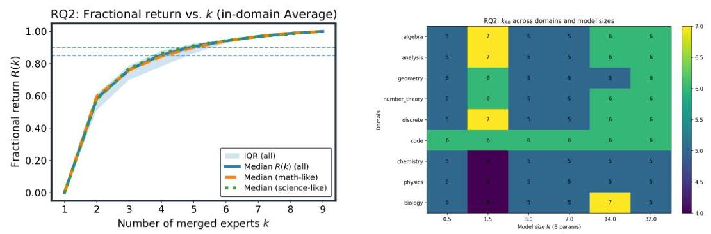

Figure 16: Most of the gain comes from the first few experts. Left: Median fractional return $R(k)$ with IQR band; $k=5$ and $k=6$ cross the $85 \% / 90 \%$ thresholds, respectively. Right: $k_{90}$ across domains and sizes concentrates at $k \in\{5,6\}$ (about half to two-thirds of this 9 -expert pool $(5 / 9 \approx 56 \%))$.
only TIES with the strongest nonlinearity requires an extra bounded term $+D(N) \frac{k}{k+q}$, with small $D$ and stable $q$. We release per-method parameter tables $\left\{b, A_{0}, \gamma, L_{s}, B, \beta\right\}$ and residual plots versus $k$; companion figures reproduce Fig. 4a for all methods and provide fractional-return curves $R(k)$ and $k_{90}$ heatmaps across $N$. Headline patterns match the main text: most pooled improvement is realized by $k \leq 6$, method differences narrow with $k$, and scaling in $N$ lowers both the pooled floor and the tail.

| Method | Qwen-0.5b | Qwen-1.5b | Qwen-3b | Qwen-7b | Qwen-14b | Qwen-32b | Qwen-72b | SUM(GPUh) |
| :-- | :--: | :--: | :--: | :--: | :--: | :--: | :--: | :--: |
| TA | 32 s | 68 s | 129 s | 244 s | 383 s | 777 s | 2686 s | 1.20 |
| AVG | 48 s | 73 s | 168 s | 265 s | 421 s | 843 s | 2280 s | 1.14 |
| Dare | 30 s | 72 s | 102 s | 251 s | 420 s | 796 s | 2360 s | 1.112 |
| Ties | 43 s | 77 s | 136 s | 270 s | 507 s | 961 s | 2967 s | 1.38 |

Table 13: The GPU hours when merging 9 domains for different size of models.

| Model Size | Model Name |
| :--: | :--: |
| 3B | theprint/ReWiz-Llama-3.2-3B (theprint, 2025) |
|  | NousResearch/Hermes-3-Llama-3.2-3B (NousResearch, 2025b) |
|  | MergeBench/Llama-3.2-3B-Instruct_coding (MergeBench, 2025a) |
|  | MergeBench/Llama-3.2-3B-Instruct_math (MergeBench, 2025c) |
|  | MergeBench/Llama-3.2-3B-Instruct_multilingual (MergeBench, 2025d) |
|  | meta-llama/Llama-3.2-3B-Instruct (meta llama, 2025b) |
|  | ValiantLabs/Llama3.2-3B-ShiningValiant2 (ValiantLabs, 2025) |
|  | MergeBench/Llama-3.2-3B-Instruct_safety (MergeBench, 2025e) |
|  | MergeBench/Llama-3.2-3B-Instruct_instruction (MergeBench, 2025b) |
| 8B | Undi95/Meta-Llama-3-8B-Instruct-hf (Undi95, 2025b) |
|  | Undi95/Llama-3-LewdPlay-8B-evo (Undi95, 2025a) |
|  | jondurbin/bagel-8b-v1.0 (jondurbin, 2025) |
|  | Weyaxi/Einstein-v6.1-Llama3-8B (Weyaxi, 2025) |
|  | VAGOsolutions/Llama-3-SauerkrautLM-8b-Instruct (VAGOsolutions, 2025) |
|  | aaditya/OpenBioLLM-Llama3-8B (aaditya, 2025) |
|  | Dampfinchen/Llama-3-8B-Ultra-Instruct (Dampfinchen, 2025) |
|  | NousResearch/Hermes-3-Llama-3.1-8B (NousResearch, 2025a) |
|  | meta-llama/Llama-3.1-8B-Instruct (meta llama, 2025a) |

Table 14: List of open source models on Huggingface.

# EXTENDED EVIDENCE 

Small-k mean gaps vs. Average (relative \%). We report (Avg - Method)/Avg at $k=2$ and the signed gap at $k=9$ (lower is better).

|  | 0.5B |  | 14B |  |
| :-- | :--: | :--: | :--: | :--: |
| Method | $k=2$ | $k=9$ | $k=2$ | $k=9$ |
| TA $(\lambda=0.8)$ | $0.9 \%$ | $+0.7 \%$ (worse) | $0.6 \%$ | $+1.4 \%$ (worse) |
| TIES $(\lambda=0.5)$ | $0.9 \%$ | $-1.1 \%$ (better) | $0.6 \%$ | $-2.2 \%$ (better) |
|  |  |  |  |  |
| Method | $k=2$ | $k=9$ |  |  |
| TA $(\lambda=0.8)$ | $1.2 \%$ | $+1.2 \%$ (worse) |  |  |
| TIES $(\lambda=0.5)$ | $1.7 \%$ | $-2.3 \%$ (better) |  |  |

Summary. The method "bandwidth" is consistently narrow across scales: at small $k$, TA and TIES( 0.5 ) are modestly better than Average (typically $1 \% \sim 2 \%$ at $k=2$ ), and by $k=9$ gaps further compress (TIES $(0.5)$ usually retains a $\approx 1 \% \sim 2 \%$ edge, TA is near-tied or slightly worse). Variance shows the same convergence: at $N=32 \mathrm{~B}, k=2$ the across-merge variance is $9.67 \times 10^{-4}$ (Average), $7.83 \times 10^{-4}$ (TA, $-19 \%$ ), and $6.50 \times 10^{-4}$ (TIES $0.5,-33 \%$ ); by $k=8$ all methods are around $(3-4) \times 10^{-5}$. At $N=0.5 \mathrm{~B}, k=2$ the pattern holds (Average $1.73 \times 10^{-3}$, TA $-26 \%$, TIES $0.5-44 \%$ ). A mild late- $k$ uptick for TIES $(\lambda=1)$ at 3 B is captured by a small bounded term $D \frac{k}{k+q}$; using $\lambda=0.5$ restores the standard monotone $1 /(k+b)$ tail. Together, these results support the main-text claim: method differences are second-order and shrink quickly with $k$.

## I APPENDIX: Cross-domain Synergy (Pooled Evidence)

We quantify donor-receiver interactions by adding one expert at a time in the cross-domain setting (randomized orders) and recording the marginal change in macro CE for each evaluation domain, aggregating into a $9 \times 9$ synergy matrix $S_{d \rightarrow e}$. Using DARE at $N=32 \mathrm{~B}$ as a representative case (Fig. 17), the heatmap reveals a structured, non-random pattern: science $\leftrightarrow$ science pairs (physics, biology, chemistry) are strongly positive, math $\leftrightarrow$ math pairs are moderately positive, and cross-block interactions are weakly negative at scale; code provides mild benefits to discrete and geometry. This structure is consistent with feature/skill overlap-closer domains supply complementary signal, while distant domains may dilute it-and persists across base sizes with slightly stronger block contrast for larger $N$. In practice, to help a science target, prioritize donors from \{physics, biology, chemistry\}; for math targets, stay within the math block or include code. We report the full matrix values, rank-ordered donor $\rightarrow$ receiver pairs, and size-wise trends in the released tables and replicate the qualitative structure for other methods (TA, TIES) with minor early- $k$ differences that narrow as $k$ grows.
Details under DARE We compute a $9 \times 9$ synergy matrix $S_{d \rightarrow e}$ by parsing each DARE trajectory from results_dare_ $\{0.5,1.5,3,7,14,32,72\} B . \operatorname{csv}$ : at step $t$ (sequence "model" length $t$ ), adding donor $d_{t}$ yields a marginal gain $\Delta L_{e}^{(t)}=L_{e}^{(t-1)}-L_{e}^{(t)}$ on evaluation domain $e$, and $S_{d \rightarrow e}$ averages these deltas over all occurrences (typically $11 \sim 13$ per pair at 32B). Using domain blocks $\mathcal{M}=\{$ algebra, analysis, discrete, geometry, number_theory $\}$ and $\mathcal{S}=\{$ biology, chemistry, physics $\}$, block means $\bar{S}_{A \rightarrow B}=\frac{1}{|A||B|} \sum_{d \in A, e \in B} S_{d \rightarrow e}$ are: at 7B, $\bar{S}_{\mathcal{M} \rightarrow \mathcal{M}}=0.009, \bar{S}_{\mathcal{S} \rightarrow \mathcal{S}}=0.117, \bar{S}_{\mathcal{M} \rightarrow \mathcal{S}}=0.014, \bar{S}_{\mathcal{S} \rightarrow \mathcal{M}}=-0.003$; at 14B, $0.016,0.077,-0.011,-0.005$; at $32 \mathrm{~B}, 0.012,0.073,-0.013,-0.005$. The strongest offdiagonal positive pairs at 32 B are biology $\rightarrow$ chemistry $(+0.076)$, physics $\rightarrow$ biology $(+0.074)$, physics $\rightarrow$ chemistry $(+0.068)$, chemistry $\rightarrow$ biology $(+0.066)$, biology $\rightarrow$ physics $(+0.054)$; the largest negatives are algebra $\rightarrow$ physics $(-0.026)$, geometry $\rightarrow$ chemistry $(-0.020)$, discrete $\rightarrow$ chemistry $(-0.018)$, algebra $\rightarrow$ biology $(-0.016)$, number_theory $\rightarrow$ biology $(-0.015)$. Donor strengths (row-sums, off-diagonal) rank physics $0.124>$ biology $0.107>$ chemistry $0.063>$ discrete $0.025 \gtrsim$ number_theory 0.021 , with algebra and geometry weakest $(-0.032,-0.005)$; receiver susceptibilities (column-sums) rank biology $0.133>$ chemistry $0.087>$ physics 0.059 , while code is slightly negative $(-0.029)$. We release the full matrices and top-

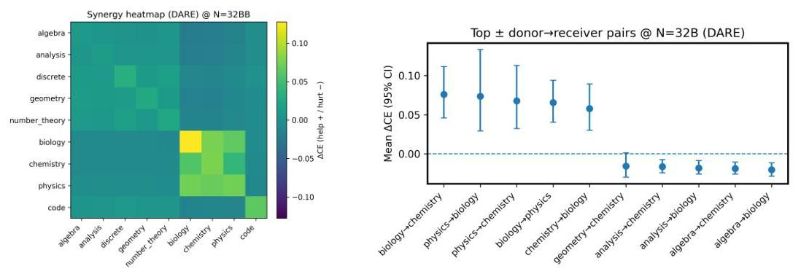

Figure 17: Cross-domain synergy (DARE, 32B). Left: synergy heatmap $S_{d \rightarrow e}$ (red $=$ help, blue $=$ hurt) showing science $\leftrightarrow$ science and math $\leftrightarrow$ math blocks; cross-block entries are weakly negative; code $\rightarrow$ (discrete, geometry) is mildly positive. Right: representative top $\pm$ pairs (donor $\rightarrow$ receiver) highlight actionable donor choices for target domains.
pair lists for $7 \mathrm{~B} / 14 \mathrm{~B} / 32 \mathrm{~B} / 72 \mathrm{~B}$ as CSVs (out/rq6_synergy_matrix_32B_DARE.csv, out/rq6_top_pairs_32B_DARE.csv); Fig. 17 visualizes the 32B heatmap and top pairs that these numbers summarize.

# I. 1 Details for Order Sensitivity and $1 /(k+b)$ Fit 

From each DARE CSV we derive $k$ (hyphen count +1 ) and collect macro Avg. CE across all permutations to compute, per $(N, k)$, the across-order std, range, and CV; we then fit $\operatorname{Std}_{\text {order }}(N, k)=$ $c_{0}(N)+\frac{c_{1}(N)}{k+b}$ by grid-search over a small $b \in[0,2]$ with linear least squares for $\left(c_{0}, c_{1}\right)$. Table 15 shows that dispersion collapses from $k=1$ to $k=8$ at $0.5 \mathrm{~B} / 32 \mathrm{~B} / 72 \mathrm{~B}$ (std drops $\sim 79 \%-81 \%$, range $\sim 83 \%$ ), and Table 16 reports fitted $\left(\bar{b}, c_{0}, c_{1}\right)$ and $R^{2}$ across sizes, where a single small offset $\bar{b} \approx 2$ with $c_{0} \approx 0$ explains most of the decay; these are the statistics underlying the violin/heatmap/bar visualizations in Fig. 8.

| $N(\mathrm{~B})$ | $k$ | mean CE | std (across orders) | range (max-min) | CV |
| :--: | :--: | :--: | :--: | :--: | :--: |
| 0.5 | 1 | 0.8164 | 0.0388 | 0.1122 | 0.048 |
| 0.5 | 8 | 0.7810 | 0.0081 | 0.0185 | 0.011 |
| 32 | 1 | 0.5207 | 0.0313 | 0.0865 | 0.060 |
| 32 | 8 | 0.4634 | 0.0060 | 0.0148 | 0.013 |
| 72 | 1 | 0.4638 | 0.0364 | 0.1056 | 0.072 |
| 72 | 8 | 0.4247 | 0.0076 | 0.0179 | 0.018 |

Table 15: Across-order dispersion of Avg. CE at $k=1$ vs. 8 (DARE). Order sensitivity drops rapidly with $k$ at all $N$ (std $\sim-79 \%-81 \%$, range $\sim-83 \%$ ).

| $N(\mathrm{~B})$ | $\bar{b}$ | $c_{0}$ | $c_{1}$ | $R^{2}$ |
| --: | :--: | :--: | :--: | :--: |
| 0.5 | 2.00 | -0.002 | 0.033 | 0.94 |
| 1.5 | 2.00 | +0.002 | 0.028 | 0.90 |
| 3 | 2.00 | +0.003 | 0.023 | 0.88 |
| 7 | 2.00 | +0.002 | 0.021 | 0.92 |
| 14 | 2.00 | +0.003 | 0.019 | 0.91 |
| 32 | 2.00 | +0.001 | 0.017 | 0.75 |
| 72 | 2.00 | +0.002 | 0.023 | 0.69 |

Table 16: $\operatorname{Std}_{\text {order }}(N, k) \approx c_{0}+c_{1} /(k+b)$ fits (DARE). A small shared offset $b \approx 2$ with $\left(c_{0}, c_{1}\right)$ per size explains the decay; $c_{0}$ is near zero (floor) and $c_{1}$ shrinks up to mid-scale.

# I. 2 Details for Cross-Backbone/open-Source Replication 

For each backbone, every CSV row corresponds to one merge order (tokenized in the model field) evaluated on a domain with CE in CE Loss. We compute macro CE per order by averaging CE Loss over the nine domains, derive $k$ as the length of the model token list, and then average across orders with the same $k$ to obtain a per-backbone series $\left\{\left(k, \bar{L}_{k}\right)\right\}_{k=1}^{9}$. We fit $L(k)=L_{\infty}+\frac{A}{k+b}$ by least squares with a small grid over $b \in[0,1]$; the best $b$ and $\left(L_{\infty}, A\right)$, along with $R^{2}$ and the end-point values $L(k=1) / L(k=9)$, are reported in Table 17. These numbers back Fig. 9 and show near-unity $R^{2}$ and small residuals, confirming that the same $1 /(k+b)$ tail holds on LLaMA backbones.

| Backbone | $R^{2}$ | $b$ | $L_{\infty}$ | $A$ | $L(k=1)$ | $L(k=9)$ |
| :-- | :--: | :--: | :--: | :--: | :--: | :--: |
| LLaMA-3.2 3B | 0.9989 | 0.6875 | 0.7137 | 0.0783 | 0.7599 | 0.7221 |
| LLaMA-3 8B | 0.9955 | 0.0000 | 0.7252 | 0.0573 | 0.7837 | 0.7325 |

Table 17: Fitted floor+tail parameters on LLaMA backbones (appendix). Least-squares fits to macro-averaged CE vs. $k$; both series achieve near-unity $R^{2}$ with a shared $1 /(k+b)$ tail.

## J MIXING DOMAINS HELPS GENERALIZATION

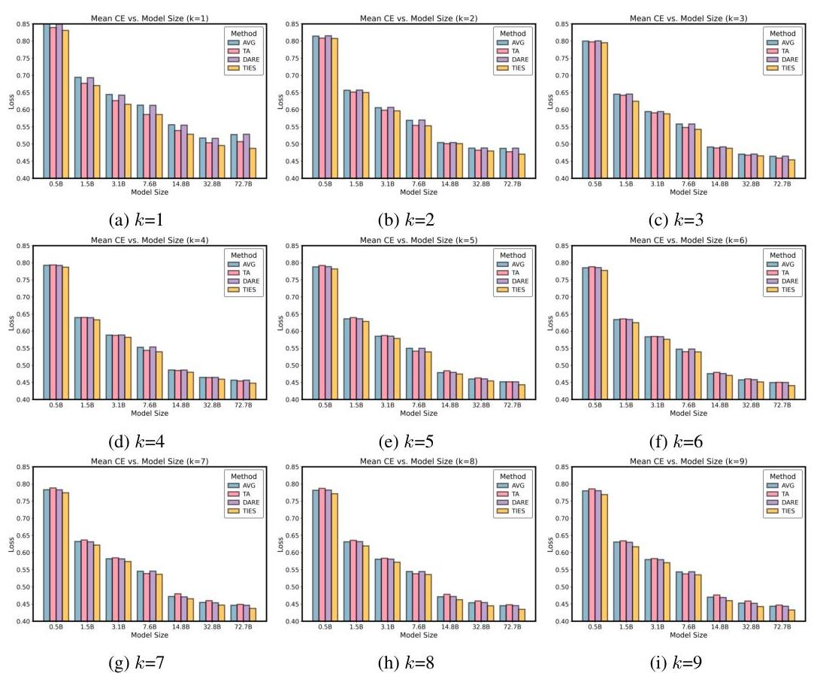

Figure 18: Mean CE Loss vs. Model Size with Different $k$